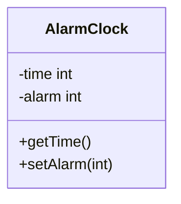

## Public and Private Content
Attributes and methods can be `public` or `private`:

* `private` members of a class cannot be accessed from outside the object.
* `public` can be accessed from outside.
	* This can be done via the dot notation:
	
	```java
	int t = alarmClock.time;
	alarmClock.setAlarm(t+5);
	```
The `public` members form the object's **interface**. This consists of the messages it can receive and the services it can offer.

## Information Hiding
It is good practice to declare attributes `private` to avoid accidental outside interference or messy dependencies.

This principle is called **information hiding** or **encapsulation**.
{:.info}

## Setting Private Attributes via Methods
You can introduce `public` methods whose sole job it is to get or set the value of `private` attributes.

* Methods that **modify** attributes are called **mutators**.
* Methods that **retrieve** the value of an attribute are called **accessors**.

It is convention to call them `getX` or `setX` for `private` attributes `X`.
{:.info}

## Alarm Clock Example



`-` means private and `+` means public.
{:.info}

```java
AlarmClock a  new AlarmClock();
int t = a.getTime();
a.setAlarm(t + 5);
```