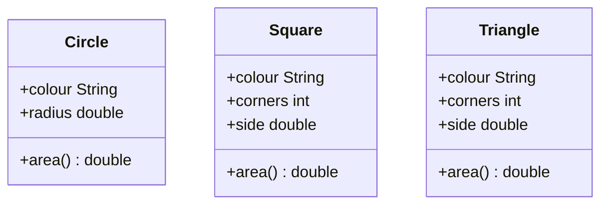
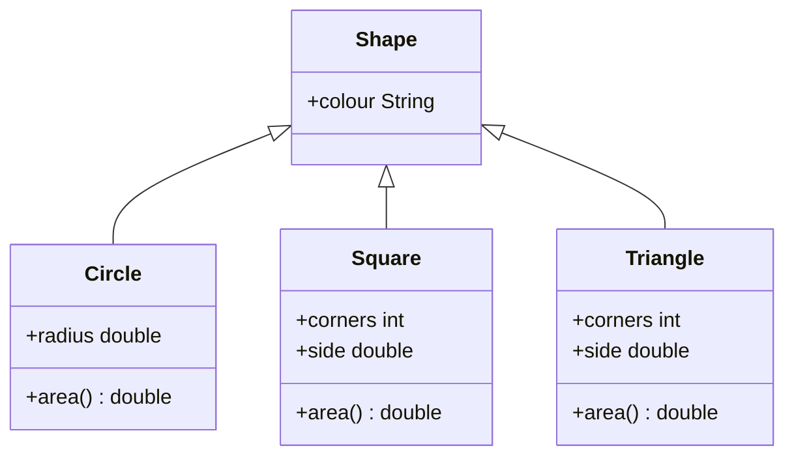
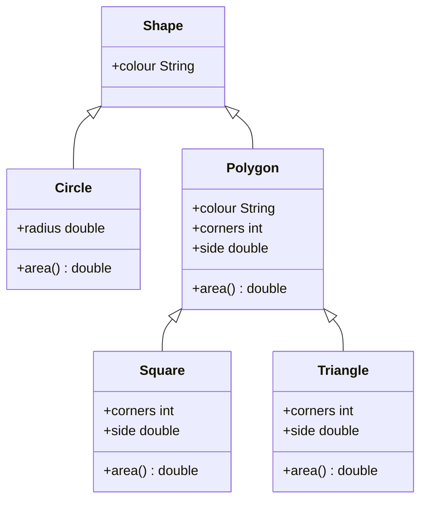
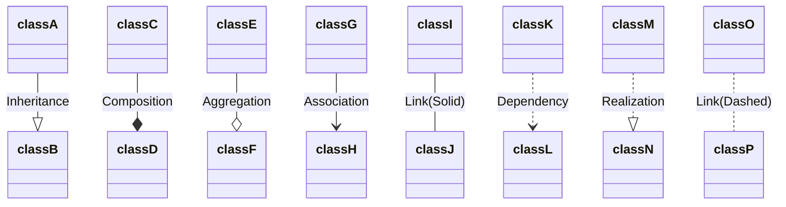
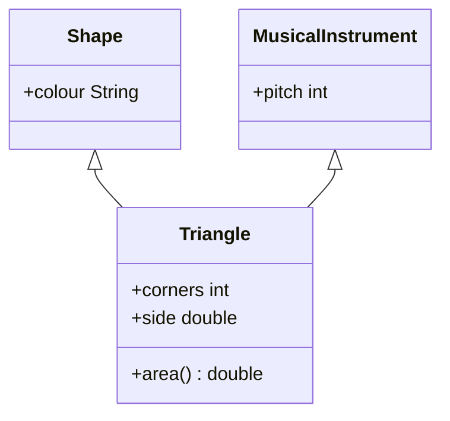

## Inheritance
This is a mechanism of creating a new (**sub**)class based on an existing (**super**)class, retaining a similar implementation.

This allows the following two:

* **Abstraction** - It allows to express an "is-a" relationship. Every instance of the subclass is also and instance of the superclass.
* **Code re-use** - A subclass inherits methods/attributes and only needs to implement what's new.

### Shapes Example
Our existing example was left with the following classes:



We can make this into a super-class of `Shape` buy reassigning redundant variables:



You could also make an additional intermediate class:



This tree is called a **class hierarchy**
{:.info}



## Java Syntax for Subclass Definitions
The Java keyword `extends` is used to specify the subclass/superclass relationship in class definitions.

```java
public class Triangle extends Polygon {
	// public int colour;	// inherited from Shape
	// public int corners;	// inherited from Polygon
	public double side;	// only in Triangle
	public double area; () {...}
}
```

### Single vs. Multiple Inheritance



In Java this is not possible, every class has exactly one superclass, with the exception of `Object`.

The exception is because `Object` is the root class, meaning every class is a sub-class of `Object`.
{:.info}

### What is Inherited?
A subclass inherits all `public` or `protected` members of its superclass. This includes:

* Attributes 
* Methods

This does not include **constructor methods** as they are not members of the super-class.
{:.warning}

#### `protected`
This is *similar* to `private` fields or methods but they cannot be accessed from outside an instance directly.

A `protected` field or method is inherited whereas a `private` identifier is only accessible in the class where it is defined.

In UML diagrams, `#` depicts `protected` class members.
{:.info}

## Uses of Inheritance

* Inheritance can introduce more abstraction in the code.
* It enhances core re-use.
* It improves the code readability.
* Properly applied, inheritance can reduce software maintenance costs.