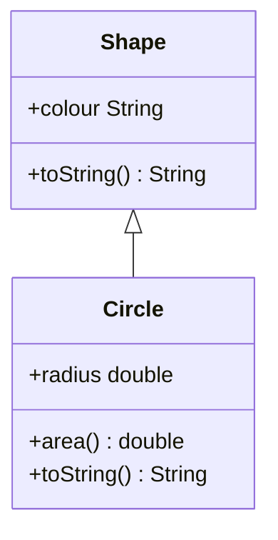

## Class Hierarchy = Type Hierarchy
Every class defines a data type.

* Subclasses therefore define sub-types.

### Example
Every circle is also a shape and thus can be assigned to a variable of type `Shape`.



```java
Shape s = new Circle();
s.colour = "red";
s.radius = 2.0; // this will fail 
s.to.String(); // this will call Circle.toString()
```

### Assigning Variables Between Subclasses

```java
Circle c = new Circle("red");
Triangle t = new Triangle ("blue");

Shape s = c; // makes a new shape initialised to c
System.out.println(s); // calls s.toString() from circle

s = t; // reassigns to triangle
System.out.println(s); // calls s.toString() from triangle
```

You can see that the `Shape` `s` inherits the methods from it's assignment when assigned a variable of a subclass.
{:.info}

## Type Casting
This is telling the compiler that an object is from a particular subclass and not of a superclass.

```java
Shape s = new Circle();
Circle c = s; // will fail as not every Shape is Circle
Circle c = (Circle)s; // will pass as we know s is Circle
```