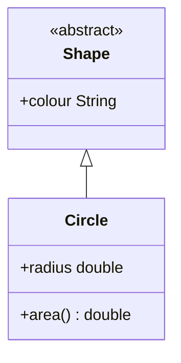

We can stop instantiations of certain superclasses by making them **abstract**:



The name of this class should be in *italics*. If it is abstract.
{:.info}

I have used an annotation here which is also acceptable.
{:.info}

## Code Example

```java
public abstract class Shape {
	public String colour;
}
```

```java
public class Circle extends Shape {
	public double radius;
	public double area() {
		return (radius * radius) * Math.PI;
	}
}
```

```java
Shape s = new Circle();
Shape s = new Shape(); // not possible as Shape is abstract
```

## Abstract Classes

* Cannot be instantiated.
* Can be **extended** and concrete (non-abstract) subclasses can be.

## Abstract Methods

* Do not provide a full implementation.
* They have to be overrode by subclasses.

### Example

```java
public abstract class Shape {
	public String colour;
	public abstract double area();
	public String report() {
		return "My area is " + area();
	}
}
```

By stating `abstract` on the area we say that this method must be overrode by subclasses.
{:.info}

You can also call abstract methods before they are defined.
{:.info}

```java
public class Circle extends Shape {
	public double radius;
	public double area() {
		return (radius * radius) * Math.PI;
	}
}
```

```java
Shape s = new Circle();
double a = s.area();
double a = ((Circle) s).area();
String r = s.report();
```

If we implement an abstract method for `Shape.area` then the second line will work. If not we will have to type-cast like in the third line.

## Summary
There are two good reasons for making a class `abstract:

1. To prevent it from being instantiated.
1. To enforce that concrete (instantiable) subclasses override.