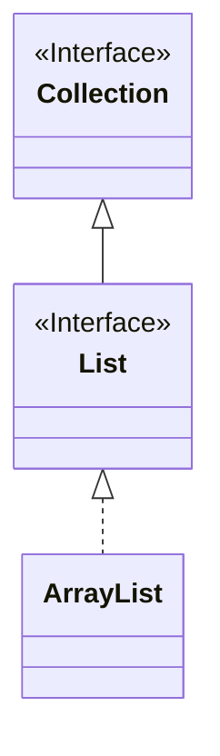
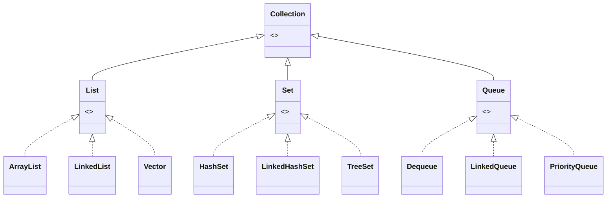

Collections are containers to store objects:

* They are parameterised by a base type.
* They can be dynamically resized.
* They can store and access content in different ways.

## Example - List of Strings

```java
import java.util.*;
List<String> customers;
customers = new ArrayList<String>();

customers.add("Ms. X");
customers.add("Mr. Y");
customers.add("Mx. Z");

int count = customers.size();
String next = customers.get(2);
```

This shows that we can get an element from a list of strings using `x.get()` and the size of a list with `x.size()`.
{:.info}

From this code we can make the following UML diagram:



This is to say that a `List` is a type of `Collection` and `ArrayList` is an implementation of a `List`.

This is an example of **generics**/**parameterised types** as you can change `String` to another object.
{:.info}

## Generics
You should be careful when using generics as they only accept objects and **not** primitives/base-types. 

You must use a wrapper class such as `Integer` instead of `int` to overcome this.

## Inside `java.util`



## Stacks

```java
Stack<Integer> st = new Stack<Integer>();

// push to the stack
st.push(12);
st.push(-1);
st.push(10);
System.out.println(st);

// pop the topmost stack element
int x = st.pop();
```

You can also call the `size` method from `Collection` to find the size of a stack.
{:.info}

## Maps

* Store (`key`, `value`) pairs.
* Have two parameters (`key type`, `value type`).

A useful implementation is `java.util.HashMap`.

* `HashMap<K,V>` requires that `K.hashCode()` exists.

### HashMap Example

```java
// create a mapping from strings to integers.
Map<String, Integer> wc = new HashMap<String, Integer>();

// store a (key, value) pair
wc.put("place", 3);

// access the value associated with a key
int number = wc.get("place");

// check if key has a value
bool contains = wc.containsKey("and");

// remove some pair completely
wc.remove("the");
```

`Map` is the interface and `HashMap` is the class that implements that interface.
{:.info}

## Why Use Collections
To utilise established and well-tested implementations from common algorithmic data structures and tasks.

* Avoid linked lists.
* Maximised code-reuse.
* Ensure inter-operability.

It is always best to use the standard library if an implementation exists.
{:.info}