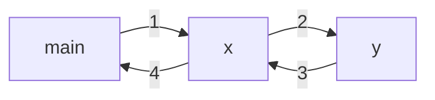
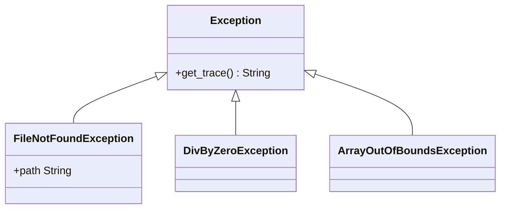
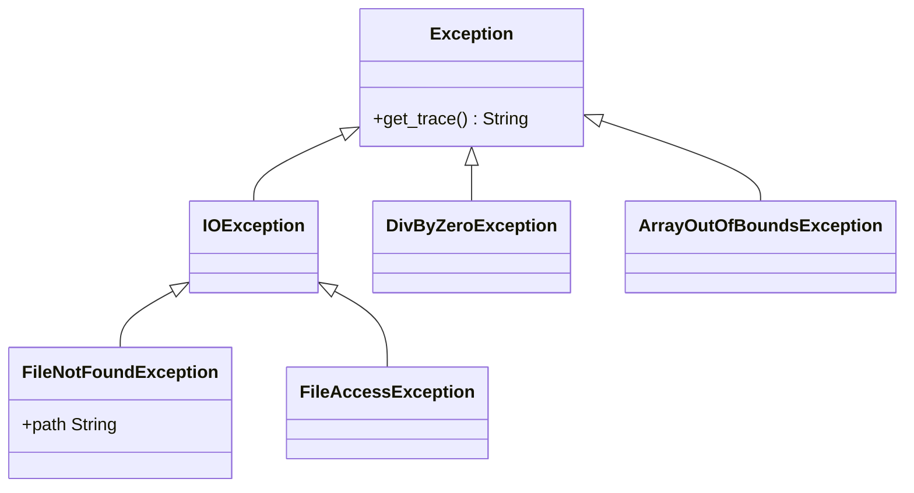

## Normal Program Flow
In normal program flow, one subroutine will call another while the original is put on hold:



This is called the **call stack**.
{:.info}

### Errors
There are several ways to handle errors if they occur in the call stack.

* Account for all possible errors in the function that you **call**.
* Pretend that the error didn't happen and continue with the **calling** function.
* Have the **called** function return an error code.
* Have the called function **raise an exception**.
	* This reports that an anomaly has occurred.
	* If this is the case the interpreter will execute the **exception handler** from the **calling** function.
		* If there is no exception handler in the **calling** function we look further up the call stack until one or none is found.

## Exception Handling

* This method of error handling standardised error handing.
	* Compiler support.
* Clean separation of error handling and normal code.

There are **two** aspects to exception handling:

* To report an anomaly you **raise** or **throw** and exception.
* To deal with possible exceptions, define suitable **handler**.

### Common Pattern

```java
try {
	do stuff;	// errors may happen
}
catch exception {
	deal with it;	// handler
}
```

The exception could have the following effects:

* Report and re-throw.
* Log and continue.

### Exception handling in OOP

Exceptions are objects.
{:.warning}

When an anomaly occurs an `Exception` object is created:

* It represents the situation and has relevant info.
	* As attributes.
* The environment looks for a handler based on its type.

### Exception Classes



You could also have a deeper hierarchy for particular types of exception:



### Extended Pattern
This is a pattern that used multiple exception handlers from different classes:

```java
try {
	// open a file for writing
}
catch (FileNotFoundException e) {
	// complain that e.path was invalid
}
catch (FileAccessException e) {
	// complain that file is read-only
}
```