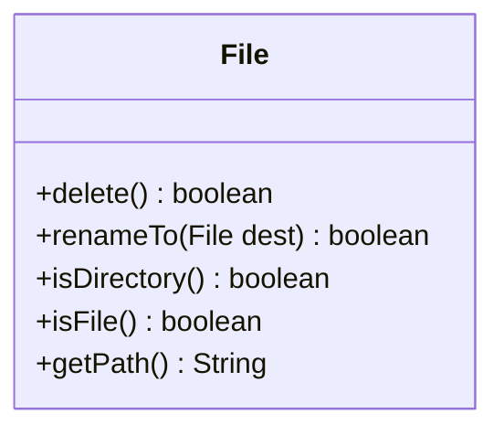

## File Handles
This is an object that represents a file on the disk (a path in the file system).

`java.io.File` is used to represent files and provides methods to interact with the file system.

You can call the following methods on a `File`:

* Deleting
* Renaming
* Check if it exists:
	* Check if it is a file
	* Check if it is a folder
	


## Renaming

```java
import java.io.File;
...

File f1 = new File("output.txt");
File f2 = new File("stuff.out");
if(f1.rename.To(f2)) {
	System.out.println("File rename successful");
else {
	System.out.println("File rename failed");
}
```

This is not handled using exceptions.
{:.warning}

### Dealing with Path Differences
Windows uses `\` and Unix uses `/` for directory separators.

To remove this use you can use the `separator` attribute of the `File` class:

```java
import java.io.File;

String sep = File.separator;
File fh = new File("data"+ sep + "output.txt");
```

This will input the appropriate separator for the file-system.

## Reading a File with `FileReader`
The following code will read in a file one character at a time and print it out:

```java
File fileHandler = new File("this-file.txt");
FileReader fileReader = new FileReader(fileHandler);

int i;
while((i = fileReader.read()) != -1) {
	char c = (char)i;
	System.out.print(c);
}
```

`.read()` gets the contents one character at a time.
{:.info}

Opening a file that doesn't exist will give an `IOException`. This must be done in a `try` `catch` block.
{:.error}