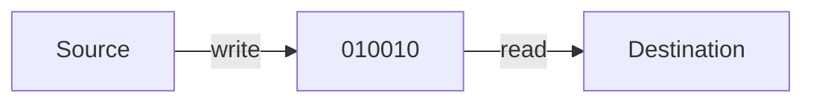
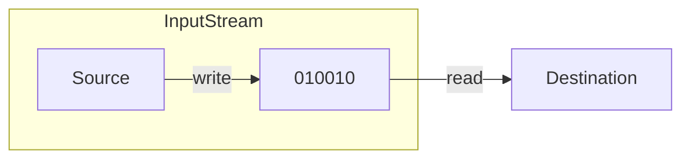
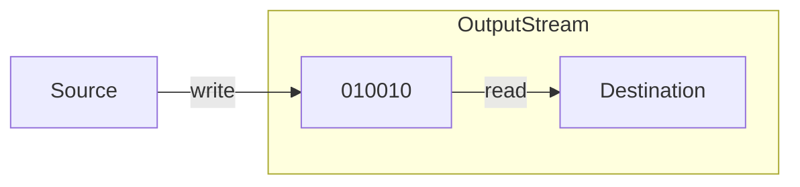
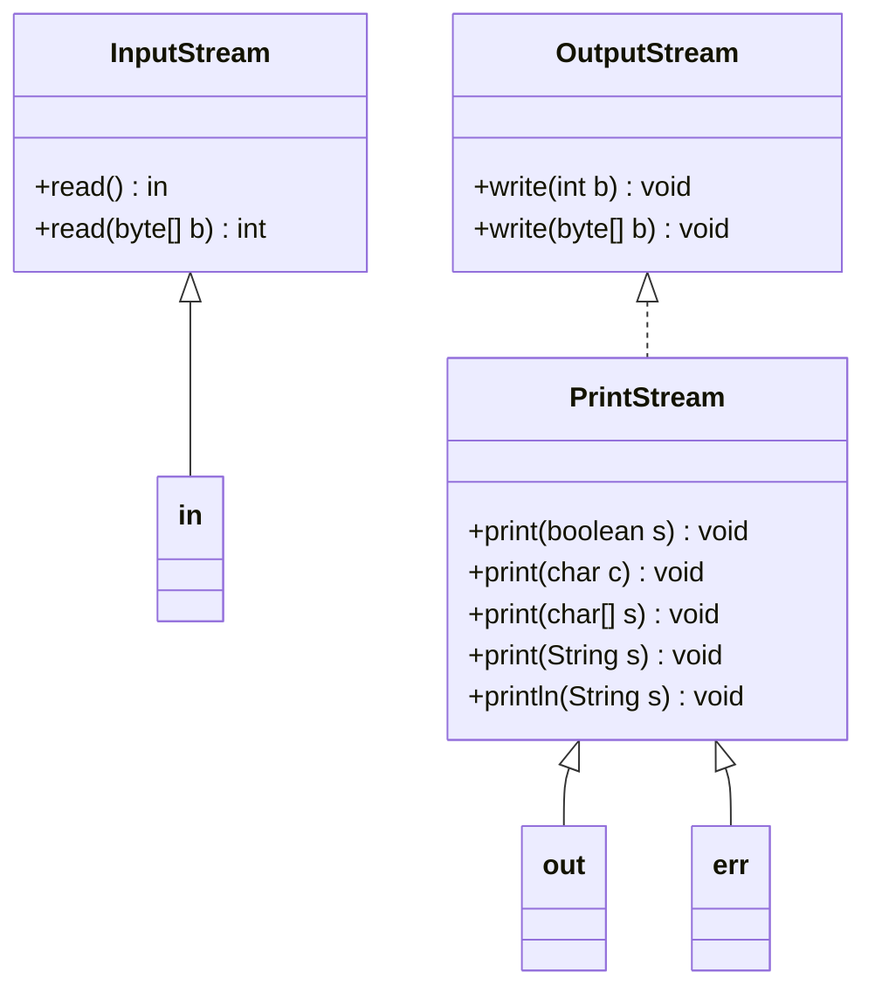

Streams are an endless flow of data from a **source** to a **destination**:

Streams are **objects**. There are different classes for various types of sources and destinations.
{:.warning}

## Streams as Object
The standard library `java.io` implements streams in an object-oriented way.

The `InputStream` class is **read** from:

The `OutputStream` class is **written** to:

## Stream Contents
There are several basic types of data that can be transported by a stream:

* Basic `Input`/`OutputStreams` are **byte-based**:
	* You can read/write a byte = 8 bits.
	* For example, `public int InputStream.read()` reads the next bytes of datat from the input stream.
* `java.io.Reader`/`Writer` are based on characters:
	* `char`, or `Character`, store UTF-16 encoded characters.
	* `public int Reader.read()` reads the next character.
	
		This reads an `int` as the primitive type `char` is syntactic sugar for a 16-bit integer. This means that you need to cast the return type into a `(char)`.
		{:.info}
* `ObjectInputStream` and `ObjectOutputStream` represent streams that can send whole objects.
	* Works as long as the object belongs to a class that implements the `Serialisable` interface.
	* `public Object ObjectInputStream.readObject()` reads the next object.

## Standard Streams
The standard streams include:

* `stdin`
* `stdout`
* `stderr`

These are represented in the following classes:

`in`, `out` and `err` in this diagram are representing the objects:

* `System.in`
* `System.out`
* `System.err`

## Java I/O Summary

* All of Java's input/output is based on Streams
* `InputStream`, `OutputStream`:
	* Based on bytes.
* `Reader`, `Writer`:
	* Based on characters.
* There are many derived types in `java.io`:
	* File Access
	* Network Access