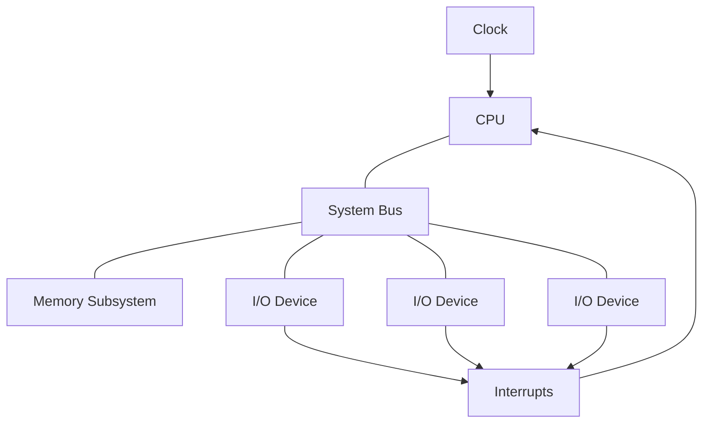

## The Von Neumann Model
1. The input device is used to load programs and data into memory.
1. The CPU fetches program instructions from memory, processing the data and generating results.
1. The results are sent to an output device.

## Systems
The CPU is connected to the rest of the components by the system bus and is driven by the clock. If any component wants to interrupt the CPU's current task then it can send an interrupt. 

## CPU
The CPU fetches instructions from main memory and executes them. 

The instructions it executes are very basic:

* Move a value.
* Add 2 numbers.

Different types of CPU have different instruction sets.

In this course we will use intel x86 assembly.
{:.info}

The internal activity of the CPU is synchronised to a fast clock. 

## System Bus
The bus is a collection of connections allowing communication between the various components on the motherboard.

This is much simpler than a **point-to-point** system as all components share the same connection.

The sender places an item/message on the bus, to be taken off by the receiver.

The bus may be split into:

* Address lines
	* Used to specify a memory address to be accessed.
* Data Lines
	* Used to carry a value to be transferred.
* Control Lines
	* Tell the receiver what to do.

In modern systems there are several interconnected buses (SATA, PCIe, USB).

If multiple components want to communicate at the same time then you run into an issue of **bus contention**.

## I/O Devices
These include any device that can input or output data to the system. These can include peripherals or sensors inside the system.

To find whether devices are ready the following are options:

* Polling
	* Inefficient
	* Not a good use of CPU time.
* Interrupts
	* The device sends a signal when it is ready.
	* An **interrupt handler** is invoked by the interrupt.
	
## Memory
All programs and data must be converted to binary form and brought into the computer memory prior to being processed. (**stored program concept**)

Memory can be:

* RAM
	* Volatile random access memory.
* ROM
	* Non-volatile read only memory.
	* Used to hold system boot code.
* Flash
	* Read and write, non-volatile.
	
Can be thought of as a sequence of words. A **word** is **4 bytes** of memory. (32-bit)

Each word holds its own content and has its own unique address.

Most modern systems are bytes addressable.

### Words, Bytes & Bits
* A word is formed from one or more bytes.

* Individual bits are zero indexed from right to left.

* Bit zero may be referred to as the **least significant bit** (lsb).
	* At the other end is the **msb**.