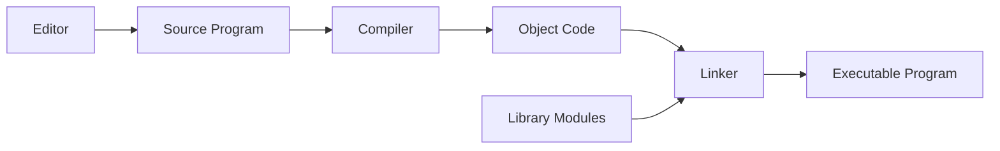

## A Typical Instruction Set
* Data Transfer
	* Load, store, push, pop.
* Arithmetic
	* Add, subtract, multiply, divide.
* Logical
	* AND, OR, NOT, shift rotate.
* Test and Compare
* Control Flow
	* Conditional jump, unconditional jump, subroutine call and return.
* Other

All high-level language code must be translated into these basic machine code instructions.
{:.info}

The difference between machine code and assembly are that machine code are the bytes that the CPU reads. Assembly is 1 to 1 with machine code but gives the instructions names and allows you to give memory addresses names.

## Instruction Format
### Opcode
Specifies the operation to be performed.

### Operand Specifiers
The locations of source operands and destinations for results.

Often one of the operand will act as both source and destination.

## Addressing Modes
The locations of operands are specified using addressing modes:

* Immediate
	* The operand value is encoded directly into the instruction.
* Register
	* The operand resides in a CPU register.
* Direct
	* The operand resides in main memory; the instruction encodes its address.
* Register Indirect
	* The instruction specifies a register, which in turn holds the address of the operand.
	
## Generating Instructions
The machine code for high level languages is made by a compiler.

### HLL Translation Process

The compiler analyses the **source code**, checks for certain types of error, and generate equivalent **object code**.

The user's code is integrated with pre-compiled library routines by a **linker** to form final the executable.

A single HLL statement may convert to many low-level instructions.

This process allows making human readable code that can run on the CPU.
{:.info}