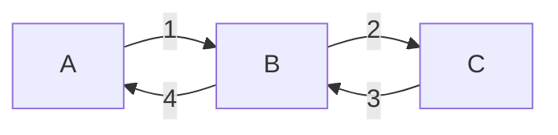

## The CALL Instruction
`CALL` does the following:

1. Records the current value of the IP as the **return address**.
1. Puts the required subroutine address into the IP, so the next instruction to be executed is the first instruction of the subroutine.

## The RET Instruction
`RET` retrieves the stored return address and puts it back into the IP, causing execution to return to the instruction after the `CALL`.

## Nested Calls
The deeper the nesting of subroutines calls, the more space we need to store all return addresses.

Ideally, we'd like to stack return addresses as calls are made, and unstack them in reverse order on return:

### Using a Stack
`CALL` does the following:

1. Records the current value of the IP as the **return address**; puts it on top of the stack.
1. Puts the required subroutine address into the IP, so the next instruction to be executed is the first instruction of the subroutine.

`RET` does the following:

1. Takes the address on top of the stack and puts it into the IP.

