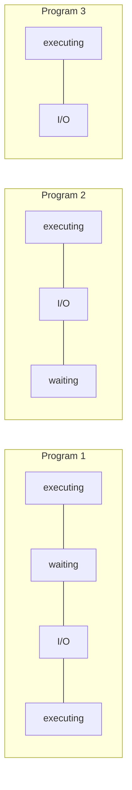
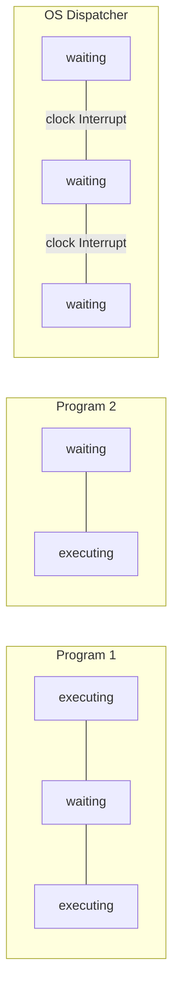

Largely driven by desire to do something useful when a program cannot continue. We want the CPU to be busy all the time.

## Early Systems

* Job loaded from punched cards or tape, output to printer.
* Job may include loading compiler, assembler, linker, data.
* CPU idle for much of the time.
* Jobs run sequentially, from start to finish.

## Batch Systems

* Job passed to human operator.
* Operator groups jobs into batches with similar characteristics, e.g. all programs using same compiler.
* More efficient use of resources (still lots of wasted time waiting for a person).

## Multiprogramming
* Load several programs into memory simultaneously, all sharing single CPU.
* When running program cannot continue (e.g. waiting for I/O), switch to another.
* Hence, I/O and computation overlap.

### Sharing the CPU

Problems encountered with compute-bound programs and I/O-bound programs.
{:.warning}

## Multi-Access (Time-Sharing)
An extension of multiprogramming.

CPU is switched rapidly between processes to give illusion of uninterrupted execution in parallel (multitasking).

* Users can interact with programs.
* Users see their own ‘virtual machine’.
* Resources (printers, disks etc.) are shared, but this is largely transparent.

### Time-sharing the CPU

Each running program is allocated a fixed time
slice (quantum).
{:.info}