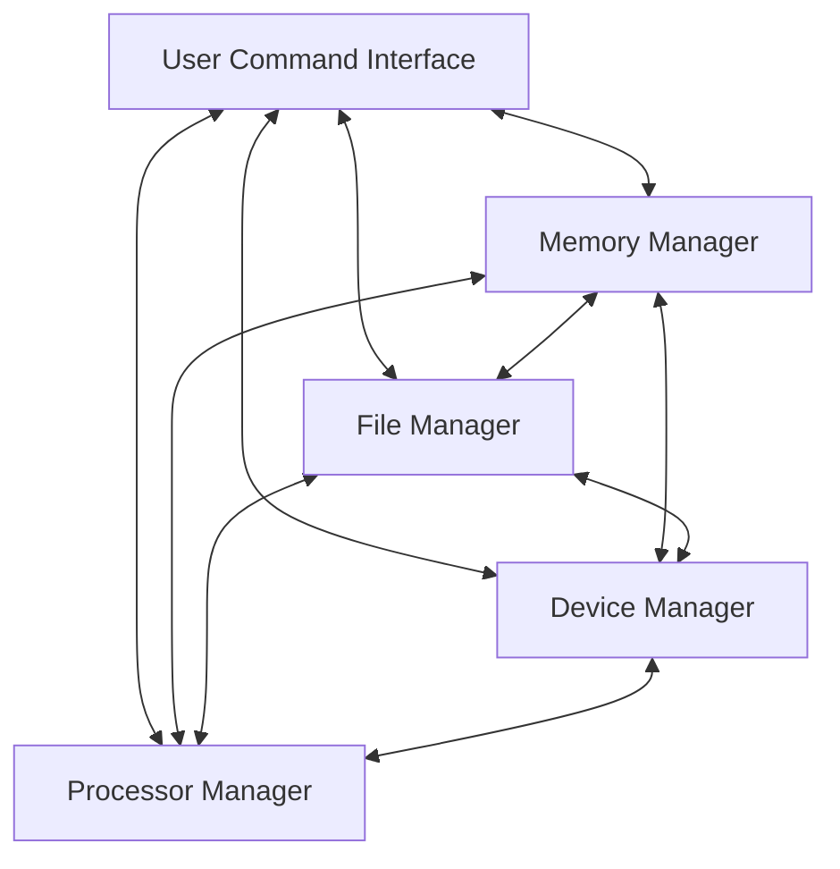

## Operating Systems
The purpose of operating systems is to:

* Turn base hardware into a usable machine.
* Make efficient use of available resources, particularly when they are shared.

### Abstract of Components

Everything can talk to every other thing.
{:.info}

All but the UCI are the four essential managers of every OS, each working with the others to perform its task:

* Memory Manager
* Processor Manager
* Device Manager
* File Manager

Network functions were not always an integral part of an OS.
{:.warning}

* A Network Manager can be added to handle networking tasks.
* User Command Interface
	* How users interact with the OS by issuing commands.

### Manager Functions
Each subsystem manager must perform the following tasks:

* Continuous monitoring of resources.
* Enforcement of policies that determine who gets what resources, when they get them and how much.
* Allocation of resource when it is appropriate.
* De-allocation of resources when finished.