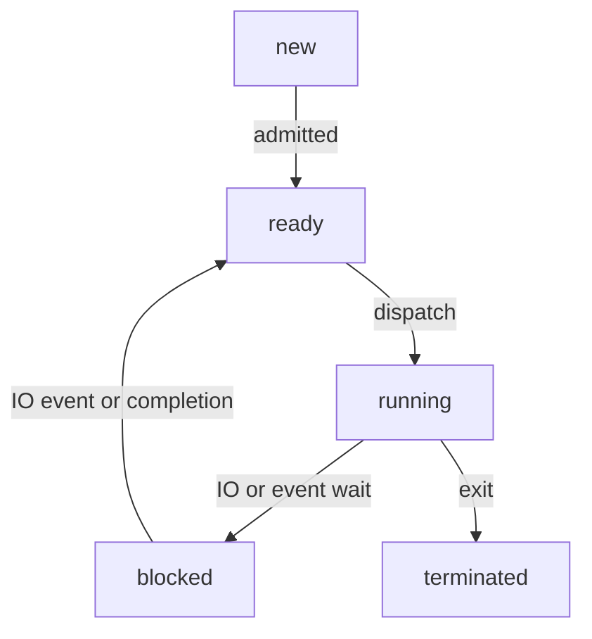

This lecture goes more in depth on the tasks of the **process manager**.

## Processes
We have seen that a process is the basic unit of work in a computer system. The OS processor manager is responsible for every aspect of a process.

It must:

* Allocate initial memory for the process.
* Continue to ensure that memory is available to the process, as it is needed.
* Assign the necessary files and I/O devices.
* Provide stack memory.
* Schedule CPU execution time for the process.
* Restore the system facilities and resources when a process is completed.

### Process Descriptors
For each process, the OS kernel maintains a descriptor or **process control block** (PCB)

PCB contains info like:

* Unique process ID
* User ID of process owner
* Process state
* Position in memory
* Accounting stats
	* Time used, etc.
* Resources allocated 
	* Open files, devices, etc.
* Register values
	* Instruction pointer, etc.

### Process states
A process goes through possibly many changes of state during its lifetime. The OS must keep track of these, and update the PCB accordingly.

A process could be in the following states:

* Running
	* On a uni-processor machine, only one process can be executing at any time.
	* May be interrupted at end of time-slice if no I/O requests or system calls performed.
* Ready
	* Refers to a process that is able to run, but does not currently have the CPU.
* Waiting/Blocked
	* Refers to a process that is unable to continue, even if granted the CPU.

#### State Changes
These states can be shown in the following loop:

