In any mutliprogramming situation, processes muyst be scheduled. 

The scheduler selects the next job from the ready queue:

* Determines which process gets the CPU, when and for how long. Also when processing should be interrupted.
* Various algorithms can be used

Scheduling algorithms may be **preemptive** or **non-preemptive**

## Non-Preemptive Scheduling
Once CPU has been allocated to a process the process keeps it until it is released upon termination of the process or by switching to the waiting state.

## Preemptive Scheduling
Preemptive algorithms are able to stop what is currently running on the CPU to swap another process on.

## Scheduling Policies
Several criteria could be considered:

* **Maximise Throughput**
	* Complete as many processes as possible in a given amount of time.
* **Minimise Response Time**
	* Minimise amount of time it takes from when a request was submitted until the first response is produced.
* **Minimise Turnaround Time**
	* Move entire processes in and out of the system quickly.
* **Minimise Waiting Time**
	* Minimise amount of time a process spends waiting in the ready queue.
* **Maximise CPU Efficiency**
	* Keeps the CPU constantly busy by running CPU bound processes and not IO bound ones.
* **Ensure Fairness**
	* Give every process an equal amount of CPU and IO time by not favouring only one regardless of its characteristics.

Often applying multiple of these will create conflictions.
{:.info}

## Scheduling Algorithms
The scheduler relies an algorithms that are based on a specific policy to allocate the CPU.

### First Come, First Served (FCFS)
* Uses a **first-in-first-out** (FIFO) queue.
* **Non-preemptive** algorithm that deals with jobs according to their arrival time.
* If the process is **blocking** then the process is returned to the **back of the queue**.

The process control block (PCB) of any new processes is linked to its place in the queue.
{:.info}

#### Example
Suppose we have three processes arriving in the  following order:

* $P_1$ with CPU burst of 13 milliseconds.
* $P_2$ with CPU burst of 5 milliseconds.
* $P_3$ with CPU burst of 1 millisecond.

The burst time is the amount of time before the process blocks or terminates. You can have multiple bursts.
{:.info}

Using the FCFS algorithm we can view the result as a Gantt chart:

```mermaid
gantt

dateformat S
axisformat %S

P1: a, 0, 13s
P2: b, after a, 5s
P3: c, after b, 1s
```

From this we can calculate the average wait time as:

$$\frac{0+13+18}{3}=10.3\text{ms}$$