## FCFS
### Different Arrival Time
What if the order of arrival changed to the following:

```mermaid
gantt

dateformat S
axisformat %S


P2: a, 0, 5s
P3: b, after a, 1s
P1: c, after b, 13s
```

This would give the following average wait time:

&#92;[\frac{0+5+6}{3}=3.7\text{ms}&#92;]

This is significantly shorter than the original 10.3ms.

### Advantages
* Very easy to implement.

### Disadvantages
* The average wait time is generally not minimal and can vary substantially.
* Unacceptable for use in time-sharing systems as each user requires a share of the CPU at regular intervals.
	
	Processes cannot be allowed to keep the CPU for an extended length of time as this dramatically reduces system performance.
	{:.warning}
	
## Shortest Job First
* **Non-preemptive** algorithm that deals with processes according to their CPU burst time.

* When the CPU becomes available it is assigned the next process that has the smallest burst time.
	* If two processes have the same burst time, FCFS is used to determine which one gets the CPU.
	
### Example
Suppose we have the following four processes:

* &#92;(P_1&#92;) with CPU burst of 5 milliseconds.
* &#92;(P_2&#92;) with CPU burst of 9 milliseconds.
* &#92;(P_3&#92;) with CPU burst of 6 millisecond.
* &#92;(P_4&#92;) with CPU burst of 3 millisecond.

Using the SJF algorithm we can schedule the processes as viewed in the following Gantt chart:

```mermaid
gantt

dateformat S
axisformat %S

P4: a, 0, 3s
P1: b, after a, 5s
P3: c, after b, 6s
P2: d, after c, 9s
```

This gives the following wait times:

* 3 milliseconds for &#92;(P_1&#92;).
* 14 milliseconds for &#92;(P_2&#92;).
* 8 milliseconds for &#92;(P_3&#92;).
* 0 milliseconds for &#92;(P_4&#92;).

Thus, the average wait time is:

&#92;[\frac{3+14+8+0}{4}=6.25\text{ms}&#92;]

### FCFS Comparison
If we had used FCFS the wait time would be:

&#92;[\frac{0+5+14+20}{4}=9.75\text{ms}&#92;]

We can see that this algorithm gives shorter wait times compared to FCFS.
{:.info}

### Advantages
* Reduces the overall average waiting time.

	Is provably optimal in that it gives the minimal average waiting time.
	{:.info}

### Disadvantages
* Can lead to starvation.
* May be difficult to estimate execution times.
	* Often relies on previous history, which may not always be available.
