## Shortest Remaining Time First
* A **preemptive** version of the shortest job first algorithm.
	* Based on the **remaining** time rather than the **burst** time.
* CPU is allocated to the job that is closest to being completed.
* Can be preempted if there is a newer job in the ready queue that has a shorter completion time.

## Priority Scheduling
This is an algorithm that gives preferential treatment to important jobs.

* Each process is associated with a priority and the one with the highest priority is granted the CPU.
* **Equal** priority processes are scheduled in **FCFS** order.
	* SJF is a **special case** of the general priority scheduling algorithm.
	
Priorities can be assigned to processes by a system administrator or determined by the *processor manager* on characteristics such as:

* Memory requirements.
* Peripheral devices required.
* Total CPU time.
* Amount of time already spent processing.

### Example
Suppose we have five processes all arriving in the following order:

* &#92;(P_1&#92;) with CPU burst of 9 milliseconds, priority 3.
* &#92;(P_2&#92;) with CPU burst of 2 milliseconds, priority 2.
* &#92;(P_3&#92;) with CPU burst of 1 milliseconds, priority 5.
* &#92;(P_4&#92;) with CPU burst of 5 milliseconds, priority 3.
* &#92;(P_5&#92;) with CPU burst of 6 milliseconds, priority 4.

Assuming that **0 represents the lowest** priority, using the priority algorithm we can view the result as the following Gantt chart:

```mermaid
gantt

dateformat S
axisformat %S

P3: a, 0, 1s
P5: b, after a, 6s
P1: c, after b, 9s
P4: d, after c, 5s
P2: e, after d, 2s
```

This gives the following wait times:

* 7 milliseconds for &#92;(P_1&#92;).
* 21 milliseconds for &#92;(P_2&#92;).
* 0 milliseconds for &#92;(P_3&#92;).
* 16 milliseconds for &#92;(P_4&#92;).
* 1 milliseconds for &#92;(P_5&#92;).

Thus, the average wait time is:

&#92;[\frac{7+21+0+16+1}{5}=9\text{ms}&#92;]

### Advantages

* Simple algorithm.
* Important jobs are dealt with quickly.
* Can have a preemptive version.

### Disadvantages:

* Process starvation can be a problem.

	This can be alleviated through the **aging** technique. This gradually increases the priority of process that have been waiting a long time.
	{:.info}

### Windows
Priorities are in a range of 0-31.

A new process is given one of 6 base priorities:

* `IDLE` (4)
* `BELOW_NORMAL` (6)
* `NORMAL` (8) (Default)
* `ABOVE_NORMAL` (10)
* `HIGH` (13)
* `REALTIME` (24)

Normal processes can receive a **priority boost** when brought into the foreground.

A process can be boosted when it receives input or an event for which it is waiting.

For a boosted process, the priority is reduced by one level at the end of each time slice, until its base level is reached.
