**Preemptive** algorithm that gives a set CPU time to all active processes.

* Similar to FCFS, but allows for preemption by switching between processes.
* Ready queue is treated as circular. The CPU allocates each process a **time-slice**.

**Time Quantum** - A small unit of time, varying anywhere between 10 and 100 milliseconds.

**Ready Queue** - Treated as a FIFO queue.

CPU scheduler selects the process at the font of the queue, sets the timer to the time quantum and grants the CPU to this process.

## Edge Cases

1. If the process's CPU burst time is **less** than the specified time quantum, it will **release** the CPU upon completion.
	* The scheduler will then proceed to the next process at the front of the ready queue.
1. If the process's CPU burst time is **more** than the specified time quantum, the timer will expire and execute an **interrupt** and execute a **context switch**.
	* The interrupted process is added to the end of the ready queue.
	* The scheduler will then proceed to the next process at the front to the ready queue.
	
## Example
Suppose we have three processes all arriving at time 0 and having CPU burst times as follows:

* $P_1$ with CPU burst of 20 milliseconds.
* $P_2$ with CPU burst of 3 milliseconds.
* $P_3$ with CPU burst of 3 milliseconds.

Supposing a time quantum of **4 milliseconds**, we can view the results as the following Gantt chart:

```mermaid
gantt

dateformat S
axisformat %S

P1: a, 0, 4s
P2: b, after a, 3s
P3: c, after b, 3s
P1: d, after c, 4s
P1: e, after d, 4s
P1: f, after e, 4s
P1: g, after f, 4s
```

Generally, you wouldn't have one process taking many quantum due to the large number of processes.
{:info}

Thus, the average wait time is:

$$\frac{(10-4)+4+7}{3}=5.66\text{ms}$$

The $10-4$ represents the 10ms wait time for $P_1$ take the time from it's first run.
{:.info}

## Advantages

* Easy to implement as it is not based on characteristics of processes.
	* Commonly used in interactive/time-sharing systems due to its preemptive abilities.
* Allocates CPU fairly.

## Disadvantages
Performance depends heavily on selection of a good time quantum:
	
* If time quantum is too large, RR reduces to the FCFS algorithm.
* If time quantum is too small, overhead increases due to the amount of context switching.

Real operating systems use a combinations of several scheduling algorithms. Windows uses priority round robin.
{:.info}