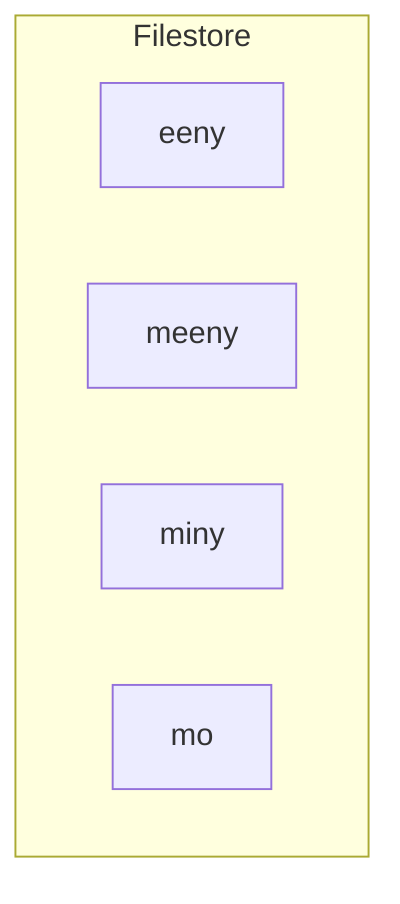
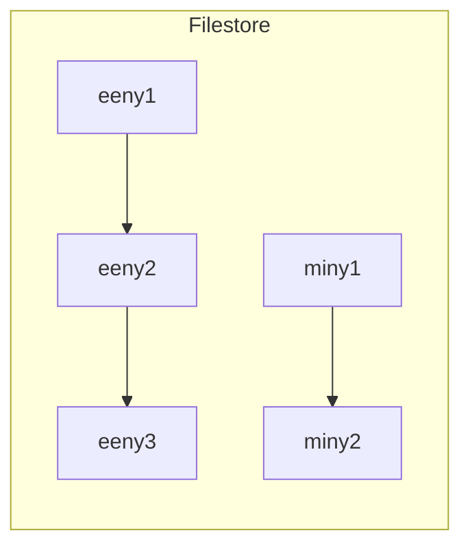

## Contiguous Allocation
Each file is allocated a contiguous set of blocks.

Location of information consists simply of:

* Start Block
* Number of blocks.

### Advantages
* Fast for both **sequential** and **direct** access.

### Problems
* Fragmentation
	* May need regular compaction.
* Number of blocks to allocate.
* File growth.

## Linked Allocation
Each block contains a pointer to the next.

These blocks could be anywhere on the disk.
{:.info}

Could be improved by allocating blocks in **clusters** but this worsens internal fragmentation.

### Advantages
* Easy to grow/shrink files.
* No Fragmentation.

### Problems
* Blocks are widely dispersed.
* Sequential access less efficient.
* Direct access even worse.
	* Requires &#92;(n&#92;) reads to get to block &#92;(n&#92;) (following the chain.
* Danger of pointer corruption.

## File Allocation Table
Block allocations are held in a table located at the start of the partition.

`-1` is the end of the list of blocks.
{:.info}

`0` indicates an unused block.
{:.info}

### Advantages
* All pointer info held in one place (separate from the data).
* Easier to protect.
* No need for separate free list.
* Direct access much more efficient.

### Problems
* May require drive head to shift constantly between the FAT and file blocks.
* FAT may become huge for large disks.

## Indexed Allocation
First block holds index to all other blocks in the file.

The **inode** is what points to the first block in a file.
{:.info}

### Advantages
* Each file's pointer info is held in one place.
* Very efficient for both sequential and direct access.

### Problems
* Blocks may still be widely dispersed.
* Can tun out of pointers for large files.
	* May have to chain several index blocks together.
	
### Example - NTFS
* Has a **master file table** (MFT) using a form of indexed allocation.
* Files under 1 block will be contained entirely within the MFT to save space.
