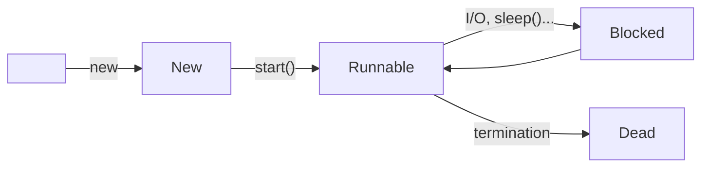

## Mathematical Example
Consider finding a single root using the quadratic formula:

$$x=\frac{-b+\sqrt{b^2-4ac}}{2a}$$

This can be split into several operations.
{:.info}

### Concurrent Operations
These operations don't rely on any other part of the expression.

1. $t_1=-b$
1. $t_2=b\times b$
1. $t_3=4\times a$
1. $t_4=2\times a$

### Serial Operations
These parts have prerequisites.

1. $t_5=t_3\times c$
1. $t_5=t_2-t_5$
1. $t_5=\sqrt{t_5}$
1. $t_5=t_1+t_5$
1. $x=\frac{t_5}{t_4}$

## Java Threads
When a Java program starts up, a single thread is always created for the program

JVM also has own threads for garbage collection, screen updates, event handling...
{:.info}

* New threads may be created by the programmer by extending the Thread class.
* Threads may be managed directly by kernel, or implemented at user level by a library.
	* Former is less efficient.
	* In latter, if one thread blocks, all threads will block.
	
### Java Thread Class

```java
public class Thread extends Object implements Runnable
```

* A `Thread` implements a `run()` method that defines what processing will be carried out during the `Thread`'s lifetime.
* Threads may be started within `main()` and run simultaneously, sharing variables, etc.

### Example

```java
class Worker1 extends Thread {
	public void run() {
		System.out.println(“I am a worker thread”);
	}
}
public class First {
	public static void main (String args[]) {
		Worker1 runner = new Worker1();
		runner.start();
		System.out.println(“I am the main thread”);
	}
}
```

This doesn't have a definite order. `Worker1` or `main` may get run first.
{:.warning}

#### Method
The class `Worker1` is derived from the `Thread` class and the work of the new thread is specified in the `run()` method.

1. In `main()` we create a new `Worker1` object.
1. Calling the `start()` method:
	* Allocates memory and initialises the new thread.
	* Causes the `run()` method to be called.
1. Original thread and new thread now run in parallel.

### Java Thread States



All threads capable of execution are in the runnable state.

This includes the currently executing thread.
{:.info}