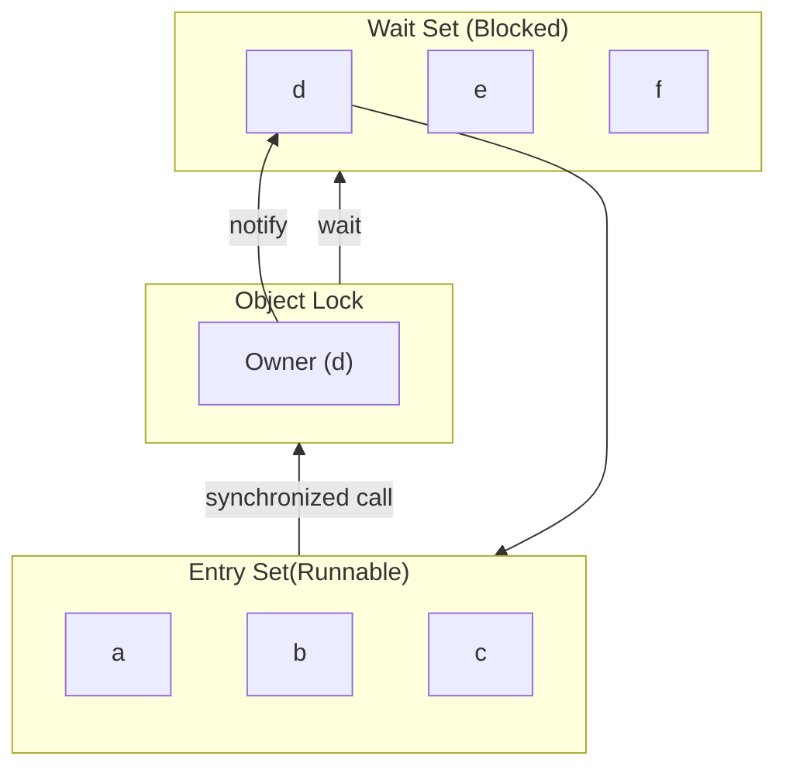

This method extends the example in the [last lecture]({{site.baseurl}}/).

Java uses the **American** spelling: `synchronized`.
{:.warning}

## Synchronised Method

```java
class Buffer {
	private int v;
	private volatile boolean empty = true;
	
	public synchronized void insert (int x) {
		while (!empty)
			;	// null loop
		empty = false;
		v = x;
	}
	public synchronized int remove() {
		while (empty)
			;	// null loop 
		empty = true;
		return v;
	}
}
```

Every object has a **lock** associated with it. 

1. When a thread called a `synchronized` method, it gains exclusive control of the lock.
1. All other threads calling `synchronized` methods on that object must idle in an **entry set**.
1. When the thread with control exits the `synchronized` method, the lock is released.
	* The JVM can then select an arbitrary thread from the entry set to be granted control of the block.

## Replace Spinlock with `wait()` and `notify()`

```java
class Buffer {
	private int v;
	private volatile boolean empty = true;
	
	public synchronized void insert (int x) {
		while (!empty) {
			try {
				wait();
			}
			catch (InterruptedException e) {}
		}
		empty = false;
		v = x;
		notify();
	}
	// similarly for remove()
}
```

* The `wait()` call:
	1. Stops thread execution.
	1. Moves the calling thread to the wait set.
* The `notify()` call:
	1. Moves an arbitrary thread from the wait set back to the entry set.
	1. Depends on particular JVM implementation.
* the `notifyAll()` call:
	1. Tells all thread in the wait set that a resource is available.
	1. Threads compete for access in the same way.
		
		The first one to call a `synchronized` method gets the access.
		{:.info}

## Entry & Wait Sets



## Key Java Multi-Threaded Concepts
The following concepts are useful for multi-threaded programs:

* `Thread` objects.
* `run()` method and the `start()` method call.
* `volatile` and `synchronized` keywords.
* `yeild()`, `wait()` and `notify()` method calls.