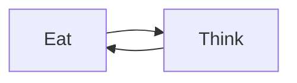

* The **producer-consumer** problem models a synchronisation environment in which processes with distinct roles have to coordinate access to a shared facility.

* The **dining philosophers** problem models an environment in which all processes have **identical roles**. Again coordinated access to shared facilities must be arranged.

## Premise
$n$ philosophers spend their time seated around a table going through a routine of:

Philosophers need nothing in order to think but, in order to eat a philosopher must use **two** items of cutlery (eg. 2 chopsticks).

However only $n$ chopsticks is provided:

* One between each philosopher around the table.

This means that if a philosopher is hungry but either neighbour is eating then they must wait until both chopsticks are available.

## Solution
Each philosopher has a unique **index value**:

* $\{0,1,2,3,4\}$

Similarly each chopstick is indexed from:

* $\{0,1,2,3,4\}$

The philosopher with index $k$ must be able to use both the chopsticks:

$$k\cap(k+1)\mod5$$

in order to eat

### Example
* $P_0$ needs $S_0$ and $S_1$
* $P_1$ needs $S_1$ and $S_2$
	
	...
* $P_4$ needs $S_4$ and $S_0$

This means that if $P_0$ is eating, then both $P_1$ and $P_4$ will have to wait for $P_0$'s sticks to be put down.

### Java Solution
The solution involves treating each chopstick as a shared resource in which access is enclosed in a critical region.

* This can be achieved via semaphores or mechanisms such as Java locks.