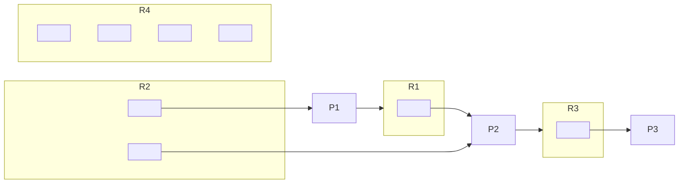
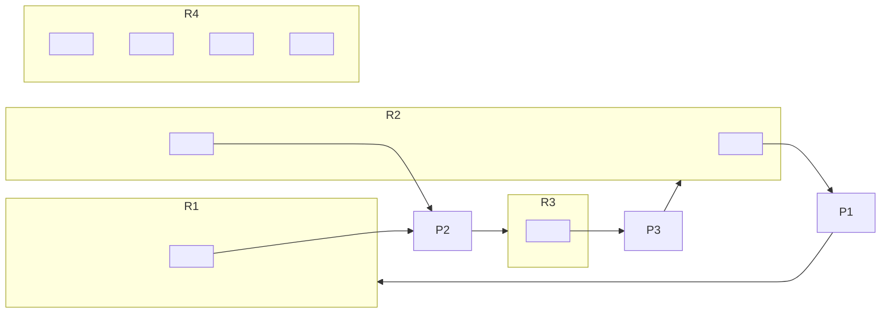

A set of processes is deadlocked if each process in the set is waiting for an event **only** another process in the set can case.

These events usually relate to resource allocation.
{:.info}

## Creating Deadlock
Deadlock will occur in the following simple situation:

1. Process $A$ is granted resource $X$ and then requests resource $Y$.
1. Process $B$ is granted resource $Y$ and then requests resource $X$.

* Both resources are **non-shareable**.
* Both resources are **non-preemptible**.
	
	They cannot be taken away from their owner process.
	{:.info}
	
## Resource Allocation Graphs
This includes:

* Set of processes.
* Set of resource types:
	* Each general type of shared resource.
	* Each instance of each type.
* Set of directed edges:
	* Request edge - From process to resource type.
	* Assignment edge - From resource instance to process.
	* Request edges are transformed into assignment edges when requests are satisfied.
		
		Arrows change direction.
		{:.info}

### Example 1

No cycles, so no deadlock.

### Example 2
Consider that $P_3$ now requests $R_2$:

In general, a cycle indicates there **could** be deadlock. This doesn't mean that there **is** or **will be** deadlock.