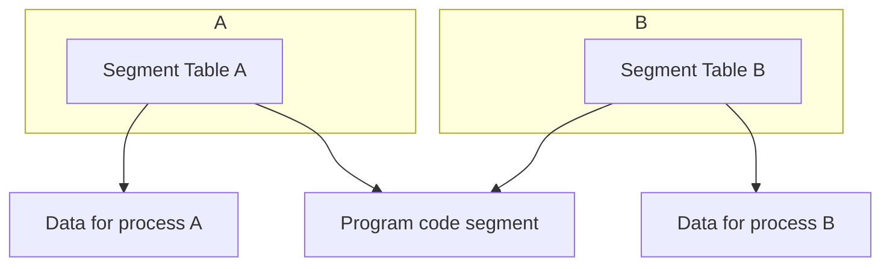

Segmentation is splitting up chunks of a process into **logical** parts.

The compiler will indicate which segment represents which logical part of the code.

Each segment has its own partition. Segments need not be contiguous.
{:.info}

* These segments are able to be organised by the memory manager to fit where space is available.
* The **segment table** stores the locations and lengths of the segments.
* This aids fragmentation as the segments are smaller/dynamically loaded.

## Segmented Address Structure
Each process has a segment table:

* Contains datum and limit vales of segments.

Address of the table is held in the **segment table base register** (STBR). 

This is saved during context switches.
{:.info}

## Segment Sharing
Suppose two users run the same program with different data:

* Processes have their own data segments by can share the program code segment if it is **pure** (**re-entrant**).
	
	Code is pure if it is not self modifying.
	{:.info}
* Economised on memory, so is more efficient.

## Advantages of Segmentation
As the memory allocation reflects the program structure:

* It is easier to organise separate compilation of procedures.
* Protection is facilitated:
	* Array bound checking can be done in hardware.
	* Code segments can be protected from begin overwritten.
	* Data segments can be protected from execution.
* Segments can be **shared** between processes.
* Large programs are broken into manageable units.
	* Memory allocation is more flexible.
	* Not all of a program needs to be in memory at the same time.
* Segments can be kept in swap space (disk) until needed.
	* Allows more programs to be kept in memory.
	* Swapping is more efficient.
