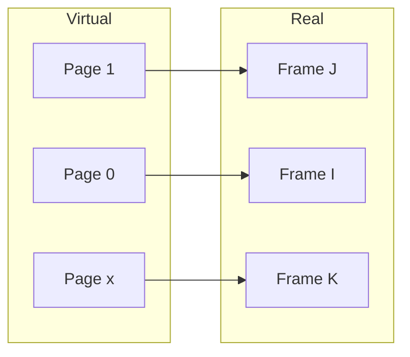
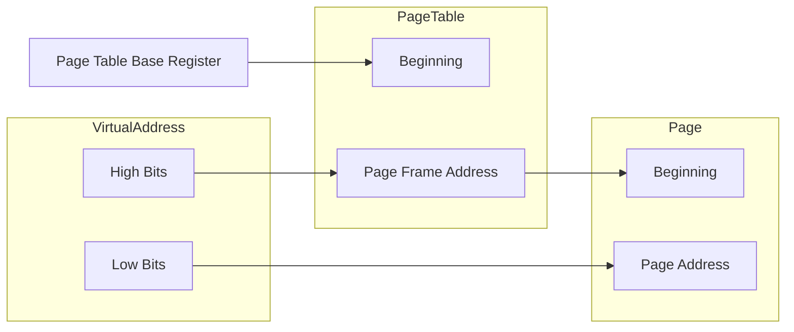
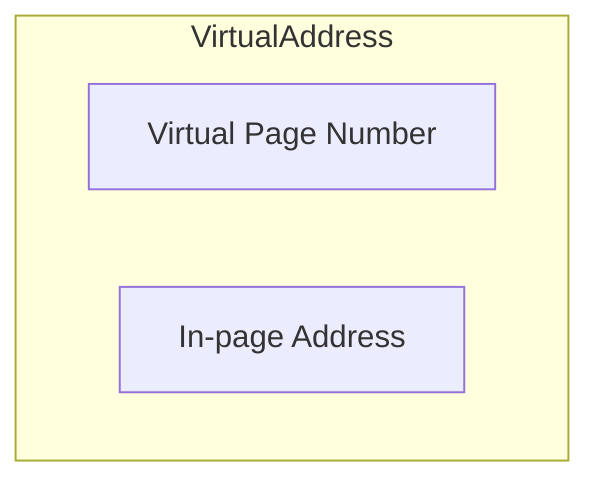
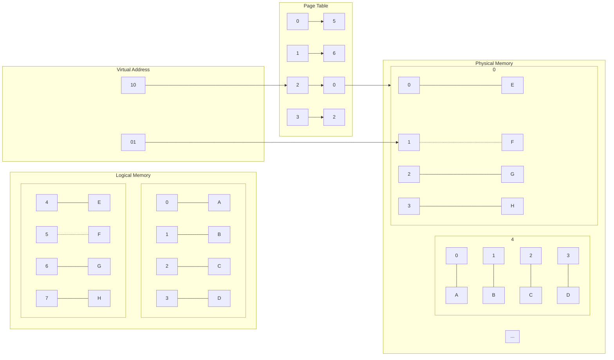

Paging is the physical division of a program's (or segment's) address space into **equal-sized** blocks, called pages.

* Each page resides within a **page frame** in the real memory.
* Pages which are consecutive in the address space (virtual memory) need not occupy consecutive page frames in real memory.
* Very similar to the way files are stored in equal size blocks in a file system.

## Page Mapping
Pages are stored in a **virtual address space** and are mapped to frames in **real memory**.

Translation of virtual addresses (used by programs) into real addresses is performed by hardware. This is via a per-process **page table**.

## Paged Memory

The virtual address points to the page frame address using it's high bits. The low bits of the virtual address are used as an offset in the page to point to the byte required.

### Virtual Addressing

This split isn't always 50/50.
{:.info}

Data in memory is found from the virtual address using the following method:

1. The page table is found using the page table base register (PTBR).
1. Virtual page number indexes the page table to produce a real page address.
1. The in-page address indexes the real bytes inside the page.

### Paging Example 

## Segmentation vs Paging

* Segmentation:
	* **Logical** division of address space.
	* Varying sized units.
	* Units are visible to the program.
* Paging:
	* **Physical** division of address space.
	* Fixed-size units.
	* Units bear no relation to program structure.

Either may be used a a basis for a **swapping system**.

Memory could be both segmented and paged via the use of multiple tables.
{:.info}

### Advantages of Paging

* Fixed-size units make space allocation simpler.
* Normal fragmentation is eliminated.
	* There is some **internal** fragmentation (space wasted within frames).

## Intel x86 MMU
This feature supports segmentation **with** paging:

1. CPU generates **logical addresses**, which are passed to the segmentation unit.
1. The segmentation unit produces a **virtual address**, which is passes to the paging unit.
1. The paging unit generates **physical addresses** in main memory.

The CPU is doing this every time an instruction needs to access memory to get or store some data.
{:.info}