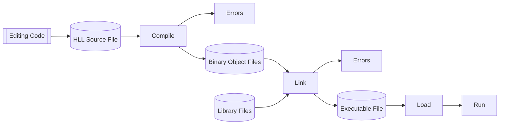

## Compilers

* Take a source program and translates it as a whole into machine code.
* The process of translation and execution are separate.

## Interpreters

* Take one instruction at a time, determine its function and then carries out those instructions.
* Source program analysis and execution are interlaced.
* No binary is generated.

## Compilers vs. Interpreters

* Execution of **compiled** code is much faster than interpretation.
* **Interpreters** are more suitable for **rapid prototyping** and for other situations where the program is frequently modified.
* **Interpretation** can make it easier to move programs between platforms.
	* More **portable**.
* Interpreters may be easier to write than compilers.
* Interpreted code is easier to debug.

## Interpreters as Virtual Machines
An interpreter is somewhat similar to a CPU:

* Takes one instruction at a time and carry out the actions it specifies.

because of that they are sometimes referred to as a **virtual machine**.

Some systems combine compilation and interpretation:

* HLL is converted to machine independent virtual machine code.
* Virtual code is then interpreted on each platform.

### Example - Java

* The Java compiler generated virtual bytecode.
* This is then interpreted by the JVM (Java virtual machine).

## Translation
Turning your source code into binary (machine code) that the CPU can understand is usually done by special programs such as:

* Compilers, translating HLL instructions into machine code.
* Assemblers, translating mnemonic form of machine instructions (assembly code) into their binary code.

Some compilers generate assembly code which is then passed to an assembler as a separate stage.

Some compilers generate the binary code directly.

### Translation Process

