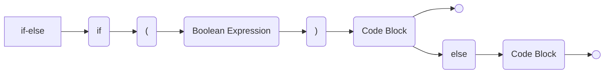
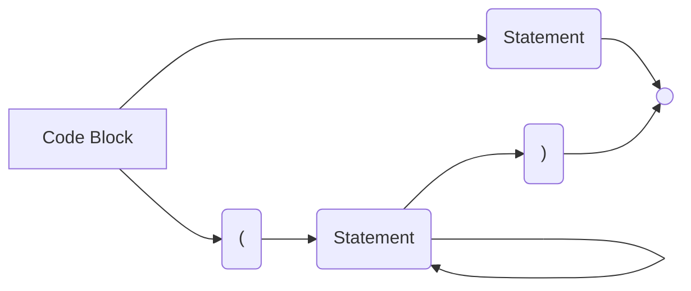

A grammar is a set of syntactic rules. Syntactic rules define syntactic **constructions** in terms of other syntactic constructions:

* Some of which need to be defined themselves.
* Some of which are already defined.

Constructions can be **terminal** (self-contained), or **non-terminal** (depend on other constructions).
{:.info}

## Hierarchy 

1. A grammar defined correct sentences (programs) in  terms of elementary parts (**symbols**).
1. Symbols are formed into **tokens**, which have meaning within the syntax of the language.

	A token is the smallest group of character symbols that has a specific meaning within the language.
	{:.info}
	
## Syntax Diagrams
We can represent the syntax rules as a set of diagrams:





In these diagrams there are two types of expressions:

* Non-terminal expressions (defined by rules):
	* if-else
	* Boolean Expression
	* Code Block
	* Statement
* Terminal expressions (in final form):
	* `if`
	* `else`
	* `(` and `)`

## Backus-Naur Form
An alternative and more precise method for describing the grammar is known as **Backus-Naur form** (**BNF**).

The rules of the language are representing in BNF in the form of productions like so:

> non-terminal $\rightarrow$ sequence of non-terminal and terminal symbols (expressions)

### Example

```
<if-else> -> if <lbracket><expression><rbracket><code block>[else <code block>]
<code block> -> <statement> | <lbracket><statement>+<rbrace>
```

This is extended BNF.
{:.info}

### Extended Backus-Naur Form
The following is valid notation:

| Notation | Description |
| :-- | :-- |
| $\rightarrow$ | Rule Definition. |
| \| | Or |
| \<name\> | Non-terminal Symbol |
| [tokens] | Optional Symbols |
| {tokens} | Symbols repeated 0 or more times. |
| * | Symbols repeated 0 or more times (suffix). |
| + | Symbols repeated 1 or more times (suffix). |


#### Example
This example defines that a `varname` must start with a letter and may have any number of letters or numbers for the rest of the name.

```
<varname> -> <letter>{<letter>|<digit>}
<letter> -> a|b|c|d|e|f|g|h|i|j|k|l|m|n|o|p|q|r|s|t|u|v|w|x|y|z
<digit> -> 0|1|2|3|4|5|6|7|8|9
```

| Valid | Invalid |
| :-- | :-- |
| zbc99 | 7gbh8 |
| a9fg28p | 89de8w45x |

## Parsing
The description of the grammar of a programming languae can consist of lots of rules (the grammar for Java contains around 120 rules).

Given a grammar, a **parsing** of a program in the language deigned by that grammar consists of determining which of the productions applies in a particular place as one analyses the program.

* If the program cannot be obtained by the grammar rues, the it is **incorrect** - there are syntactical mistakes.

The compiler will attempt to show where the error is, by often the parse error happens some way from the actual cause of the problem.
{:.info}