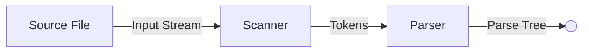

## The Compilation Process
The compilation process is normally broken down into the following major steps:

1. Lexical Analysis
1. Syntax Analysis (Parsing)
1. Semantic Analysis
1. Code Generation
1. Code Optimisation

## Lexical Analysis
The text of the program is converted into a sequence of tokens, representing distinct elements of the program:

* Numbers
* Letters
* Symbols
* Variable Names
* Keywords

As they are encountered, identifiers are entered into a **symbol table** containing:

* Variable Names
* Class Names
* Function Names
* Any other name created by the programmer.

## Syntax Analysis (Parsing)
The soruce program is analysed to uncover the grammatical form of the costructions used.

The aim is to group and structure the tokens in a way which identifies the kinds of program constructs:

* Declarations
* Loops
* Other constructs

## Scanning and Parsing
The scanner and parser work together:



* The **scanner** uses regular expressions to define tokens.
* **BNF** rules define the **parser's** grammar elements.

### Example
For the following **source file**:

```java
sum = x1 + x2;
```

The **scanner** splits it into the following **tokens**:

```java
sum
=
x1
+
x2
;
```

The **parser** will make the following **parse tree** from those tokens:

```mermaid
graph TD
sum --> =
= --> +
+ --> x1
+ --> x2
```

## Semantic Analysis

1. In this phase, information is built up in the symbol table about the data items being declared:

	* Variables
	* Arrays
	* Other data items.

	Memory locations will be assigned for each variable.
	{:.info}

1. Checks are performed for type consistencies.

	In strongly typed languages, this is where types are checked.
	{:.info}
	
1. The compiler will show error messages if is sees problems at this stage.

## Code Generation

1. Code will be generated for **each of the construct identified** during the syntax and semantic steps:

	* Loops
	* Conditions
	* Method Calls

	These all have to be stored in the **parse tree**.
	{:.info}

1. Walk through the parse tree and generate low-level (machine) code for each aspect of the tree.
1. Moving node by node through the tree will generate the code in the right order.

## Code Optimisation
The code is analysed to determine if there are ways to:

* Reduce the amount of code.
* Eliminate repeated operations.
* Reorganize parts of the program to execute faster.

Optimisation can happen in multiple places:

* Scanning
* Parsing
* Code Generation

### Example
Removing loop-invariant code:

```java
for (int i = 0; i <= n; i++) {
	x = a + 5;	// doesn't rely on the loop
	System.out.println(x * i);
}
```

Becomes:

```java
x = a + 5;
for (int i = 0; i <= n; i++) {
	System.out.println(x * i);
}
```

This saves redundant execution cycles for setting the variable `x`.
