### Question 1 - Memory Management Unit
> Which component of the CPU manages the storage and retrieval of data from main memory?
>
> - [ ] Base register
> - [ ] Cache
> - [ ] ALU
> - [x] MMU
> - [ ] Accumulator

Look here for more information about [memory management]({{site.baseurl}}/comp124/lectures/2021/05/04/1.html#dynamic-run-time-binding).

{:.info}

### Question 2 - Principle Components of an Operating System
> Which of these is not one of the four principal components of an operating system?
> 
> - [ ] Device manager
> - [x] Window manager
> - [ ] Memory manager
> - [ ] File manager
> - [ ] Processor manager

The principle components are:

* Memory Manager
* Processor Manager
* Device Manager
* File Manager

For more information see [Operating Systems Overview]({{site.baseurl}}/comp124/lectures/2021/03/06/1).

### Question 3 - Virtual Memory Location
> Where is virtual memory is located?
> 
> - [ ] On an external drive
> - [x] On a swap partition
> - [ ] In the CPU cache
> - [ ] On a server in the cloud
> - [ ] In the process control block

Swap partitions are used in Linux to hold virtual memory (swap space). They virtual memory can also be stored in a file (as in Window's pages file or Linux's swap files).

See [Swapping]({{site.baseurl}}/comp124/lectures/2021/05/04/2.html#swapping) from Memory Fragmentation.

### Question 4 - Process Scheduling
> Consider the pool of processes below, which arrive in the order listed. What will be the average wait time if the CPU is allocated to processes using a FCFS scheduling policy?
> 
> * $P_1$ has a burst time of 6 ms.
> * $P_2$ has a burst time of 10 ms.
> * $P_3$ has a burst time of 2 ms.
> * $P_4$ has a burst time of 8 ms.
> * $P_5$ has a burst time of 12 ms.
> 
> > NOTE: If you attempted this question before 12:25 on 13th May, ALL answers below were incorrect due to a typo on my part. Sorry about that. There is now ONE correct answer below.
(I can absolutely assure you that the REAL exam has been triple checked by multiple people, and there is one correct answer for each question!)
> 
> - [ ] 23.25 ms
> - [ ] 35 ms
> - [ ] 9.4 ms
> - [x] 13.2 ms
> - [ ] 7 ms

This can be modelled with the following Gantt chart:

```mermaid
gantt

dateformat S
axisformat %S

P1: a, 0, 6s
P2: b, after a, 10s
P3: c, after b, 2s
P4: d, after c, 8s
P5: e, after d, 12s
```



This gives the following wait times:

* 0 milliseconds for $P_1$.
* 6 milliseconds for $P_2$.
* 16 milliseconds for $P_3$.
* 18 milliseconds for $P_4$.
* 26 milliseconds for $P_5$.

This would give the following average wait time:

$$\frac{0+6+16+18+26}{5}=13.2\text{ms}$$

For more examples see the following:

* [FCFS and Shortest Job First]({{site.baseurl}}/comp124/lectures/2021/03/10/1)
* [Shortest Remaining Time and Priority Scheduling]({{site.baseurl}}/comp124/lectures/2021/03/11/1)
* [Round Robin]({{site.baseurl}}/comp124/lectures/2021/03/12/1)

### Question 5 - EBNF (Extended Backus-Naur Form)
> Which of these strings does not match `<S>` in the EBNF grammar shown below?
> 
> * `<S>` $\rightarrow$ `{<D>|<U>}<L>`
> * `<U>` $\rightarrow$ `A|B|C|D|E`
> * `<L>` $\rightarrow$ `v|w|x|y|z`
> * `<D>` $\rightarrow$ `0|2|4|6|8`
> ^
> 
> - [ ] `24x`
> - [ ] `EB2C4w`
> - [ ] `z`
> - [x] `DA6`
> - [ ] `Dz`

[This table]({{site.baseurl}}/comp124/lectures/2021/05/12/1.html#extended-backus-naur-form) explains the EBNF notation. 

`DA6` is the only one that is valid as it is the only one which:

* Starts with any number of `A-E` or `0,2,4,6,8`:
	* This is `DA`
* Ends with a single character of `v-z`

### Question 6 - Register Names
> Which one of the following is not a valid register name within a 32-bit Intel x86 CPU?
>   
> - [ ] ESP
> - [ ] EBP
> - [ ] ECX
> - [ ] EIP
> - [x] ETP

I just used `Ctrl + f` to search through [COMP124]({{site.baseurl}}/comp124). The valid registers listed are:

* ESP - Stack Pointer
* EBP - Base Pointer
* ECX - C Register (used for counting loops)
* EIP - Instruction Pointer

All of these registers are the 32-bit versions.

### Question 7 - Assembly Operand Addressing Modes
> Which one of the following is not an assembly language operand addressing mode?
> 
> - [ ] Register indirect
> - [ ] Direct
> - [x] Indirect
> - [ ] Register
> - [ ] Immediate

See [Addresssing Modes]({{site.baseurl}}/comp124/lectures/2021/02/16/1.html#addressing-modes). This refers to the forms that operands can take.

### Question 8 - Assembly Program 1
> What decimal value will be stored in the accumulator after the > following assembly code fragment has been executed?
> 
> ```asm
> asm: mov ebx, 8
>      cmp ebx, 5
>      jg one
>      mov eax, 2
>      jmp end
> one: mov eax, 1
> end: push eax
> ```
> 
> - [ ] 0
> - [ ] 2
> - [x] 1
> - [ ] 5
> - [ ] 8

Follow the flow of execution:

| Line | EAX | EBX | Greater | Accumulator |
| :-: | :-: | :-: | :-: | :-: |
| 1 |  | 8 |  | |
| 2 | | 8 | `True` | |
| 3 | | 8 | `True` | |
| 6 | 1 | 8 | | |
| 7 | 1 | 8 | | 1 |

The EFLAGS register is used when comparing two values, see [Comparing Values]({{site.baseurl}}/comp124/lectures/2021/02/17/1.html#comparing-values). This triggers the `jg` instruction if the first operand is greater.

### Question 9 - Assembly Program 2
> Which one of these statements is false when the instructions below are executed on a 32-bit system?
> 
> ```
> mov ebx, 2
> mov eax, 45
> push ebx
> push eax
> ```
> 
> - [ ] The stack base pointer is unchanged
> - [ ] The base register holds the value 2
> - [x] The stack pointer moves 8 bytes higher in memory
> - [ ] The top of the stack holds the value 45
> - [ ] The size of the stack grows by 8 bytes

The stack grows downward in memory so therefore the stack pointer moves 8 bytes **lower** not higher.

As for why the others are true:

* There is no context switch, so the base pointer is unchanged. Only the stack pointer moves when adding values to the stack.
* Registers remain unchanged when their values are moved to the stack (EBX is the base register).
* The top of the stack is always the most recent value. EAX, which holds 45, was last pushed to the stack so the top holds this value.
* Each register is 4-bytes (32-bits) long, so adding two 4-byte values to the stack grows it by 8-bytes.

### Question 10 - `Thread.yield()` Multi-Threading
> Which one of these statements is false when considering the behaviour of the Java `Thread.yield()` method?
> 
> - [ ] It is non-deterministic
> - [x] It can only be called within synchronized methods
> - [ ] It politely tells the JVM that the thread is willing to give up the CPU
> - [ ] Its behaviour depends on the JVM implementation
> - [ ] It might be ignored by the JVM

See [Yielding]({{site.baseurl}}/comp124/lectures/2021/04/22/1.html#yielding). Any thread is able to yield.

### Question 11 - Working Sets (Principle of Locality)
> What is the working set W(2,4) in this sequence of page references?
> 
> | Page | a | a | b | a | a | c | a | d | d | e |
> | :-: | :-: | :-: | :-: | :-: | :-: | :-: | :-: | :-: | :-: | :-: |
> | Time | 0 | 1 | 2 | 3 | 4 | 5 | 6 | 7 | 8 | 9 |
> 
> - [ ] ab
> - [ ] ade
> - [x] abc
> - [ ] de
> - [ ] ca

Remember to count the letter that the working set starts on. For the method see [this example]({{site.baseurl}}/comp124/lectures/2021/05/06/2.html#example).

### Question 12 - Network Topologies
> How many paths would be required to fully connect 5 devices in a point-to-point system?
> 
> - [ ] 20
> - [ ] 5
> - [x] 10
> - [ ] 15
> - [ ] 25

This is the same as a mesh topology. You can draw it out and count the paths or calculate:

$$4+3+2+1=10$$

which represents the number of unique paths connecting each node to every other node.