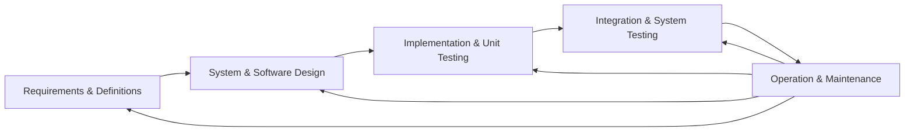
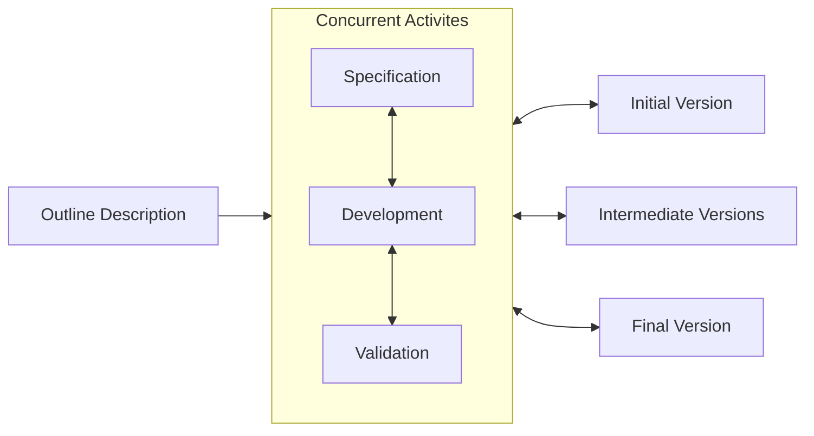

When you are completing a process you need to separate the process into individual tasks. These tasks can include planning, execution, testing and review.

> A **process** is a sequence of steps to accomplish a set of tasks.

## Characteristics
Any process has the following characteristics:

* It prescribes all of the **major activities**.
* I uses resources and produces **intermediate and final products**.
* It may include sub-processes and has **entry** and **exit criteria**.
* The activities are **organised in a sequence**.
* Constraints or controls may apply to activities.
	* Budget, availability of resources...

## Life Cycle
The process of building a **software product** is called the **software life cycle**. This includes:

* Specifying
* Designing
* Implementing
* Testing

## Similarities & Differences with Other Engineering

* Software can be changed at anytime.
	* Is often required to change after construction.
* Software can be improved *almost* without limit.
* Software often gets faults as it evolves.
* Software is hard to manage.
* Issues with the user's experience and expectations.

## Software Process Models
* The Waterfall Model
	* Separate and distinct phases of specification and development.
* Evolutionary Development
	* Specification and development are interleaved.
* Agile and Scrum
	* Used widely in the industry today.

### Waterfall Model
This model struggles to accommodate change after the process is underway.

* Inflexible partitioning of the project into distinct stages.
* This makes it difficult to respond to changing customer requirements.
* This model is only appropriate when the final requirements are well-understood.

This model describes a process of step-wise refinement:

* Based on hardware engineering models.
* Widely used in military and aerospace industries.

### Evolutionary Development
This starts with an **initial development** that can be shown to the user for feedback and refinement.

This is an example of **exploratory development**:

* Objective is to work with customers and to evolve a final system from an initial outline specification.
* Should start with well-understood requirements.
* The system evolves by adding new features as they are proposed by the customer.

* Lack of **process visibility**.
	* Don't know how close you are to finishing.
* Systems are sometimes **poorly structured**.
* Applicable for all systems by rare in safety critical systems.

### Agile Development

* Lightweight approach to software development.
	* Light on documentation and heavy on development.

This method is focused on:

* Code development as code activity.
* Test driven development.
	* Test developed before code.
* Often use pair programming.
* Iterative development.
* Self organised teams.

### Scrum - Incremental Development
Rather than deliver the system as a single delivery, the development and delivery is broken down into increments (SCRUM **sprints**) with each increment delivering part of the required functionality:

* User requirements are prioritised.
* Once the development of an increment is started the requirements are frozen.
	* The requirements of later increments can still be developed.
	
#### Incremental Development Considerations

* Customer value can be delivered with each increment so system functionality is available earlier.
* Early increments act as a prototype to help elicit requirements for later increments.
* Lower risk of overall project failure.
* The highest priority system services tend to receive the most testing.

## Specification
> The specification is the most important part of any project.