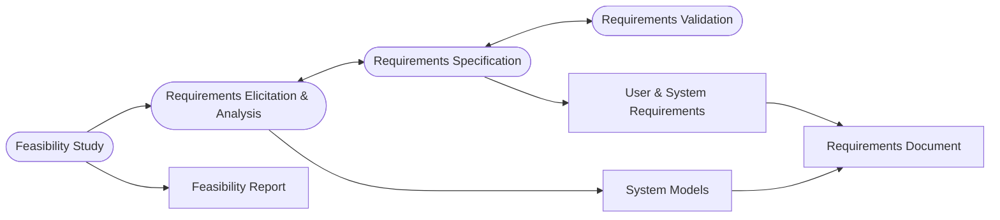
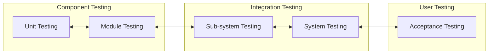

## Requirements Engineering & Specification
**Software specification** is the process of establishing what services are requires and the constraints on the system's operation and development.

### Requirements Engineering Process

## Software Design & Implementation
This is the process of converting the system specification into an executable system. This includes:

1. **Software Design**
	* Design a software structure that realises the specification.
	* There are many **tasks** that comprise this section.
1. **Implementation**
	* Translate this structure into an executable program.

Design and implementation are closely related and may be inter-leaved.
{:.info}

## Design Process Activities 

1. Architectural Design (Separating web service modules)
	* Sub-systems making up the ystem and their relationships are identified and documented.
1. Abstract Specification
	* For each sub-system, an abstract specification of its operation constraints and services is produces.
1. Interface Design
	* For each sub-system, an unambiguous interface with other sub-systems is designed and documented.
1. Components Design
	* Services are allocated to components and the interfaces of these components are desgned.
1. Data Structure Design
	* The data structures used in the system implementation are designed in detail and specified.
1. Algorithm Design
	* The algorithms used in components to provide services are designed and specified.
	
## Design Methods
Design methods are systematic approaches to developing a software design. This design is usually documented as a set of graphical models.

You could use the following types of model:

* Data-flow
* Entity relation attribute model.
* Structural Model
* Object Models
* State Transition Model (Showing system states and triggers)

## Programming & Debugging
Programming should be an iterative activity where small pieces are written and testing is completed.

## Testing

The prior stages are described as:

1. **Unit Testing** - Individual components are tested.
	* Testing classes.
1. **Module Testing** - Related collections of dependent components are tested.
	* Testing class integration.
1. **Sub-system Testing** - Modules are integrated into sub-systems and tested. The focus here should be on interface testing.
	* Testing classes as a service. An organised package or JAR library.
1. **System Testing** - Testing of the system as a while. Testing of emergent properties.
	* Whole system test.
1. **Acceptance Testing** - Testing with customer data to check that it is acceptable.