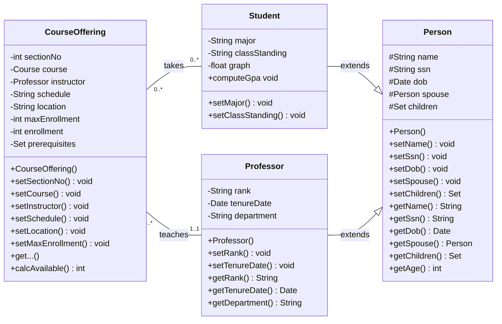
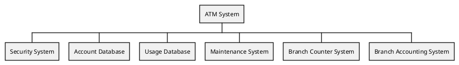
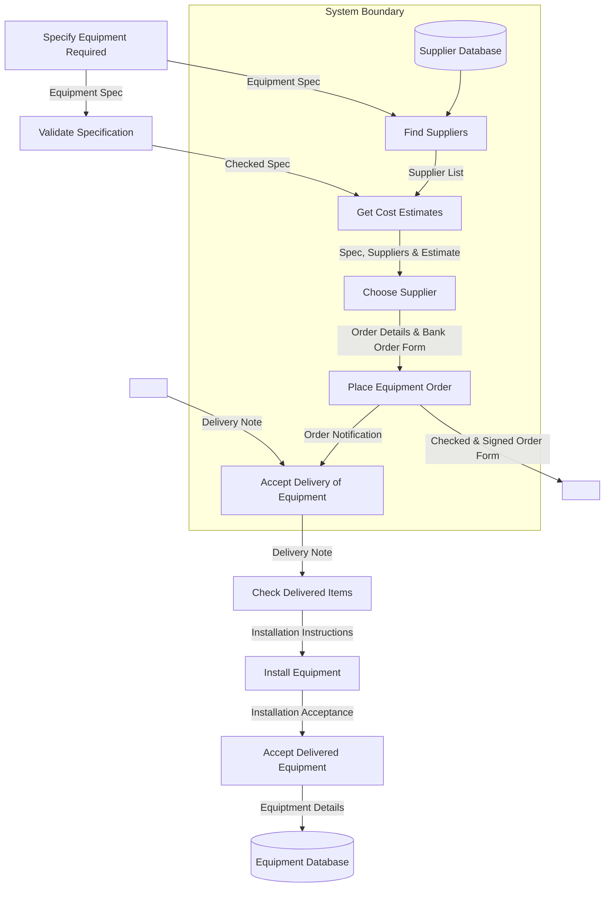
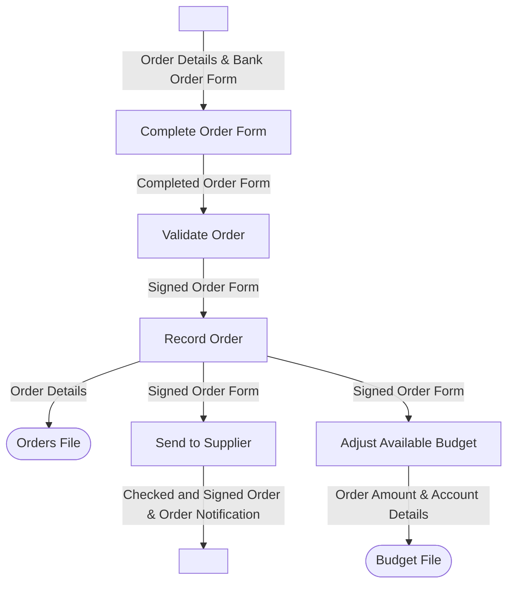
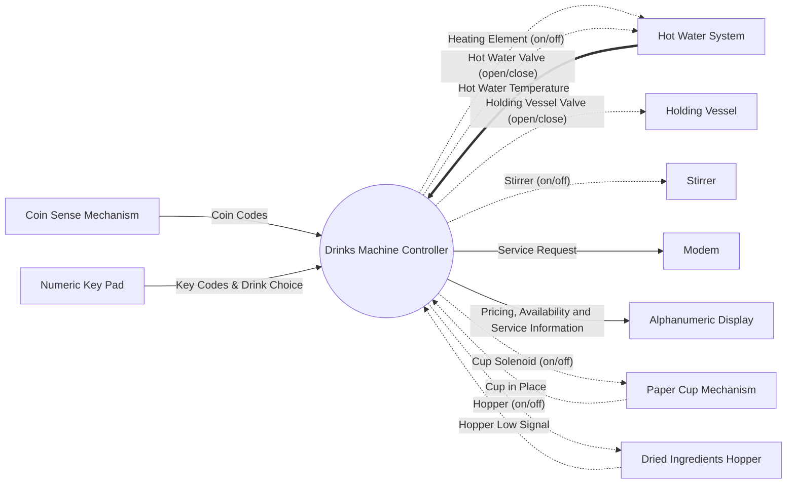
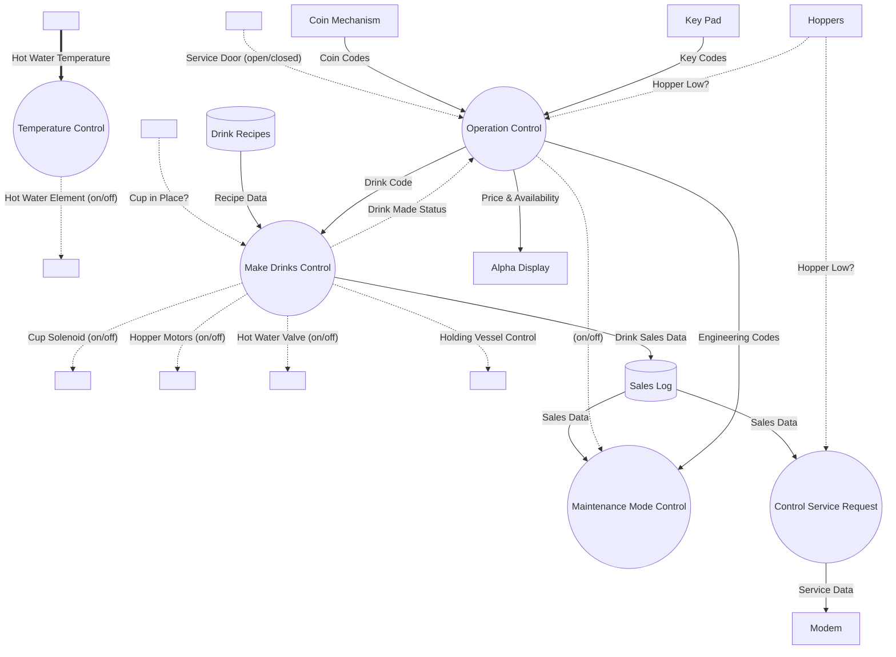
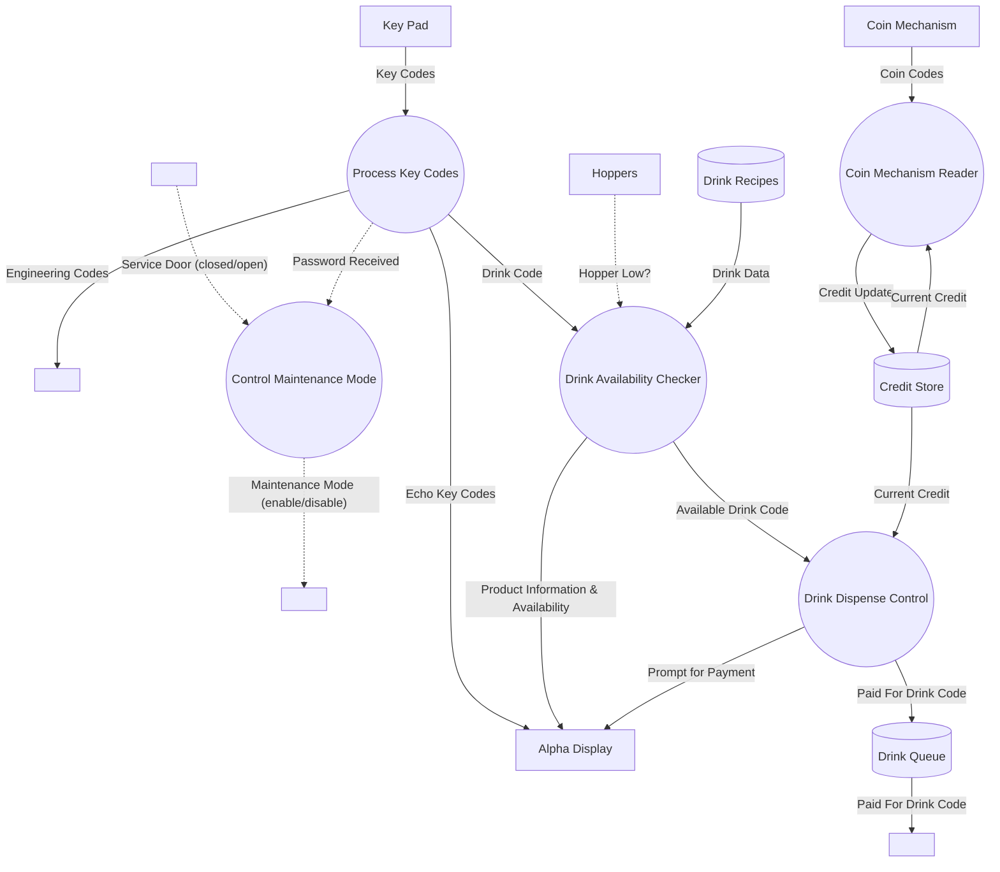
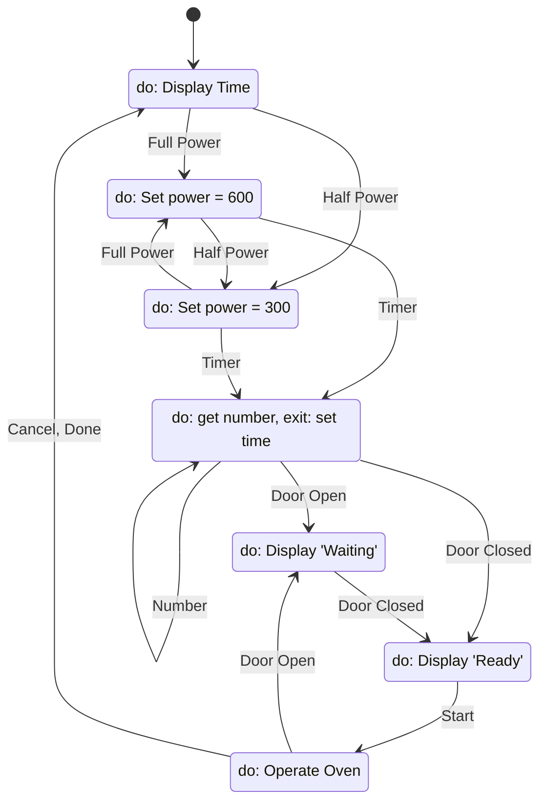
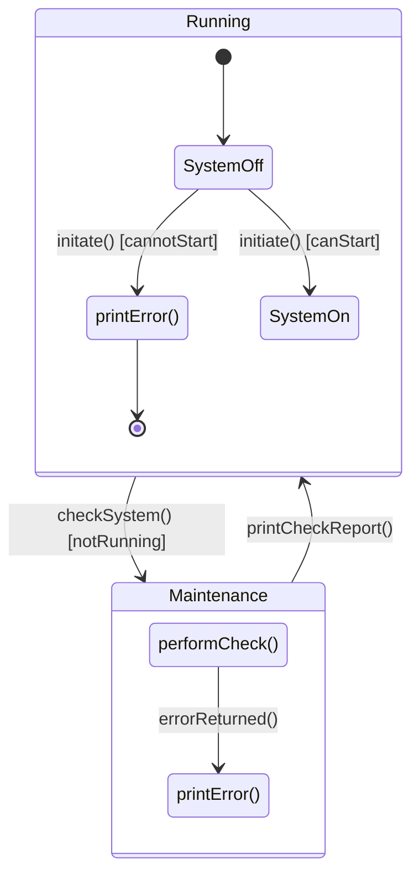
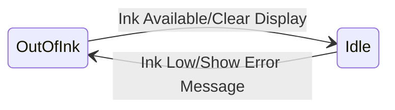

System models are abstract descriptions of systems. They explain the details of a system in a more technical way.

* System **representations** maintain all the information of a system.
* A system **abstraction** deliberately simplifies the system and picks the most important characteristics.

## System Model Weaknesses
There are several weaknesses of system models:

* They do not model **non-functional** requirements
* They do not usually include information about whether a method is appropriate for a given problem.
* They may produce to much documentation.
* They are sometime too detailed and difficult to read to be useful.

## Class Diagram
Here is an example of a class diagram:

The information in this diagram would be significantly harder to explain in natural language.
{:.info}

## Model Types
The following models have their own respective purposes:

* **Data Processing Model** - Showing how that data is processed at different stages.
* **Composition Model** - Showing how entities are composed of other entities.
* **Architectural Model** - Showing principle sub-systems and relationships with other systems.
* **Classification Model** - Showing how entities have common characteristics.
* **Stimulus/Response Model** - Showing the system's reaction to events.
* **Context Models** - Are used to illustrate the boundaries of a system.
	* Social and organisation concerns may affect the decision on where to position system boundaries.

### Architectural Model of an ATM System

### Process Models
There are several different types of data processing models:

* **Process Models** - Show the overall process and the processes that are supported by the system.
	* In process models it is implicit one process is completed before another process begins.
	* Process models are similar to flow charts.
* **Data Flow Models** - Are used to show the processes and the **flow of information** from one process to another.
	* In data flow models it is implicit that processes will happen in parallel.

#### Example Process Model
This is an example of the equipment procurement process:

### Behavioural Models
These are used to describe the overall behaviour of the system. There are two types of behavioural model:

* **Data Processing Models** - Show how data is processed as it moves through the system.
* **State Machine Models** - Show the systems response to events.

Both of these models are required for a description of the system's behaviour.
{:.info}

#### Data-Processing Models
**Data flow diagrams** are used to model the system's data processing. These show the processing steps as data flows through a system. They should:

* Be simple and intuitive to understand.
* Show end-to-end processing os data.

This is part of many analysis  methods.
{:.info}

Data flow diagrams can also used to show data exchange between a system and other systems in its environment.
{:.info}

Data flow diagrams show a **functional perspective** where each transformation represents a single function or process. This is useful for requirements analysis as it shows end-to-end processing.

##### Example Data Flow Diagram
This is an example of order processing:

##### Example Data Flow Diagram (DFD) Context Diagram

The hot water temperature (in bold) is a **continuous** input. It should have a double arrowhead but I can't do that.
{:.info}

* **Solid** lines are information flows.
* **Dotted** lines are control flows.
* **Double** arrow heads are continuous data.
* **Single** arrow heads are discrete data.

##### Level 0 DFD
This is the top level that represents all the systems in the machine:

##### Level 1 DFD - Operation Control
A level 1 DFD explores a discrete system from the level 0 DFD:

#### State Machine Models
State machine models, also called **state chart diagrams**, show the behaviour of the system in response to external and internal events.

* State-charts allows the decomposition of a **model** into **sub-models**.
* A brief description of the action is required. (`Do` is optional).
* Can be complemented by table describing the states and stimuli.

There are some additional hints for state machines:

* All states need an exit.
* Use an `Idle` state to show when the process isn't active.
* You don't need to have a state chart as a sub-state of another state chart.
	* The system can be described by multiple state machines running concurrently.
* Use multiple state charts to keep the design simple.

##### Example State Machine Model

A state machine model **does not** show flow of data within the system.
{:.info}

This state graph has the associated stimuli table:

| Stimulus | Description |
| :-- | :-- |
| Half Power | The user has pressed the half power button. |
| Full Power | The use has pressed the full power button. |
| Timer | The user has pressed one of the timer buttons. |
| Number | Ther user has pressed a numeric key. |
| Door Open | The oven door switch is not close. |
| Door Closed | The oven door switch is closed. |
| Start | The user has pressed the start button. |
| Cancel | The user has pressed the cancel button. |

##### State Diagram with Composite States
This diagram makes use of a couple of additional features:

* **Guard** - On the arrows. Ensures that the system only moves from one state to the other if the expression is satisfied.
	* This can be a method as shown on this example.
* **Composite Sates** - This is a state sub-diagram that models the states of a state.

##### Actions
You can put actions after the event using a `/`:

#### Finite State Machines
Refer to notes on [Deterministic Finite Automata (DFAs)]({{site.baseurl}}/comp218/lectures/2021/09/28/1.html) for information about finite state machines.
