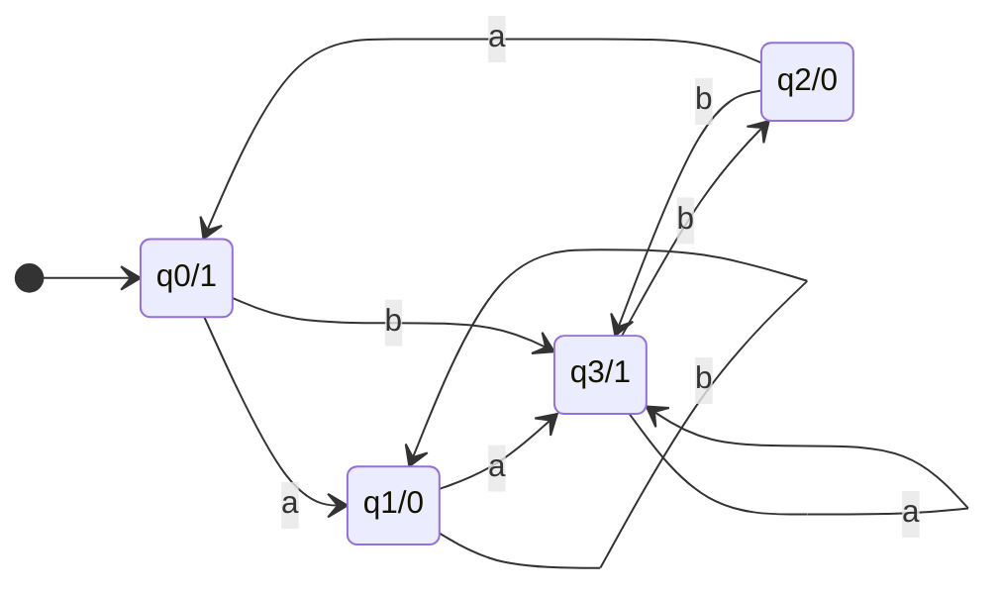
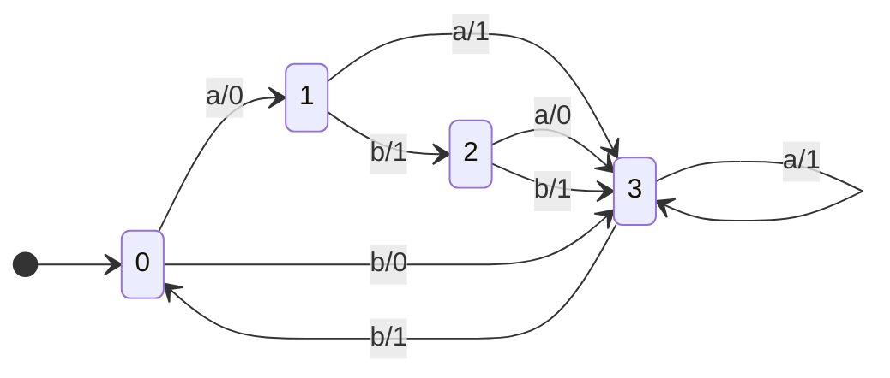
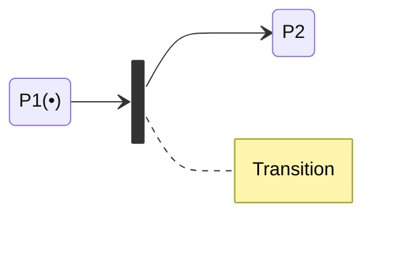
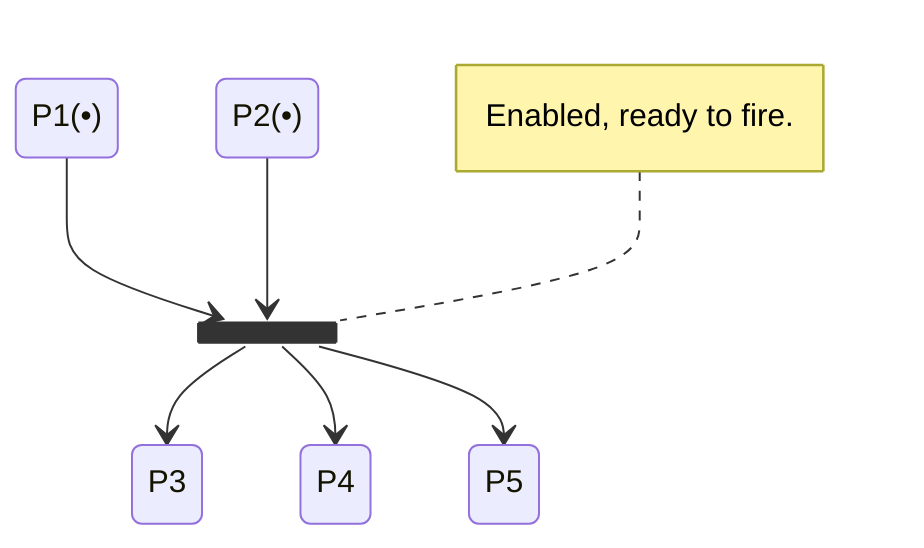
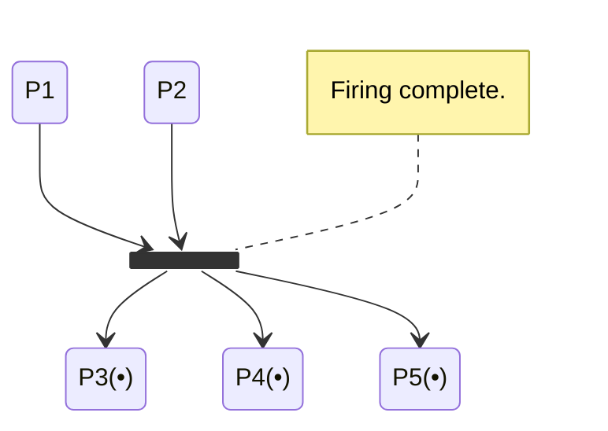
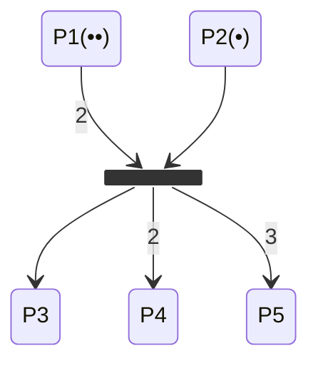
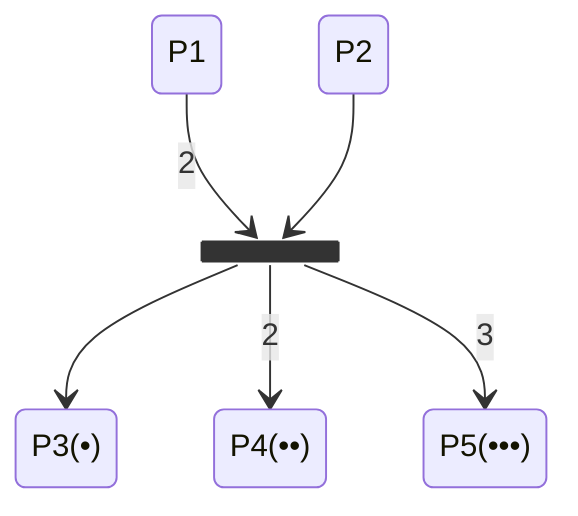
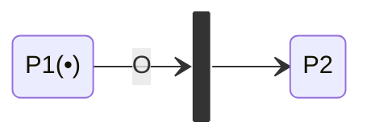
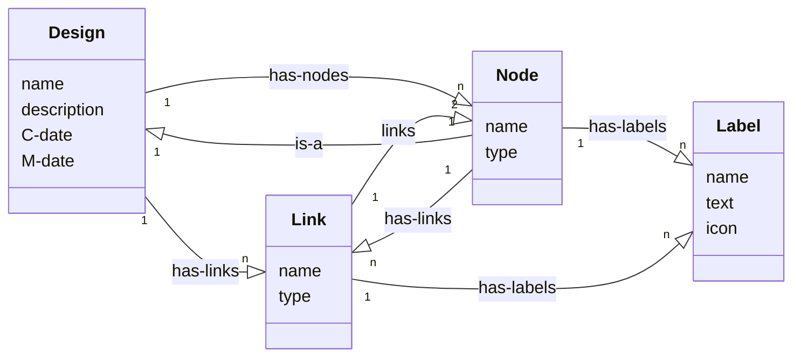

## Finite State Machines
Refer to notes on [Deterministic Finite Automata (DFAs)]({{site.baseurl}}/comp218/lectures/2021/09/28/1.html) for information about finite state machines.

There are several variant of finite state machines:

* Mealy Machines - Have actions (outputs) associated with transitions.
* Moore Machines - Have actions (outputs) associated with states.
* [Nondeterministic Finite Automata (NFAs) & Epsilon-NFAs]({{site.baseurl}}/comp218/lectures/2021/10/01/1.html) - Allow for multiple transitions with the same input and transitions with no cost.

### Moore Machines
A more machine has the following additional attributes:

* It has two alphabets, an **input** and an **output** alphabet.
* It has an **output letter** associated with each state.
	* The machine writes that appropriate output letter as it enters each state.



```
Input: abab
Output: 10010
```

The states are named with there identifier: `q0` and then their output: `0` with a slash inbetween.
{:.info}

To find this result we:

1. Start at $q_0$, outputting 1.
1. Transition via $a$ to $q_1$, outputting 0.
1. Transition via $b$ to $q_1$, outputting 0.
1. Transition via $a$ to $q_3$, outputting 1.
1. Transition via $b$ to $q_2$, outputting 0.

### Mealy Machines
These are computationally equivalent to Moore machines, however:

* Mealy machines **output on the transition** instead of the state.



```
Input: aaabb
Output: 01110
```

The transitions are identified $i/j$ where $i$ is the input and $j$ is the output.
{:.info}


* Mealy machines are **complete** as there is a transition for each character in the input alphabet leaving every state.
* There are no accept states in a Mealy machine as is it not a language recogniser.
* It only outputs and its output will be the same length as its input.

### Petri Net Models
Petri nets are a collection of **directed arcs** connecting **places** and **transitions**:

* Places may hold **tokens**.
* The **state/marking** of a net is its assignment of tokens to places.

Petri nets are **non-deterministic** so they can be used to model **discrete distributed systems**.
{:.info}



The tokens are represented by the number of `•` after the place name.
{:.info}

#### Capacity

* Arcs have capacity 1 by default but this can be marked on the arc.
* Places have infinite capacity by default.
* Transitions have no capacity and can't store tokens.

#### Enabled Transitions & Firing
A transition is **enabled** when the number of tokens in each of its **input** places is at least **equal to the arc weight** going from the place to the transition:

* An enabled transition may fire at any time.





#### Arcs of Different Weights
When fired the tokens in the input places are consumed and are then generated in the output places in accordance with the arc weights:

* This results in a new marking of the net, a state description of all places.





#### Inhibition
A **circle** arrow head on an arc means that there is an inhibition. I am representing this like so:



#### Primitive Structures
There are several primitive structures that apply to real systems:

* Sequence
	
	```mermaid
	stateDiagram-v2
	direction LR
	state T1 <<fork>>
	state T2 <<fork>>
	P1(•) --> T1
	T1 --> P2
	P2 --> T2
	T2 --> P3
	```
* Conflict 

	```mermaid
	stateDiagram-v2
	state T1 <<fork>>
	state T2 <<fork>>
	state T3 <<fork>>
	P1(•) --> T1
	P1(•) --> T2
	P1(•) --> T3
	```
* Concurrency

	```mermaid
	stateDiagram-v2
	state T1 <<fork>>
	state T2 <<fork>>
	state T3 <<fork>>
	state T4 <<fork>>
	T1 --> P1(•)
	T1 --> P2(•)
	T1 --> P3(•)
	P1(•) --> T2
	P2(•) --> T3
	P3(•) --> T4
	```
* Synchronisation

	```mermaid
	stateDiagram-v2
	state T1 <<join>>
	P1(•) --> T1
	P2(•) --> T1
	P3(•) --> T1
	T1 --> P4
	```
* Confusion

	```mermaid
	stateDiagram-v2
	state T1 <<fork>>
	state T2 <<fork>>
	state T3 <<fork>>
	P1(•) --> T1
	P1(•) --> T2
	P2(•) --> T2
	P2(•) --> T3
	```
* Merging

	```mermaid
	stateDiagram-v2
	state T1 <<fork>>
	state T2 <<fork>>
	state T3 <<fork>>
	state T4 <<fork>>
	T1 --> P1(•)
	T2 --> P1(•)
	T3 --> P1(•)
	P1(•) --> T4
	```
* Priority/Inhibit

	```mermaid
	stateDiagram-v2
	state T1 <<fork>>
	state T2 <<join>>
	P1(•) --> T1
	P1(•) --> T2
	P2(•) --> T2:O
	```

## Semantic Data Models
These are used to describe the **logical structure** of data processed by the system.

* Entity-relation-attribute models are a type of semantic data model.
	* No specific notation is provided but class diagrams are the most similar structure.

### Semantic Data Model - Meta Example



### Data Dictionaries
Data dictionaries are a list of all the names in a system model:

* Descriptions of the entities, relationships and attributes are also included.
* It may be used for **name management** so that all names used in a system are consistent and do not clash.
* It serves as a store or organisational information so that all data is stored in one location.

| Name | Description | Type | Date |
| :-- | :-- | :-- | :-- |
| has-labels | 1:N relation between entities of type Node or Link and entities of type Label. | Relation | 5/10/1998 |
| Label | Holds structured or unstructured information about nodes or links. Labels are represented by an icon (which can be a transparent box) and associated text. | Entity | 8/12/1998 |
| name (label) | Each label has a name which identifies the type of label. The name must be unique within the set of label types used in a design. | Attribute | 8/12/1988 |
| $\vdots$ | $\vdots$ | $\vdots$ | $\vdots$ |

## Object Models
Object models describe the system in terms of object classes.

### Unified Modelling Language
Allows for clear representations of the structures in object-oriented languages. This will be covered later and has been partially covered in [COMP122 - Subclasses]({{site.baseurl}}/comp122/lectures/2021/03/08/1.html).