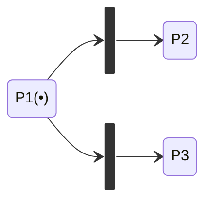
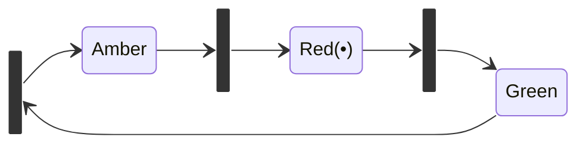
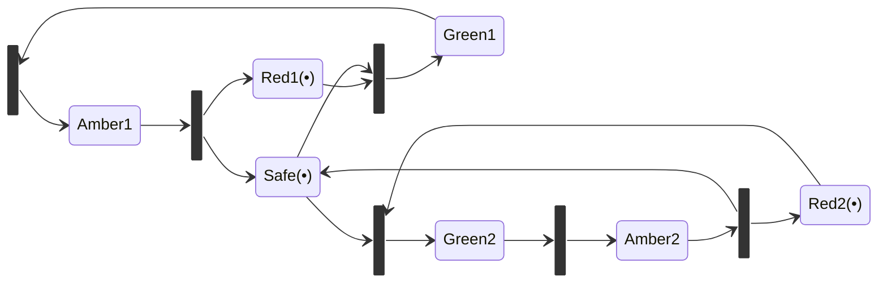
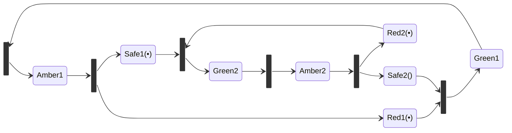
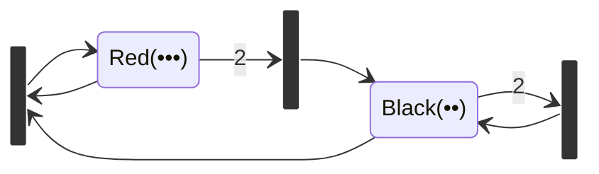
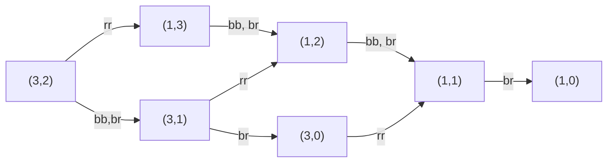

Petri nets are often used for **distributed systems** and for systems with **resource sharing**. 

Since there may be more than one transition in the Petri net active at a time and we don't know which will fire first, they are non-deterministic.

There are certain additions to Petri nets which make them **High-Level**:

* Colour - For modelling attributes.
* Time - For performance analysis.
* Hierarchy - For the structuring of models, DFD's.

## Conditions

* A transition is only enabled if each of the input places contains tokens.
* Enabled transitions can fire.
	* Firing consumes tokens from the inputs and produces tokens for the outputs according to the arcs.
	
## Example Firing
This is a sequence of firings:

1. ```mermaid
	stateDiagram-v2
	direction LR
	state T1 <<fork>>
	P1(••) --> T1
	T1 --> P2(••)
	T1 --> P3(•)
	P3(•) --> T1
	```
	
1. ```mermaid
	stateDiagram-v2
	direction LR
	state T1 <<fork>>
	P1(•••) --> T1
	T1 --> P2(•)
	T1 --> P3(•)
	P3(•) --> T1
	```
	
1. ```mermaid
	stateDiagram-v2
	direction LR
	state T1 <<fork>>
	P1(•) --> T1
	T1 --> P2(•••)
	T1 --> P3(•)
	P3(•) --> T1
	```

## Creating & Consuming Tokens
A transitions without any input can fire at any time and produces tokens in all connected places:

1. ```mermaid
	stateDiagram-v2
	direction LR
	state T1 <<fork>>
	T1 --> P1()
	```
	
1. ```mermaid
	stateDiagram-v2
	direction LR
	state T1 <<fork>>
	T1 --> P1(•)
	```
	
1. ```mermaid
	stateDiagram-v2
	direction LR
	state T1 <<fork>>
	T1 --> P1(••)
	```

A transition without any output must be enabled to fire and deletes the incoming tokens:

1. ```mermaid
	stateDiagram-v2
	direction LR
	state T1 <<fork>>
	P1(•••) --> T1
	```
	
1. ```mermaid
	stateDiagram-v2
	direction LR
	state T1 <<fork>>
	P1(••) --> T1
	```
	
1. ```mermaid
	stateDiagram-v2
	direction LR
	state T1 <<fork>>
	P1(•) --> T1
	```
	
## Non-Determinism
If two transitions fight for the same token there is a **conflict**. The next transition to fire $T1$ or $T2$ is non-deterministic:



Even if there are two tokens, there is still conflict.
{:.info}

## Modelling 

* Tokens - Can represent resources, information, conditions, or states of objects.
* Places - Can represent buffers, channels, locations, conditions, or states.
* Transitions - Represent events, transformations or transportations.

## Traffic Light Example 
To begin we will model only one traffic light:



Having two of this model would enable both sets of traffic lights to be green at the same time. To stop this we can make the following modification:



This fires the two traffic lights in random order due to the conflict with `Safe`. To make them change alternately we can use the following model:



## Definitions

* **Current State (Marking)** - The configuration of the tokens over the places.
	* This is described by a tuple.
*  **Reachable State** - A state reachable from the current state by firing a sequence of enabled transitions.
* **Deadlock State** - A state where no transition is enabled.

### Examples
For the following graph:



```
State: (3,2)
```

This is because we are ordering the tuple `(Red,Black)` and there are three tokens in `Red` and two tokens in `Black`.

We can also graph the reachable states and deadlock states in a tree:



There are 7 reachable states and one deadlock state.

Reachable are those down stream from your current place and deadlock states are those with no transitions out.
{:.info}