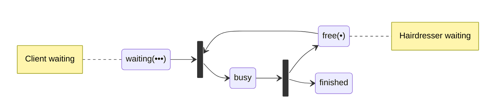
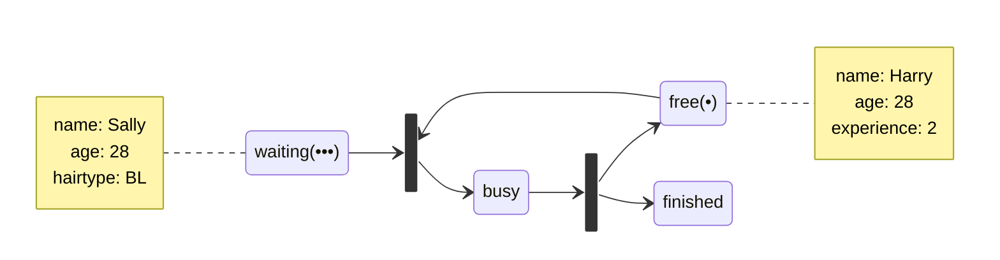
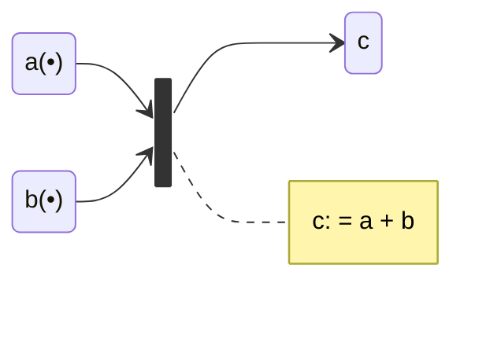
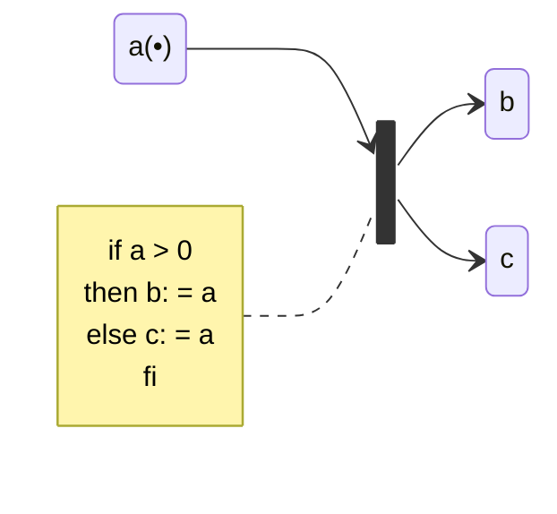
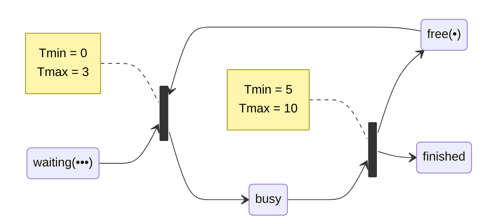
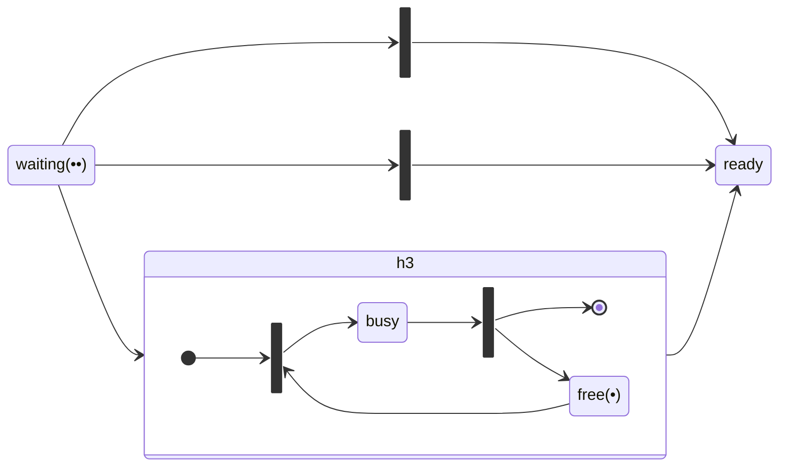
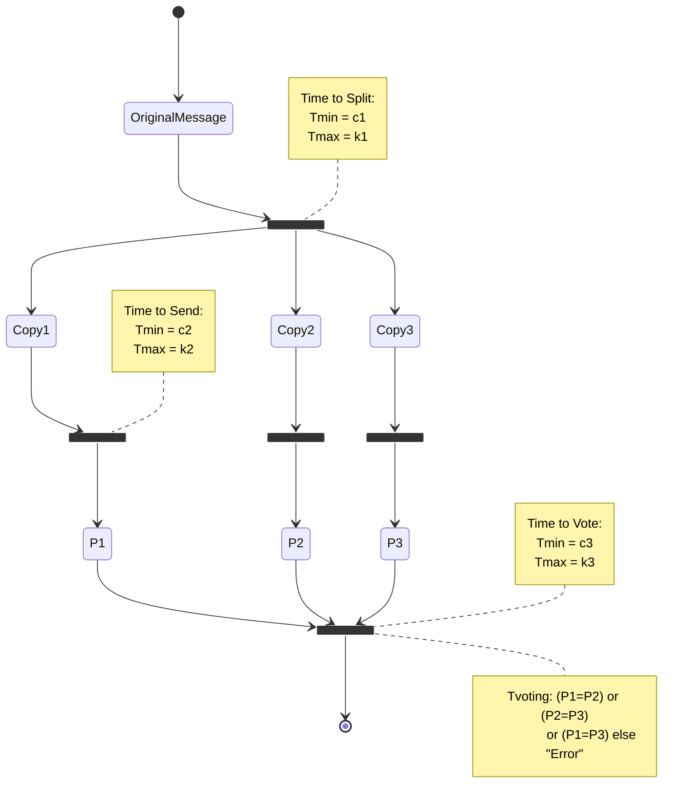

Classical Petri nets can have some problems:

* Petri nets can become too large and complex.
* It takes too long to model a situation.
* It is not possible to handle **time** or **data**.

High level Petri nets include the following to handle this:

* Colour
* Time
* Hierarchy

## Colour
Here is a standard example:

Adding **colour** involves adding **attributes** to each token:

### Colour on Transitions
Transition can also have colour. This can involve:

* The number of tokens to be produced.
* The value of these tokens.
* Optionally, a precondition. 

You can see a mathematical example here:

Here is a conditional example:

## Time
To analyse performance, we must model duration and delays.

A **timed Petri net** associates a pair $t_\min$ and $t_\max$ with each transition.

We could be answered the following questions:

1. What is the minimum and maximum times for all three people to have their hair cut in this system?

	$$
	\begin{aligned}
	t_\min&=0 + 5 + 0 + 5=10\\
	t_\max&=3 + 10 + 3 + 10 =26
	\end{aligned}
	$$
1. What is the general formula for min and max times with $n$ clients and $m$ haridressers?

	$$
	\lceil\frac n m\rceil(t_\text{start} +t_\text{end})
	$$
	
## Hierarchy
This allows you to place a sub-nets in place of a **transition**:

## Example
Consider the following scenario that you have to model as a Petri net:

> The message must be triplicated. The three copies must be forwarded through three different physical channels. The receiver accepts the message on the basis of a two-out-of-three voting policy.

From the above formal representation we can:

* Analyse deadlock and live-lock states.
	
	Live-lock are a set of states that aren't useful in a loop.
	{:.info}
* Represent timing and other constraints.