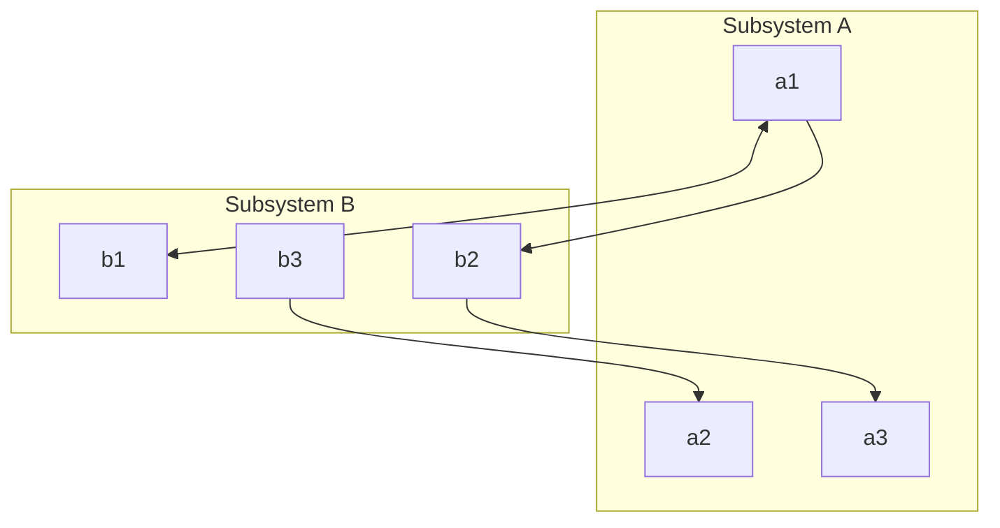

Formal specification is part of a more general collection of techniques that are know as **formal methods**.

> Formal methods are all base on the mathematical representation and analysis of software.

Formal methods include:

* Formal Specification
* Specification Analysis & Proof
* Transformational Development
* Program Verification

Formal methods aren't really used as they are more useful for assembly language programs with limited software testing and tools.
{:.warning}

## Formal Methods
Formal methods have not become mainstream in software development techniques:

* Other software engineering techniques can produce quality systems.
* Formal methods don't reduce time to market.
* The scope of formal methods is limited.
* Formal methods are had to scale up to large systems.

### Formal Method Uses
Formal methods are used to reduce the number of errors in systems. This makes them very applicable to **critical systems**.

Formal methods are most effective when you want to make systems that are completely error free and may not have means to update systems regularly.

## Specification Techniques
There are two main specification techniques:

* **Algebraic Approach** - The system is specified in term of its operations and their relationships.
* **Model-Based Approach** - The system is specified in terms of a state model that is constructed using mathematical constructs such as set and sequences.
	* Operation are defined by modification to the system's sate.
	
	Petri nets are a type of model-based approach.
	{:.info}

## Formal Specification
The formal specification involves investing more effoer in teh early phases of software development.

This reduces **requirement errors** as it forces a detailed analysis of the requirements. 
{:.info}

**Incompleteness** and **inconsistencies** can be discovered and resolved reducing the amount of rework due to issues.

Critical systems development usually follows the **waterfall model** as we won't be reworking the code:

* The system requirement and design are expressed in detail.
	* They are unambiguous and carefully analysed before implementation.

### Interface Specification
This is an **algebraic** formal specification approach. Where large system are decomposed into subsystems with **well-defined interfaces**:

* Allows independent development of each subsystem.
* Interfaces may be defined as **abstract data types** or **object classes**

#### Sub-System Interface Specification
Sub-system interface specification should be **clear and unambiguous** to reduce the change of misunderstanding between a **provider** and **user** of a sub-system:

* The algebraic approach to specification was originally developed for the definition of abstract data types.
* This idea was then extended to model complete system specifications

### Algebraic Specification
An algebraic specification is defined as below:

| \<SPECIFICATION NAME\>(Generic Parameter) |
| :-- |
| **sort** \<name\>   **imports** \<LIST OF SPECIFICATION NAMES\> |
| Informal description of the `sort` and its operations. |
| Operation signatures setting out the names and the types of the parameter to the operations defies over the `sort`. |
| Axioms defining the opertions over the `sort`. |

The parts are defined as follows:

* **Introduction** - Declares the sort (the type name) of the entity being specified (a set of objects with common characteristics). It also imports other specifications to use.
* **Description** - An informal description of the operations to aid understanding.
* **Signature** - Defines the syntax of the interface to the abstract data type (object), including their names, parameter list and return types.
* **Axioms** - Defines the semantics of the operations by defining axioms characterising the behaviour.

#### Algebraic Specification of a `List`
We want to define the data type of a list. This would be represented as such:

| List |
| :-- |
| List(Elem) **sort** List **imports** INTEGER |
| Defines a list where elements are added at the end and removed from the front. The operations are Create, which brings an empty list into existence, Cons, which creates a new list with an added member, Length, which evaluates the list size, Head, which evaluates the list size, Head, which evaluates the front element of the list and Tail, which creates a list by removing the head from its input list. |
| Create $\rightarrow$ List |
| Cons(List, Elem) $\rightarrow$ List Head(List) $\rightarrow$ Elem Length(List) $\rightarrow$ Integer Tail(List) $\rightarrow$ List |
| Head(Create) = Undefined exception (empty list) Head(Cons(L, v)) = if L = Create then v else Head(L) Length(Create) = 0 Length(Cons(L, v)) = Length(L) + 1 Tail(Create) = Create Tail(Cons(L, v)) = if L = Create then Create else Cons(Tail(L), v) |

#### Algebraic Specification for Air Traffic Sector
We want to define the specification of a sector which contains several planes. The planes must be suitably separated:

| Sector |
| :-- |
| **sort** Sector **imports** INTEGER, BOOLEAN |
| Enter - Adds an aircraft to the sector if safety conditions are satisfied. Leave - Remoes an aircraft from the sector. Move - Moves an aircraft from on height to another if safe to do so. Create - Creaes an empty sector Put - Adds an aircraft to a sector with no constraint checks InSpace - Checks if a specified height is available. |
| Enter(Sector, CallSign, Height) $\rightarrow$ Sector Leave(Sector, CallSign) $\rightarrow$ Sector Move(Sector, CallSign, Height) $\rightarrow$ Sector Lookup(Sector, CallSign) $\rightarrow$ Height Create $\rightarrow$ Sector Put(Sector, CallSign, Height) $\rightarrow$ Sector InSpace(Sector, CallSign) $\rightarrow$ Boolean Occupied(Sector, Height) $\rightarrow$ Boolean |
| Enter(S, CS, H) = 	if InSpace(S, CS) then S exception (Aircraft already in sector) 	elseif Occupied(S, H) then S exception (Height conflict) 	else Put(S, CS, H)  Leave(Create, CS) = Create exception (Aircraft not in sector) Leave(Put(S, CS1, H1), CS) = if CS = CS1 then S else Put(Leave(S, CS), CS1, H1)  Move(S, CS, H) =  	if S = Create then Create exception (No aircraft in sector) 	elseif not InSpace(S, CS) then S exception (Aircraft not in sector) 	elseif Occupied(S, H) then S exception (Aircraft not in sector) 	else Put(Leave(S, CS), CS, H) 	 # NoHeight is a constant indicating that a valid height cannot be returned  Lookup(Create, CS) = NoHeight exception (Aircraft not in sector) Lookup(Put(S, CS1, H1), CS) = if CS = CS1 then H1 else Lookup(S, CS)  Occupied(Create, H) = false Occupied(Put(S, CS1, H1), H) = 	...  InSpace() ... |

It is a good idea to implement basic functions such as `Put` and `Create` and then use those to implement other functions.
{:.info}
