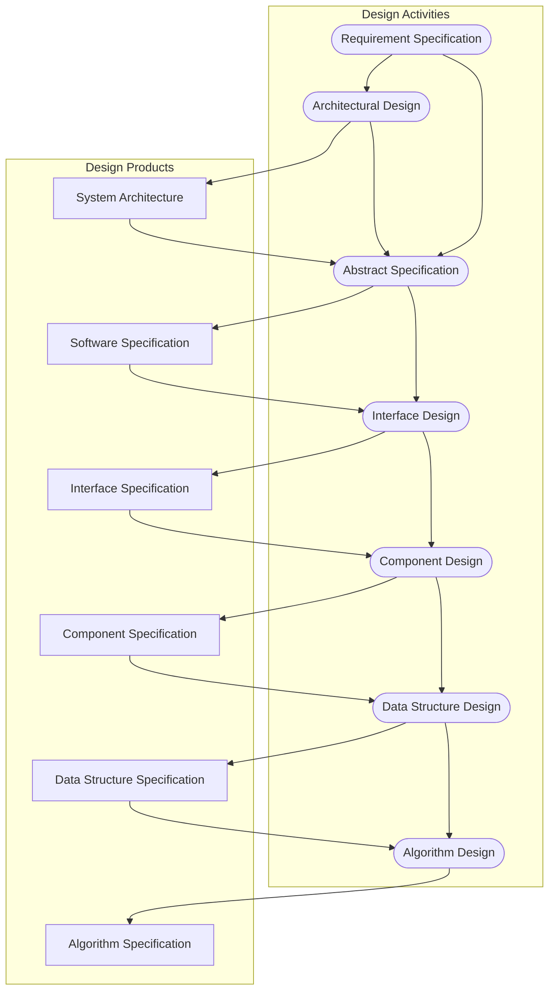

## Software Design
The requirement for software should be split into several object-oriented classes so that development can be distributed between several developers.

Additionally the end software needs to be:

* Simple
* Understandable
* Flexible
* Portable
* Re-usable

## Stages of Design

1. Problem Understanding

	Look at the problem from different angles to discover the design requirements.

1. Identify One or More Solutions

	Evaluate possible solutions and choose the most appropriate depending on the designer's experience and available resources.
1. Describe Solution Abstractions

	Use graphical, formal or other descriptive notations to describe the components of the design.
	
1. Repeat Process for Each Identified Abstraction
	
	Until the design is expressed in primitive terms.
	
## The Design Process
Any design may be modelled as a directed graph made up of entities with attributes with participate in relationships:

* The system should be described at several different levels of abstraction.
* Design takes place in overlapping stages.

Computer systems are not monolithic. They are usually composed of multiple, interacting **modules**. The goal of system design is to decode:

* What the modules are.
* What the modules should do.
* How that modules interact with one-anothe.

### Design Process Phases



* **Architectural Design** - Identify sub-systems.
* **Abstraction Specification** - Specify sub-systems.
* **Interface Design** - Describe sub-system interfaces.
* **Component Design** - Decompose sub-systems into components.
* **Data Structure Design** - Design data structures to hold problem data.
* **Algorithm Design** - Design algorithms for problem functions.

## Modular Programming
Modules should have the following properties:

* Autonomous
* Coherent
* Robust (Shouldn't crash the whole system in the event of an error.)

There are several types of modular programming:

### Procedural Abstraction
Procedural abstraction is where procedures in code represent **distinct logical functions** in a program such as:

* "Display Menu"
* "Get User Option"

### Programs as Functions
Programs as function are where programs are viewed as a function from a set $I$ of legal inputs to a set $O$ of legal outputs:

$$
x\rightarrow f\rightarrow f(x)
$$

ML, Miranda and LISP support this directly and it is useful for non-distributed, terminating systems such as: compilers.

The use of internal state is against functional programming.
{:.warning}

### Object-Oriented Design
This methodology views the system as a collection of interacting objects.

The system **state** is **decentralised** and each object manages its own state.

Objects may be instances of an object class and can communicate by exchanging messages.

### Criteria for Design Methods
There are five criteria to help evaluate modular design methods:

#### Modular Decomposability
This criterion is met by a design method if the method support the composition of a problem into **smaller sub-problems**, which can be solved independently.

Generally the sub-problems will be divided further.
{:.info}

**Top-down design** methods fulfil this criterion by using **step-wise refinement**.

##### Top-Down Design
**In Principle** - This involved starting at the upper most components in the system hierarchy and working down the hierarchy level by level.

**In Practice** - Large systems design is never truly top-down as some branches are designed before others. Designers reuse experience and components during the design process.

#### Modular Composability
A method satisfies this criterion if it leads to the production of modules that may be freely combined to **produce new systems**.

Composability is directly related to the issues of re-usability.
{:.info}

Composability is often at odds with top-down design. 
{:.warning}

#### Modular Understandability
A design method satisfies this criterion is it encourages the development of modules which are easily understandable. 

You should name variables and methods so that they are descriptive about the contents:

```
int A = 21;
```

```
int age_in_years = 21;
```

A component is understandable if:

* It can be understood on its own.
* If the names used are meaningful.
* If there is good documentation.
* If complex algorithms are limited.
	* High complexity involves many relationships between different components.

#### Modular Continuity
This is satisfied if small changes in the specification lead to small changes in the software.

This can be enforced by only using symbolic constrains.
{:.info}

#### Modular Protection
This method is satisfied if the effect of an abnormal condition at run-time only effect one (or very few) modules.

To protect modules you can use input validation and use the most appropriate datatypes.

### Module Storage & Communication
Sub-systems making up a system must exchange and share data so they can work together.

The is how data is stored in the system.
{:.info}

There are two main approaches to data storage:

* The Repository Model
	* All shared data is held in a central database which may be accessed by all sub-systems.
	* Each sub-system or component maintains its own database. Data is then exchanged between sub-systems via message passing.
	
#### Repository Model
There are several **advantages** to the repository model:

* Databases are an efficient way to share large amounts of data and data does not have to be transformed between different sub- systems (they agree on a single data representation).
* Sub-systems producing data need not be concerned with how that data is used by other sub-systems.
* Many standard operations such as backup, security, access control, recovery and data integrity are centralised and can be controlled by a single repository manager.
* The data model is visible through the repository schema.

The **disadvantages** include:

* Sub-systems must agree on the data model which means compromises must be made, for example with performance.
* Evolution may be difficult since a large amount of data is generated and translation may be difficult and expensive.
* Different systems have different requirements for security, recovery and backup policies which may be difficult to enforce in a single database.
* It may be difficult to distribute the repository over a number of different machines.