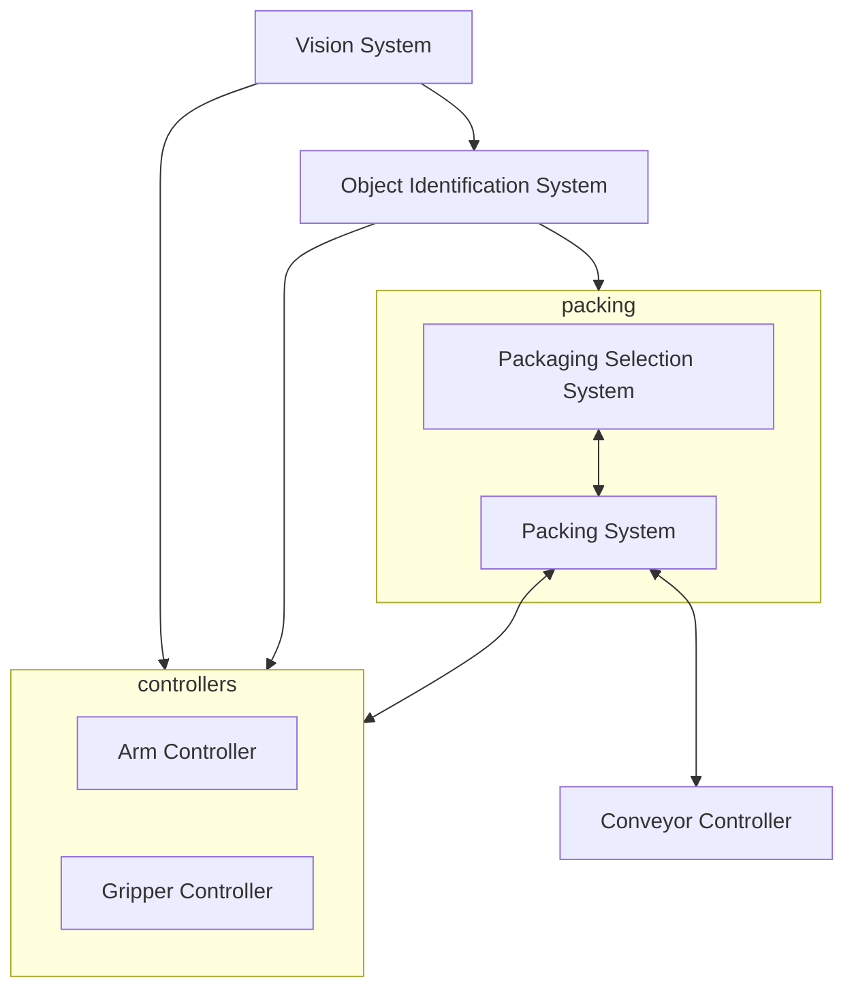

## Architectural Design
This stage represents the link between **specification** and **design processes**:

* Often carried out in parallel with some specification activities.
* Involves identifying **major system components** and their **communications**.

### Architectural Design Process

1. System Structuring
	* The system is decomposed into several principal sub-systems and communications between these sub-systems are identified.
1. Control Modelling
	* A model of the control relationships between the different parts of the system is established.
1. Modular Decomposition
	* The identified sub-systems are decomposed into modules.

## Sub-Systems vs. Modules

* A **sub-system** is a system in its own right whose operation is independent of the service provided by other sub-systems. (Java Packages/Libraries)
	* Subsystems are beneficial as you can mix and match them to make new systems out of existing components.
* A **module** is a system component that cannot be considered a separate system.
	
	Generally modules are made of several sub-systems.
	{:.info}
	
## Architectural Models
Several architectural models may be produces during the design process. Each model presents **different perspectives** on the architecture:

* Static Structural Model - Shows the major system components.
* Dynamic Process Model - Shows that process structure of the system.
* Interface Model - Defines sub-system interfaces.
* Relationships Model - Such as a data-flow model.

### System Structuring
This is where you decompose the system into interacting sub-systems.

The architectural design is normally expressed as a **block diagram** presenting an overview of the system structure:

#### Packing Robot Control System

## Network Models
You can use network models to represent networked devices, for example in a client-server architecture:

## Control Models
These are concerned with the control flow between sub-systems:

* **Centralised Control**
	* One sub-system has overall responsibility for control and starts and stops other sub-systems.
* **Event-Based Control**
	* Each sub-system can respond to externally generated events from other sub-systems or the system's environment.

### Centralised Control
A control sub-system takes responsibility for managing the execution of other sub-systems. There are two main types of centralised control models:

* **Sequential**
	* **Call-return model** is used. This is where control starts at the top os a subroutine hierarchy and moves downwards. 
* **Parallel**
	* **Manager model** is used. One system component controls the stopping, starting and coordination of other system processes.
		
		This can also be implemented in sequential systems as a case statement.
		{:.info}

### Event-Driven Systems
These are driven by externally generate evens when the timing of the event is out of the control of the sub-systems which process the event.

There are two main event-driven models:

#### Broadcast Model
An event is broadcast to all sub-systems. Any subsystem which can handle the event may do so.

This is effective in integrating sub-systems on different computers in a network.
{:.info}

* Sub-systems register an interest in specific events. When these occur, control is transferred to the sub-system which can handle the event. 
* **Control policy** is not embedded in the event and message handler. Sub-systems decide on events of interest to them. 

Subsystems don't know if or when an event will be handled.
{:.warning}

#### Interrupt-Driven Models
Used in real-time system where interrupts are detected by an interrupt handler and passed to some other component for processing.

These are used where a fast response to an event is essential.
{:.info}

* There are known interrupt types with a handler (routine) defined for each type.
* Each type is associated with a memory location and a hardware switch causes transfer to its handler.

These are very fast by complex to program and validate.
{:.warning}

## Modular Decomposition
This is another structural level where sub-systems are decomposed into modules.

If possible, decisions about **concurrency** should be delayed until modules are implemented.
{:.info}

There are two modular decomposition models covered:

### Object Models
These structure the system into a set of **loosely coupled** objects with well-defined interfaces.

Object-oriented decomposition is concerned with identifying:

* Object Classes
	* Attributes
	* Operations

When implemented, objects are created from these classes and some control model is used to coordinate object operations.

**Class diagrams** are a type of object model.
{:.info}

### Data-Flow Models
These are **functional transformations** that process inputs to produce outputs.

May be referred to as a **pipe** and **filter** model (as in UNIX shell)
{:.info}

These aren't really suitable for interactive systems.
{:.error}