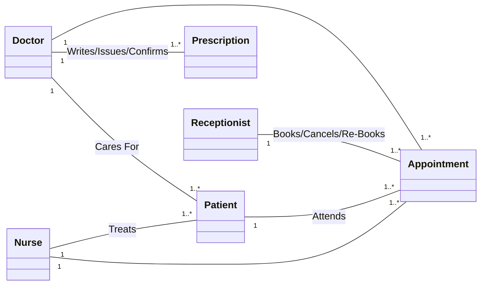
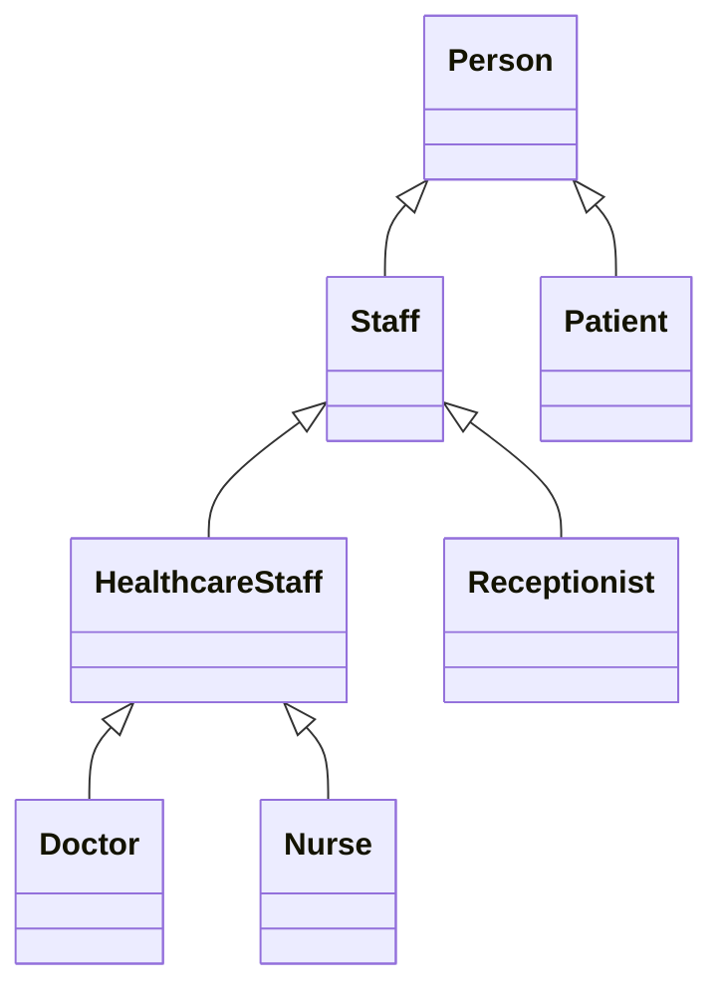
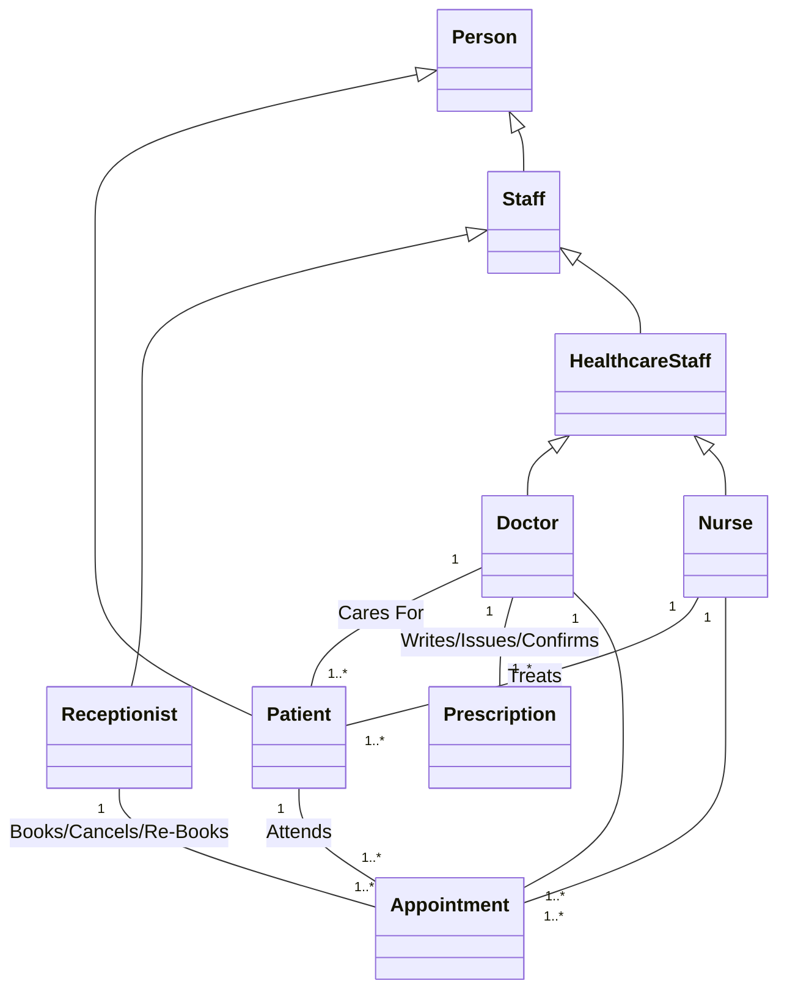
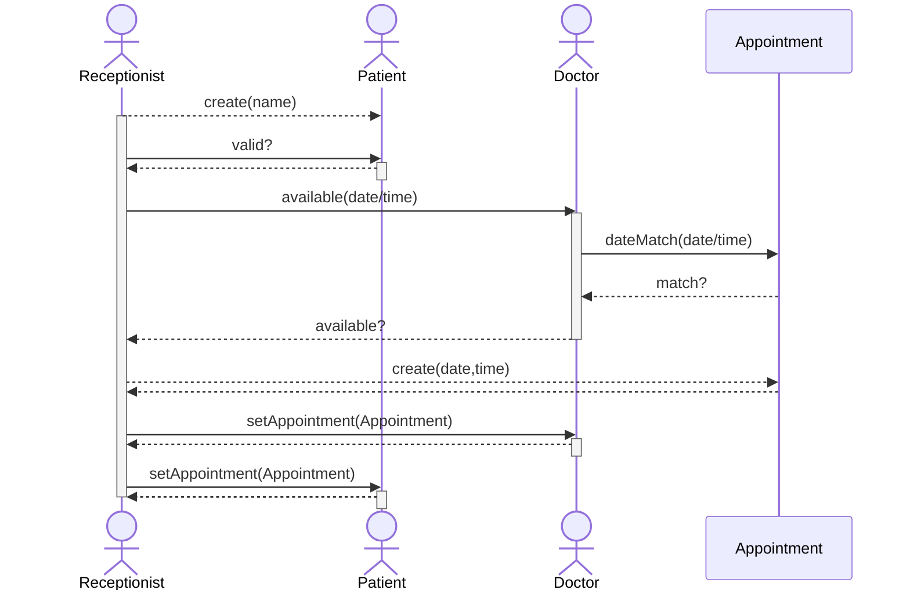
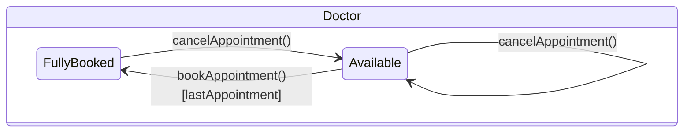

## The Problem
You have been contacted to develop a computer system for a university medical clinic.

The clinic needs the following types of service:

* Staff management
* Booking appointments
* Keeping records

You are asked to build an interactive system which
handles all of these aspects online.

## Developing Requirements
We need to identify all the actors:

* Doctors
* Patients
* Admin Staff

and the data we want to keep track of:

* Appointments
* Treatments

We can as the actors about their requirements that can then be made into use-cases.
{:.info}

## Use Case Model
We should take the requirements, identify the **actors** and the **use cases** (tasks) that the actors must undertake.

 R
R --- va
R --- sa
R --- ca
D --- vn
D --- an
D --- ip
Pa -up- rrp
Pa -up- ra
Ph -up- sp
Ph -up- cs
'>

We shouldn't make addition use-cases without first confirming with the client.
{:.warning}

We should make this use-case diagram with an iterative approach.
{:.info}

## Identifying Classes
This is where the **noun identification** technique is used.

Consider that we have the following requirements document:

> Clinic, appointments and treatment system.

> Before seeing a doctor or nurse the patient needs to make an appointment. The appointment will be made by the receptionist, before making the appointment the patient needs to ask the patient which doctor they wish to see and if the appointment is a standard appointment or urgent appointment. The receptionist will use this information, check the appointment schedule and find a free slot and make the booking. When the patient sees the Dr, the Dr will sometimes issue a prescription. The patient may at some time request a repeat issue of their prescription. Receptionists can also cancel appointments. Each doctor has a maximum of 2000 patients registered to them.

We can then underline all nouns like:

* Clinic
* System
* Doctor
* Appointment
* Prescription
* Time
* ...

We can the use these as a list of **candidate classes**.
{:.info}

We should remove nouns that are:

* Outside the scope of the system.
* Redundant 
* Measures, such as "time".
* Vague (need clarification)
* Meta-language, such as "system".

### Relations Between Classes
We can use the classes we have found to create an initial class model using only the **multiplicity relations**:

### Inheritance Class Model
We can see if there are any shared roles between the actors. This can inform the **inheritance**. 

We can then involve hierarchy this in our initial diagram:

## Interaction Diagrams (Sequence Diagram)
Consider what happens in the appointment booking scenario when a user wishes to make an appointment:

1. The receptionist must check that the person is a valid patient.
1. Then the doctor object must be checked to see if there are any available appointments.
1. If there are any suitable slots available, a new appointment should be created and assigned to the doctor.

This can be shown in the following sequence diagram:

## State Diagrams
Objects in the system have a state. State diagrams show how methods can change an object's state:

