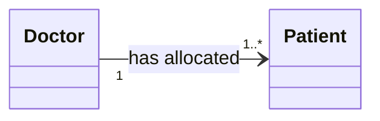
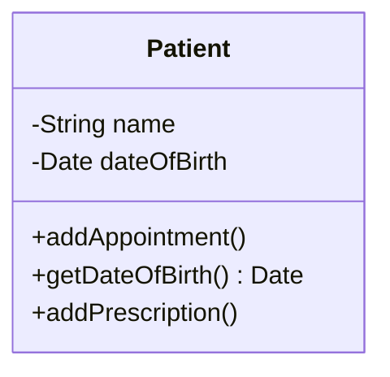
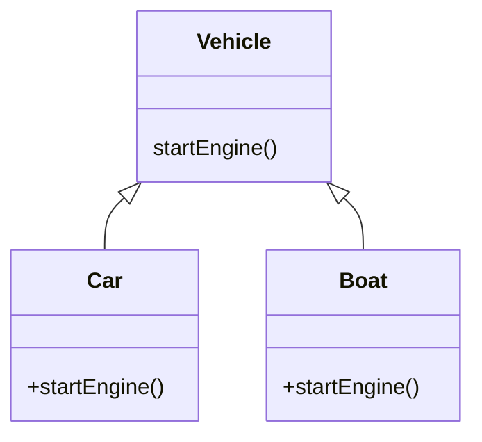
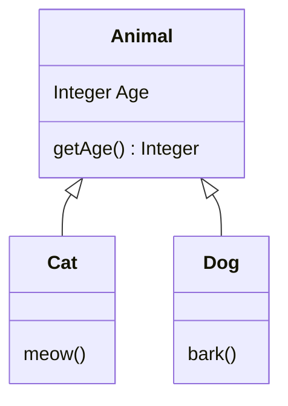

## Naming Classes
Classes should be named with:

* Nouns
* Non-plurals
* Not general process descriptors:
	* Printing - Bad
	* Printer - Good
	
## Class Models
We can use two different methods to derive classes:

* **Data Driven Design** (DDD) - We identify all the data of the system and divide it into classes. We then assign particular  responsibilities (methods) to these classes.]
* **Responsibility Driven Design** (RDD) - We identify all the responsibilities of the system and divide them into classes. We then find the data each class requires.

### Associations
If some object of class $A$ has to know about some object of class $B$ then they have an association.

We can also note multiplicity on the association:

### Attributes & Operations

* **Attributes** - Describe the data contained in an object of the class and their type.
* **Operations** - Define the way in which objects may interact.

### Dynamic Binding
You can overwrite the an inherited method using dynamic binding:

### Generalisation
All attributes and methods from the top of the inheritance are passed though to the children:

## CRC Cards
The following are examples of CRC (classes, responsibilities, collaborations) cards:

| LibraryMember | |
| :-- | :-- |
| Responsibilities | Collaborators |
| Maintain data about copies currently borrowed. Meet requests to borrow and return copies. | `Copy` |

| Copy | |
| :-- | :-- |
| Responsibilities | Collaborators |
| Maintain data about a particular copy of a book. Inform corresponding `Book` when borrowed and returned. | `Book` |

| Book | |
| :-- | :-- |
| Responsibilities | Collaborators |
| Maintain data about one book. Know whether there are borrow-able copies. |  |

* **Collaborators** - Help to carry out each responsibility.
* There should be a low number of **responsibilities** per class.
	* Cohesion
* The number of **collaborators** should be low too.
	* Coupling