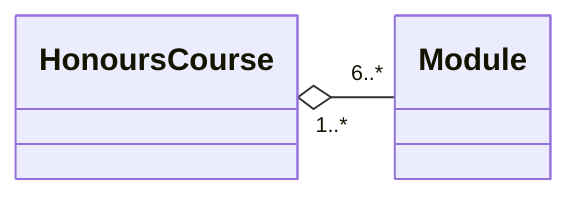
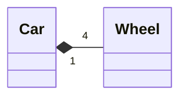
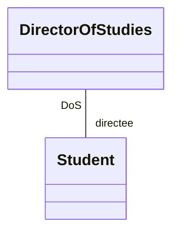
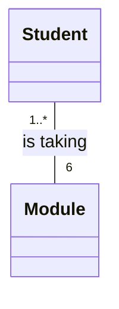
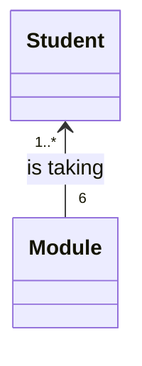
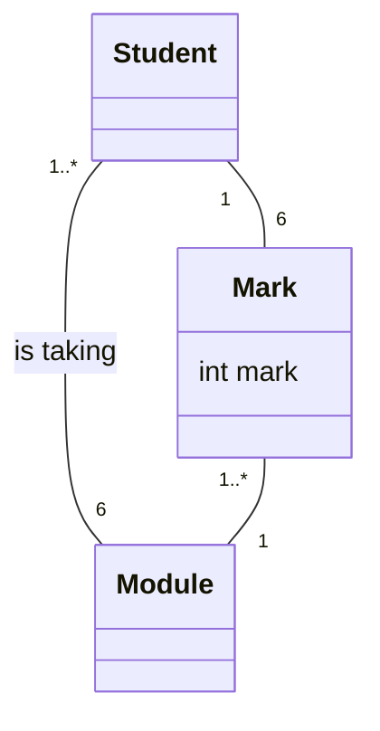
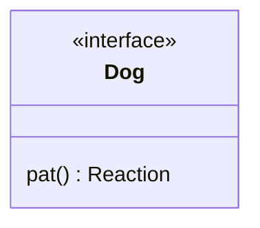
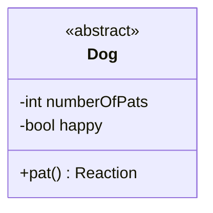

## Aggregation
Aggregation is a way of saying that an object is **part of** anther class:

This is opposed to an **is a** relation with inheritance.
{:.info}

The aggregation also allows the `Module` to be involved in multiple `HonoursCourses`.

### Composition
This is a specialised form of aggregation. In composition the whole **strongly owns** its parts:

* If the whole object is copied or deleted, its parts are copied or deleted with it.
* Multiplicity at the whole end must be `1` or `0..1`.

One wheel can't be part of multiple cars.
{:.info}

## Roles
Roles can be written on the ends of the arrows like so:

## Association with No Navigability
You can have associations with no relation type (arrows) but only a cardinality:

### Navigability
We can put an arrow on one, or both ends of the association to represent that it is possible for messages to be send in the direction of the arrow:

This arrow head just means that they are **associated**.
{:.info}

## Qualified Composition
This is putting extra attributes on the association.

I can't make this with either of my graphing tools and I'm pretty sure no-one ever uses this. Just put the attribute in the class like a normal person.
{:.error}

## Derived Associations
Derived associations show the associations that are implied by others. They are denoted by a `/`:

Lecturer -up- Module: /teaches course >
Student -r- Module: is taking
">

The direction of an association label is denoted by the black arrow.
{:.info}

## Constraints
Constraints are represented as a dotted line between associations with a boolean operand. The two associations is then constrained by that operand.

I can't make this with either of my graphing tools again. It can also be made using other methods.
{:.error}

## Association Class
This is a class with a dotted line, connected to an association. It holds attributes specific to an association.

I can't make this with either of my graphing tools again. It should be avoided and the following method used instead.
{:.error}

You can avoid using these by making an additional class normally:

## Interfaces
Interfaces specify operations that are visible outside of the class. All elements of an interface are public:

They don't require an implementation.
{:.info}

## Abstract Classes
These are similar to interfaces but are general classes used to define a set of classes:

