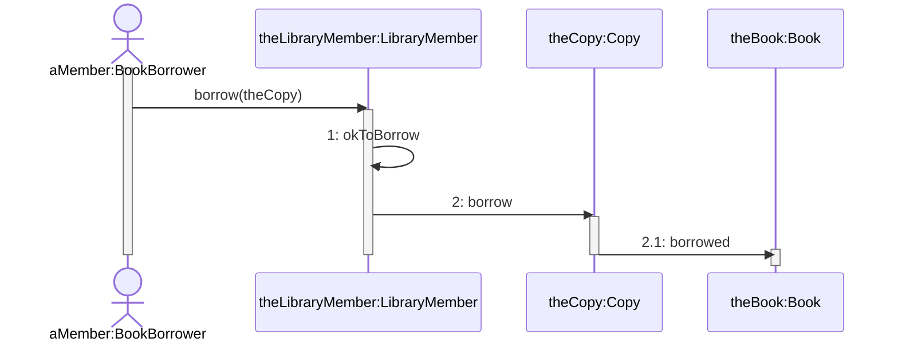
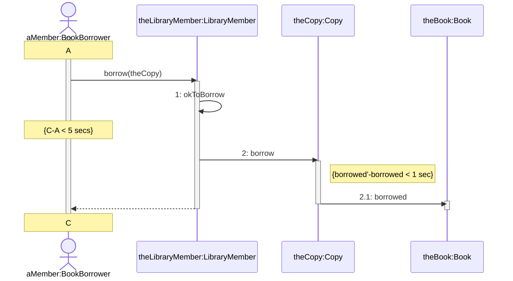
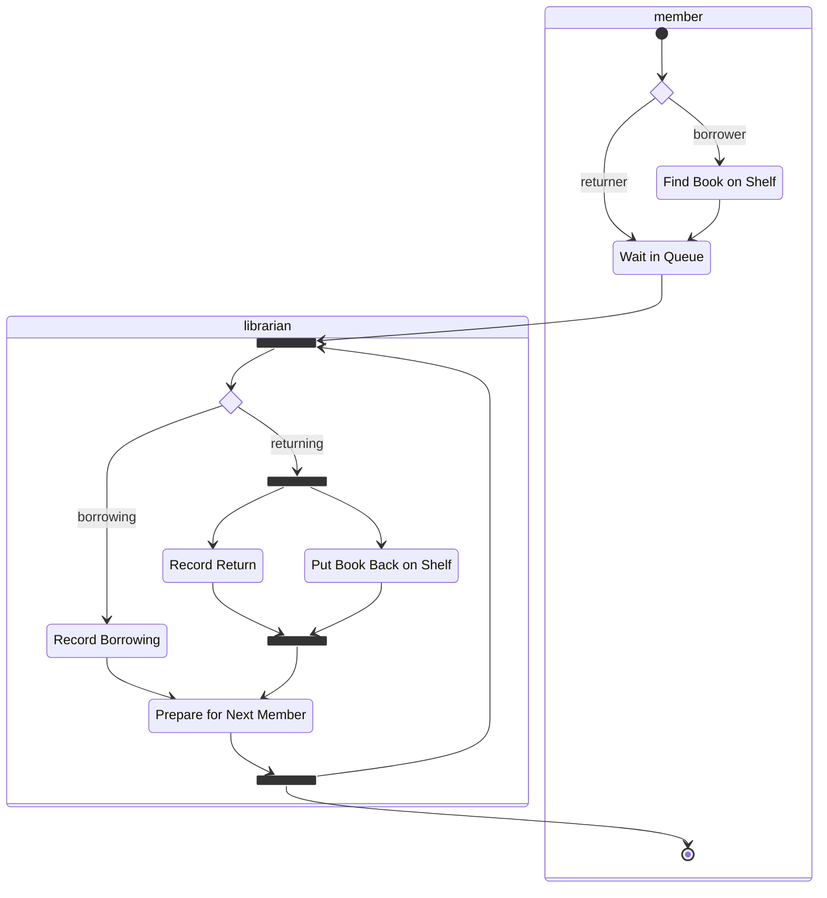

Interaction diagrams record how objects interact to perform a particular use-case.

## Collaboration Diagrams
Collaboration diagrams show links, objects and actors.

The labelled arrows show a message sent from one object to another.

librarymember -- librarymember:1: okToBorrow >
[theCopy:Copy] as copy
librarymember -- copy:2: borrow >
[theBook:Book] as book
copy -r- book:2.1: borrowed >
'>

The objects are named as `objectName:className`.
{:.info}

## Sequence Diagrams
This is the same events as before, shown in a sequence diagram:

* Messages are shown as solid lines.
* Returns are shown as dotted lines.

### Timing Constraints
You can show timing constraints like so:

## Creating & Deleting Objects
In collaboration diagrams:

* You can show if objects are created and destroyed by labelling them with `{new}` and `{destroyed}`.
* If an object is created and destroyed in the same interaction, it can be labelled `{transit}`.

UTO -r- Lecturer:3: destroy() >
UTO -- DirectorOfStudies:2: new DirectorOfStudies(n) >
'>

You can create and delete objects in a sequence diagram like so:

> Lecturer:1: n := getName()
activate Lecturer
deactivate Lecturer
create DirectorOfStudies
UTO ->> DirectorOfStudies:2: new DirectorOfStudies(n)
UTO ->> Lecturer:3: destroy()
destroy Lecturer
deactivate UTO
'>

## Messages from an Object to Itself
If an object sends a message to itself you can use the Java keyword `this`. This will call the method on the existing object.

Omitting messages from an object to itself, for internal computation, can be used as a form of **abstraction**.

## Packages
We can split of a **sub-collaboration** into a package in order to simplify a collaboration:

* Collaboration - Collection of objects and links between them.
* Sub-Collaboration - A subset of the objects together with the links connecting those objects.

## Activity Diagrams
The following is an example of an activity diagram:

It has the following components:

* **Activity** - A task to complete.
* **Transition** - Moving from one activity to another.
* **Synchronisation Bar** - Describes the coordination of activities.
* **Decision Diamond** - Can be used to show decisions.
* **Start/Stop Markers** - The same as state diagrams.

There are several differences between activity diagrams and state diagrams:

* Activity diagrams don't normally include **events**.
* Activities are intended to proceed, following the flow described by the diagram. Usually one of the **guards** of an edge leaving an activity should be satisfied.
* Concurrent activities can be modelled by using the synchronisation bar notation.