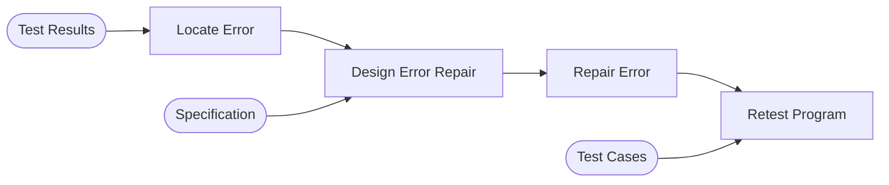
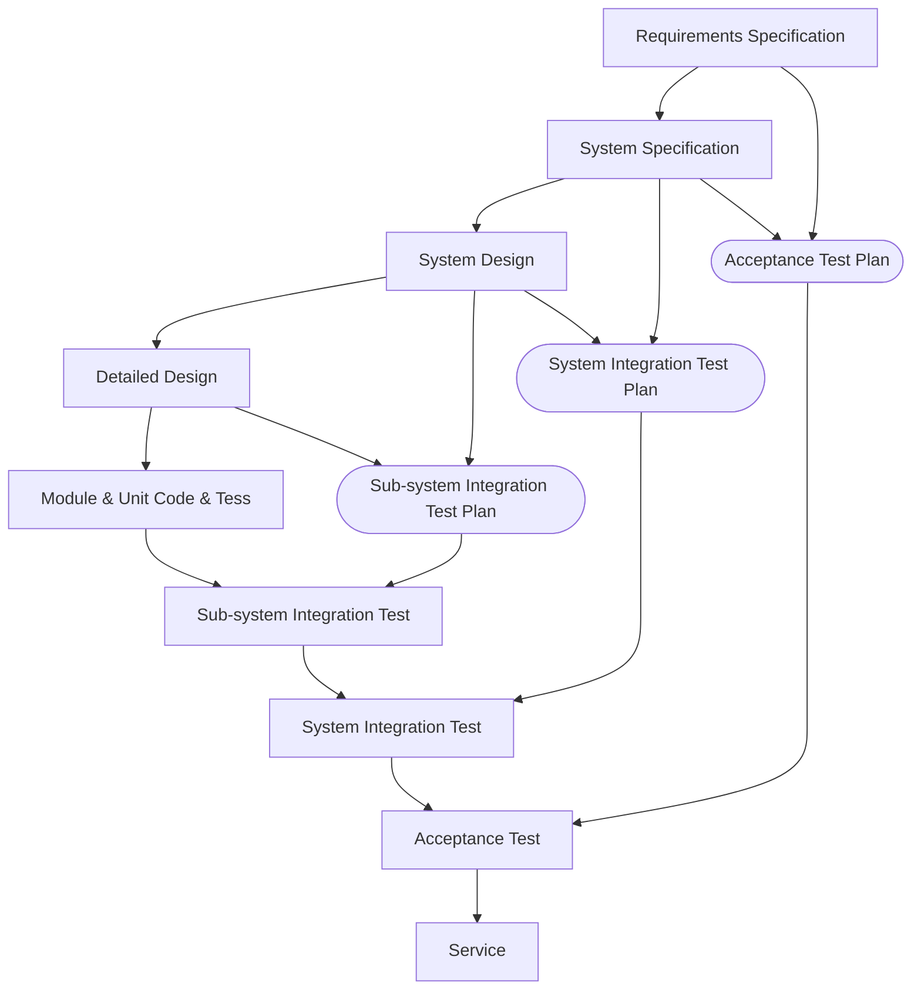

V & V is a whole-life cycle process. it must be applied at each stage in the software process. 

## Verification
This is whether the software confirms to its **specification**:

* This may involve checking that it meets its **functional** and **non-functional requirements**.

## Validation
This is whether the software does what the **user requires**:

* This goes beyond checking it meets the specification.
* The specification doesn't walways accurately reflect the real needs of the user.

## Program Inspection
### Static Verification
This is the analysis of the static system in order to discover problems:

* This can include using tools such as the compiler to find errors and warnings.
* Includes variable naming and style.
* Using the correct domain for methods and attributes.
* Includes using the correct variable types (`short`/`int`)

These generally include **syntactic** errors.
{:.info}

### Dynamic Verification
This is concerned with observing whether the product behaves as expected when given an input:

* This is only possible when an executable version of the program is available.
	* Incremental development allows for more dynamic verification.
* Real data should be used as input to find errors.

This method generally finds **semantic** errors.
{:.info}

### Testing with Agile

* Development is test driven.
	* Test is developed before the target code.
	* The target code is developed to pass the test.
* The test purely based on the specification.
* Code is often simpler and closer to the specification.

### Types of Testing
**Defect Testing**:

* Tests are designed to discover system defects.
* A successful test is one which reveals a defect in the system.
* Bugs in the code create defects.

**Statistical Testing**:

* Test the reliability of the system based on the frequency of user inputs.

**Regression Testing**:

* After fixing a defect, it is a good idea to retest the program to make sure that the fix hasn't introduced new problems.

## Debugging Process

## Verification Model of Development (V-Model)

Test planning is about defining standards for the testing process rather than describing the product tests.
{:.info}

### Software Test Plan
The software **test plan** has the following structure:

* **The Testing Process** - A description of the major phases of the testing process.
* **Requirements Traceability** - Testing should ensure that all requirements are individually tested.
* **Tested Items** - Specify the products of the software process to be tested.
* **Testing Schedule** - An overall schedule for the testing of the software is required and resources must be allocated as part of the general project schedule.
* **Test Recording Procedures** - The results of tests must be systematically recorded. This allows testing audits to ensure the testing has been completed.
* **Hardware & Software Requirements** - This part sets a list of software tools required and the estimated hardware utilisation.
* **Constraints** - Any constraints affecting the testing process.

## Software Inspection
This is where the code is inspected **without running** it. It has the aims of identifying:

* Defects
* Poor Programming Style
* Compliance with Standards
* Compliance with Portability & Maintainability