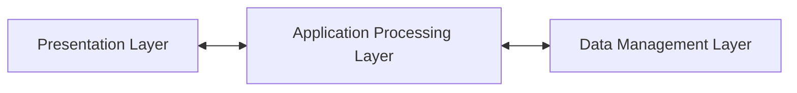
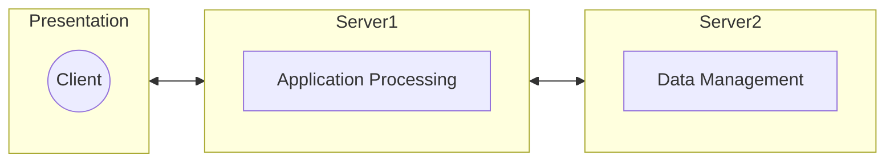

These are architectural designs for software the executes on more than one processor.

This can be on the same computer or between many machines.
{:.info}

## System Types

* **Personal Systems** - Not distributed and are designed to run on a personal computer.
* **Embedded Systems** - Run on a single processor or on an integrated group of processors.
* **Distributed Systems** - Where the system software runs on a loosely integrated group of cooperating processors linked by a network.

## Distributed Systems
Distributed systems have the following **advantages**:

* Resource Sharing
* Openness
* Concurrency
* Scalability
* Fault Tolerance
* Transparency

There are also several **disadvantages**:

* Complexity
* Security
* Manageability
* Unpredictability

### Middleware

This is software that **manages** and supports the different components of a distributed system. In essence, it sits in the **middle** of the system.

Middleware is usually off-the-shelf rather than
specially written software they can be:

* Transaction Processing Monitors
* Data Converters
* Communication Controllers

### Distributed System Architectures

* **Client-Server** - Distributed services which are called on by clients. Servers that provide the services are treated differently from clients that use the services.
* **Distributed Object Architectures** - No distinction between clients an servers. Any object on the system may provide and use services from other objects.

#### Multiprocessor Architectures
This is the simplest distributed system model:

* System composed of **multiple processes** which **may** execute on different processors.
* Architectural model of many large real-time systems.
* Distribution of process to processor may be pre-ordered or may be under the control of a **dispatcher**.

#### Client-Server Architectures
The application is modelled as a set of **services** that are processed by **servers** and a set of **client** that use theses services:

* Clients know of servers by servers need not know of clients.
* Clients and servers are **logical processes**.
* The mapping of processors to processes is not necessarily 1:1

##### Layered Application Architecture
System architectures are split into a number of layers:

* **Presentation Layer** - Concerned with presenting the results of a computation to system users and with collecting user inputs.

* **Application Layer Processing Layer** - Concerned with providing application specific functionality:
	* In a banking system, banking functions such as open account...
	
* **Data Management Layer** - Concerned with managing the system databases.

They are arranged as so:

##### Thin & Fat Clients
These are two types of organisation in the **client-server architecture**. 

* **Thin Client Model** - In a thin-client model, all of the **application processing and data management** is carried out on the server. The client is just responsible for running the presentation software.
	* Can be used when legacy systems are migrated to client-server architectures:
		* The legacy system acts a a server in its own right with a graphical interface implemented on a client.
	* Places heavy processing load on both the server and the network.
* **Fat Client Model** - In this model, the server is only responsible for **data management**. The software on the client implements the application logic and the interaction with the system user.
	* The capabilities of the client system must be known in advance.
	* More complex management than a thin client.
	* New versions of the application have to be installed on all clients.
	
##### Three-Tier Architectures
This is where each of the application layers are executed on separate processors:

* Allows for better performance.
* A more scalable architecture:
	* As demands increase extra servers can be added to the data management or application processing layers.
	

#### Distributed Object Architecture
In this architecture there is no distinction between clients and servers.

Object communication is through a middleware system called an **object request broker** (software bus):

* Each object can call on the **server process** of another object on the software bus.

**Advantages**:

* This allows the system design to **delay decisions** on where and how services should be provided.
	* Service-providing objects can execute on any node of the network and thus the distinction between thin/fat client models becomes irrelevant.
* It is **easy to add** new nodes onto the server.
	* **Object communication standards** can be used that allow objects written in different languages to communicate.
* Is is possible to **reconfigure** the system dynamically. 