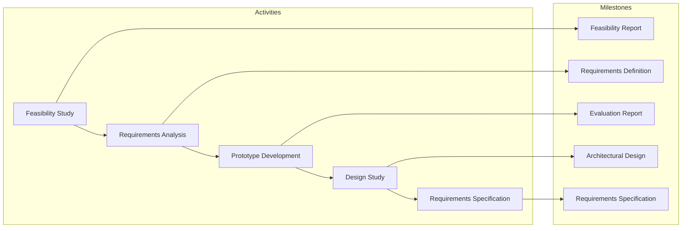
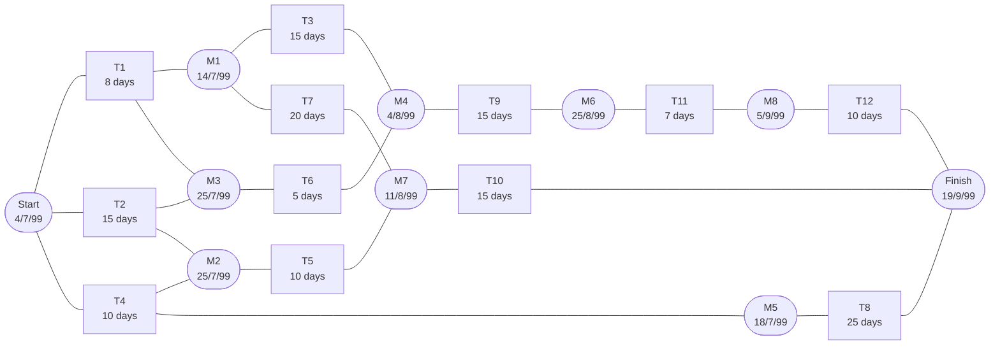
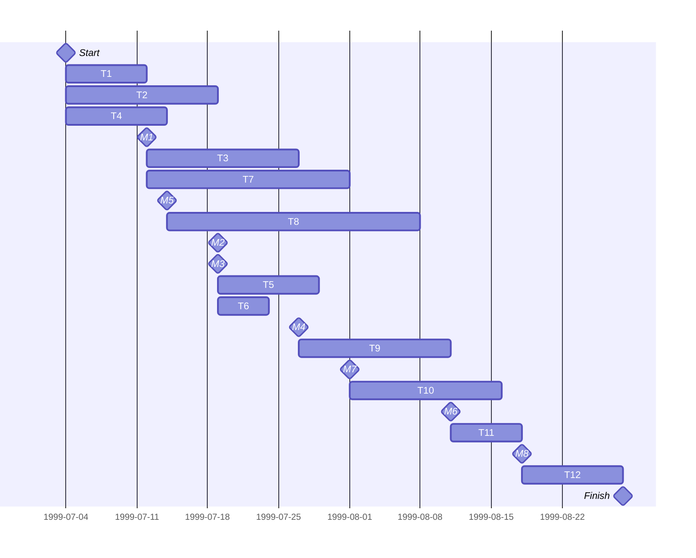
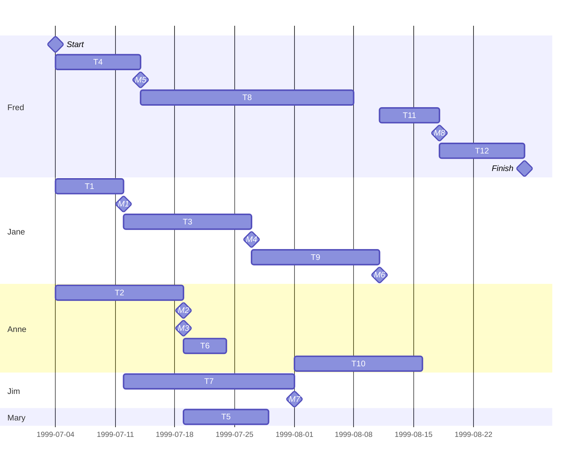

This is the process of organising, planning and scheduling software projects.

We need to make sure that the product is delivered **on time** and each component is delivered **on schedule**.

## Management Activities

* Proposal Writing
* Project Planning and Scheduling
* Project Costing
* Project Monitoring and Reviews
* Personnel Selection and Evaluation
* Report Writing and Presentations
* Project Staffing & Training

### Project Planning
The following types of project plan exist:

* **Quality Plan** - Describes the quality procedures and standards that will be used in a project.
* **Validation Plan** - Describes the approach, resources and schedule used for system validation.
* **Configuration Management Plan** - Describes the configuration management procedures and structured to be used.
* **Maintenance Plan** - Predicts the maintenance requirement for the system, maintenance costs and effort required
* **Staff Development Plan** - Describes how the skills and experience of the project team members will be developed.

The project plan should have the following structure:

1. Introduction
1. Project Organisation
1. Risk Analysis
1. Hardware and Software Resource Requirements
1. Work Breakdown
1. Project Schedule
1. Monitoring and Reporting Mechanisms

#### Activity Organisation
Activities in a project should be organised to produce **tangible outputs** for management to judge progress:

* **Milestones** -  Are the end-pont of a process activity.
* **Deliverable** - Are project results delivered to customers.

We can see this in the requirements engineering process:

### Project Scheduling
This is the process of splitting **projects** into **tasks** and estimating the time and resources required to complete each task. We should:

* Organise tasks **concurrently**.
* Minimise **task dependencies** to avoid delays.

We could face the following issues:

* **Estimating** the **difficulty** of problems is hard.
* Productivity is **not proportional** to the number of people.
* Adding people **late** can delay a project due to **communication overheads**.

Tasks should not be too small, about a **week** in length.
{:.info}

#### Task Durations & Dependencies

| Task | Duration/Days | Dependencies |
| :-- | --: | :-- |
| T1 | 8 | |
| T2 | 15 | |
| T3 | 15 | T1 (M1) |
| T4 | 10 | |
| T5 | 10 | T2, T4 (M2) |
| T6 | 5 | T1, T2 (M3) |
| T7 | 20 | T1 (M1) |
| T8 | 25 | T4 (M5) |
| T9 | 15 | T3, T6 (M4) |
| T10 | 15 | T5, T7 (M7) |
| T11 | 7 | T9 (M6) |
| T12 | 10 | T11 (M8) |

#### Activity Network

* **Minimal time** - Length of the longest (**critical**) path which is 55 days.

#### Activity Timeline (Gantt Chart)

You can extend the bars to show lag.
{:.info}

#### Staff Allocation (Gantt Chart)

The milestones weren't shown on the slide in this chart. I was too lazy to take them out.
{:.warning}

#### Pert Charts
These show the following:

* **Early Start** - Earliest time a task can start.
* **Early End** - The earliest time the task can end.
* **Late Start** - The latest time the task can start without delaying the deadline.
* **Late End** - The latest time the project can end without delaying the deadline.
* **Slack** - The amount a task can be delayed without delaying the project.
	* Calculated from *Late Start* - *Early Start*.
	* Slack = 0 means that the task is **critical**.
	
They are shown as a set of linked tables with the following format:

| Duration: 6 | Task 1 |
| :-: | :-: |
| Start | End |
| Early: 0 | Early: 6 |
| Late: 8 | Late: 14 |

You might find better information on this type of chart by searching for **activity networks**. Pert charts seem to be a different thing.
{:.info}

## Risk Management
This is drawing plans to minimise the effect of risks on the project.

Risks can be in the following categories:

* **Project Risks** - Affect the **schedule** or **resources**.
* **Product Risks** - Affect the **quality** or **performance** of the software being developed.
* **Business Risks** - Affect the organisation developing or procuring the software.

### Risk Management Process

1. **Risk Identification** - Identify project, product and business risks.
1. **Risk Analysis** - Assess the likelihood and consequences of these risks.
1. **Risk Planning** - Draw up plans to avoid or minimise the effects of the risk.
1. **Risk Monitoring** - Monitor the risks throughout the project.

### Risk Identification
You could identify risks in the following categories:

* **Technology** - The database used in the system cannot process as
many transactions per second as expected.
Software components which should be reused contain
defects which limit their functionality.
* **People** - It is impossible to recruit staff with the skills required.
Key staff are ill and unavailable at critical times.
Required training for staff is not available.
* **Organisational** - The organisation is restructured so that different
management are responsible for the project.
Organisational financial problems force reductions in the
project budget.
* **Tools** - The code generated by CASE tools is inefficient.
CASE tools cannot be integrated.
* **Requirements** - Changes to requirements which require major design
rework are proposed.
Customers fail to understand the impact of requirements
changes.
* **Estimation** - The time required to develop the software is
underestimated.
The rate of defect repair is underestimated.
The size of the software is underestimated.

### Risk Analysis
We need to estimate the following:

* **Probability**:
	* Very Low
	* Low
	* Moderate
	* High
	* Very High
* **Risk Effects**:
	* Catastrophic
	* Serious
	* Tolerable
	* Insignificant

We can then put the analysis in the following table:

| Risk | Probability | Effects |
| :-- | :-- | :-- |
| Organisational financial problems force reductions in the project budget. | Low | Catastrophic |
| | | |

### Risk Planning
We can use the following strategies to minimise risk:

* **Avoidance Strategies** - The probability that the risk will arise is reduced.
* **Minimisation Strategies** - The impact of the risk on the project or product will be reduced
* **Contingency Plans** - If the risk arises, contingency plans are plans to deal with that risk.

### Risk Monitoring
We can draw up a table of **risk factors** and indicators so that we can spot issues early:

| Risk Type | Potential Indicators |
| :-- | :-- |
| People | Poor staff morale, poor relationships amongst team member, job availability |
| | |