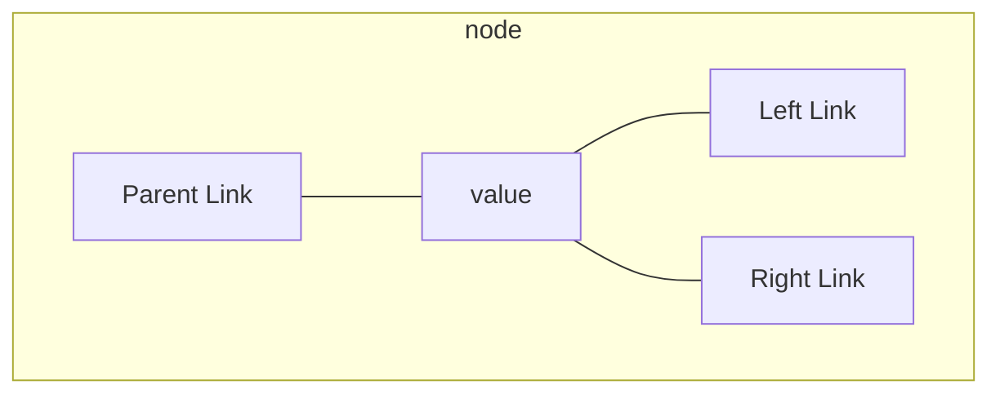

## Linked Lists & Arrays
This lecture started by covering arrays and linked lists. There are several lectures on linked lists below:

* [Linked Lists - 1 (Searching)]({{site.baseurl}}/comp108/lectures/2021/03/04/1.html)
* [Linked Lists - 2 (Insertion)]({{site.baseurl}}/comp108/lectures/2021/03/04/2.html)
* [Linked Lists - 3 (Deletion)]({{site.baseurl}}/comp108/lectures/2021/03/05/1.html)
* [Linked Lists - 4 (Summary)]({{site.baseurl}}/comp108/lectures/2021/03/05/2.html)
	* This lecture includes information about the time complexity and the differences between linked lists and arrays.

## Dictonaries & Sorted Tables
We can store data in a key-value **dictionary** store like so: [Collections (Generics, Stacks, Hash Maps)]({{site.baseurl}}/comp122/lectures/2021/04/17/1.html)

If a dictionary is ordered, we can create a **vector** to **store the values** sorted by their key.

## Binary Search
This method has been covered before in the following lectures:

* [Arrays - Binary Search]({{site.baseurl}}/comp108/lectures/2021/02/18/2.html)
* [Linked Lists - 1 (Searching)]({{site.baseurl}}/comp108/lectures/2021/03/04/1.html)

We can calculate the time complexity of the recursive algorithms using the following cases:

$$
T(n)=
\begin{cases}
b & \text{if } n < 2\\
T(\frac n 2) +b & \text{otherwise}
\end{cases}
$$

To find the total running time then we need to find how many halves it takes to get to one item remaining. This give the order of:

$$
O(\log n)
$$

We can compare the time complexity of a linked list and sorted array:

| Method | Linked List | Lookup Table |
| :-- | :-- | :-- |
| `findElement` | $O(n)$ | $O(\log n)$ |
| `insertItem` - Having located the item. | $O(1)$ |
| `removeElement` | $O(n)$ | $O(n)$ |
| `closestKeyBefore` | $O(n)$ | $O(\log n)$ |

We can use a binary search tree to take advantage of the search capabilities of an array while maintaining the insertion speed on a linked list.
{:.info}

## Trees
### Rooted Trees
These are a standard tree data-structure which has a root node with no parent.

### Binary Tree
This is a rooted tree with **at most** two children on each node. They can be represented by the following data-structure:



### Depth of Node in a Tree
The depth of a node, $v$, is the number of ancestors of $v$, excluding $v$ itself. This can be computed using the following function:

$\text{depth}(T,v)$

```
if T.isRoot(v) then
	return 0
else
	return 1 + Depth(T, T.parent(v))
```

### Height of a Tree
the height of a  tree is equal to the maximum depth of an external node in it. This function computes the height of the subtree rooted at $v$.

$\text{height}(T,v)$

```
if isExternal(v) then
	return 0
else
	h = 0
	for each w in T.children(v) do
		h = max(h, height(T, W))
	done
	return 1 + h
```

### Traversal of Trees
Traversal of trees has been covered in this lecture:

* [Trees - 2 - Binary Trees]({{site.baseurl}}/comp108/lectures/2021/03/18/2.html#traversing)

#### Binary Search Trees
We can apply this traversal to binary search trees. We have seen this before in the following lecture:

* [Trees - 3 - Applications]({{site.baseurl}}/comp108/lectures/2021/03/18/3.html#binary-search-tree)

##### Searching in a BST
Here is a recursive searching method:

* Input - A key $k$ and a node $v$ of a binary search tree.
* Output - A node $w$ in the subtree $T(v)$, either $w$ is an internal node with key $k$ or $w$ is an external node where the key $k$ would belong if it existed.

$\text{treeSearch}(k,v)$

```
if isExternal(v) then
	return v
if k = key (v)
	then return v
elseif k < key(v) then
	return treeSearch(k, T.leftChild(v))
else 
	return treeSearch(k, T.rightChild(v))
```