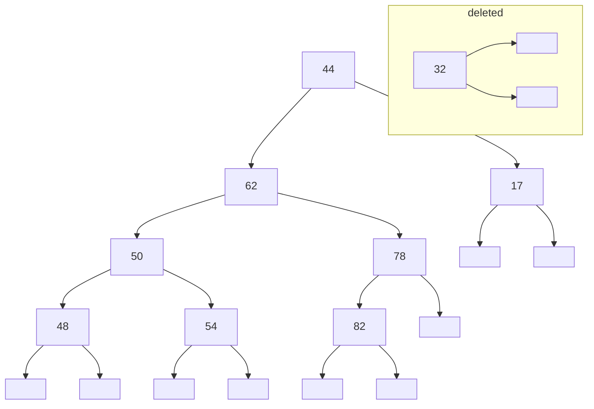
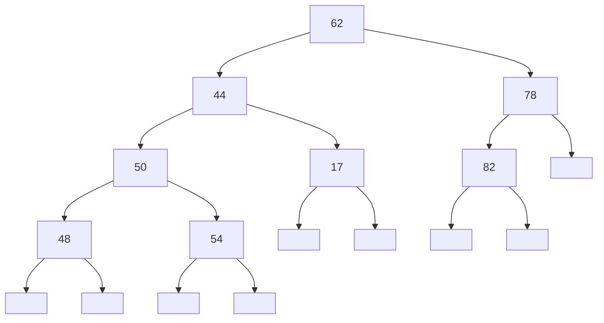
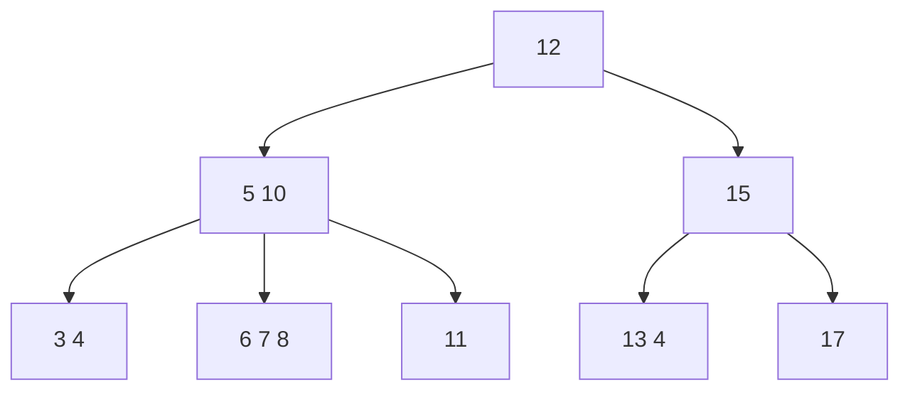

## AVL Trees
You can view interactive examples of AVL trees at: [https://www.cs.usfca.edu/∼galles/visualization/AVLtree.html](https://www.cs.usfca.edu/∼galles/visualization/AVLtree.html).
{:.info}

This is a type of tree which upholds a **height-balance property**. This rule says that the heights of the children of a node can differ by **at most 1**.

This means that the height of an AVL tree storing $n$ items is:

$O(\log n)$

This also means that:

* A **search** in an AVL tree can be performed in $O(\log n)$ time.
* Insertions an removals take more time as the height-balance property must be maintained.

### AVL Tree Insertion

1. Complete an insertion as for BST trees.
1. Re-balance the tree from the bottom up to maintain the height-balance property.

There are several "rotations" that can be performed to re-balance a tree after insertion. They are mostly intuitive and are similar to the following:

1. The tree is unbalanced as the children of the **root** have heights with difference **more than one**:

	```mermaid
	graph TD
	a["(4)"] --> T0["T0 (1)"] & b["(3)"]
	b --> T1["T1(1)"] & c["(2)"]
	c --> T2["T2 (1)"] & T3["T3 (1)"]
	```
	
	$T_0$ and so on are arbitrary sub-trees. The height of a specific node is in brackets `()`.
	{:.info}
1. This can be re-arranged in the following way to be balanced:

	```mermaid
	graph TD
	a[ ] --> b[ ] & c[ ]
	b --> T0 & T1
	c --> T2 & T3
	```
	
There are additional examples starting at [slide 46 of the lectures](https://liverpool.instructure.com/courses/47215/files/6844264?module_item_id=1390253) and in the [second tutorial](https://liverpool.instructure.com/courses/47215/files/6898644?module_item_id=1402794).
{:.info}

### AVL Tree Deletion

1. Complete the deletion like in a BST.
1. Re-balance the tree from the bottom-up.

Consider that the tree is left in the following state after deletion:



We can make the largest child of the root the new root and then rearrange the rest of the graph:



Nodes with smaller values should be on the left in these graphs.
{:.error}

### AVL Performance
All operations (search, insertion and removal) on an AVL tree with $n$ elements can be performed in:

$$
O(\log n)
$$

## (2, 4) Trees
This may have identical behaviour to a B-Tree with max degree 4. In which case, you can view interactive visualisations here: [https://www.cs.usfca.edu/~galles/visualization/BTree.html](https://www.cs.usfca.edu/~galles/visualization/BTree.html).
{:.info}

Every node in a (2, 4) tree has:

* At **least** 2 children.
* At **most** 4 children.

Each internal node (not leaves) contain between 1 and 3 values:



This creates a tree in which all leaf nodes have the **same depth** at $\Theta(\log n)$.
{:.info}

### (2, 4) Trees Search
Searching for a key $k$ in a (2, 4) tree $T$ is done via tracing the path in $T$ starting at the root in a top-down manner:

Visiting a node $v$ we compare $k$ with keys ($k_i$) stores at $v$:

* If $k=k_i$ the search is completed.
* If $k_i\leq k \leq k_{i+1}$, the $i+1^{\text{th}}$ subtree of $v$ is searched recursively.

### (2, 4) Trees Insertion
Insertion of $k$ into a (2, 4) tree $T$ begins with a **search** for an **internal** node with the **lowest level** that could accommodate $k$ without violating the range.

This action may **overflow** the node-size of a node $v$ acquiring the new key $k$. We can use the **split operation** to fix this:

1. There is an overflowing tree to split:
	
	```mermaid
	graph TD
	a[h1 h1] --> w1 & b[k1 k2 k3 k4] & w3
	b --> v1 & v2 & v3 & v4 & v5
	```

1. We move the middle value up to the next level and split the original node with values ordered appropriately:

	```mermaid
	graph TD
	a[h1 k3 h2] --> w1 & b[k1 k2] & c[k4] & w3
	b --> v1 & v2 & v3
	c --> v4 & v5
	```

### (2, 4) Trees Deletion

1. Deletion of a key $k$ from a (2, 4) tree $T$ begins with a search for node $v$ possessing key $k_i=k$.
1. Key $k_i$ is replaced by the largest key in the $i^{\text{th}}$ consecutive subtree of $v$.
1. A bottom-up mechanism, based on transfer and fusion operations, fixes any underflow.

### (2, 4) Tree Performance

| Operation | Time |
| :-- | :-- |
| Split, Transfer & Fusion | $O(1)$ |
| Search, Insertion & Removal | $O(\log n)$ |