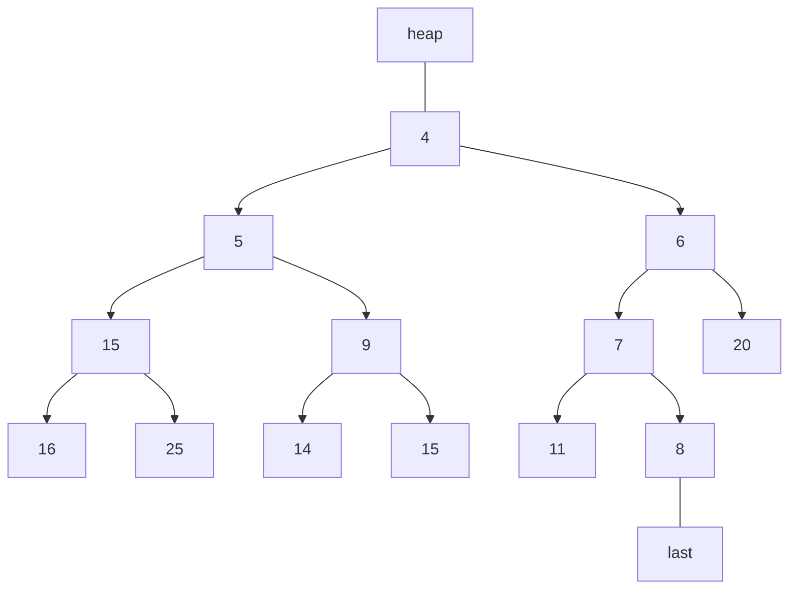

## Priority Queues
A priority queue is a container of elements, each having an associated key:

* The key determines the **priority** used in picking elements to be removed.

A priority queue has these fundamental methods:

* `insertItem(k, e)` - Insert an element $e$ having key $k$ into the PQ.
* `removeMin()` - Remove the minimum element.
* `minElement()` - Return the minimum element.
* `minKey()` - Return the key of the minimum element.

### Priority Queue Sorting (Heap Sort)
We can use a PQ to perform sorting on a set $C$ using the following steps:

1. Put elements of $C$ into an initial empty priority queue, $P$, by a series of $n$ `insertItem` operations.
1. Extract the elements from $P$ in non-decreasing order using a series of $n$ `removeMin` operations.

We can use the following pseudo-code to complete this:

```
while c /= empty
	do
		e = C.removeFirst()
		P.insertItem(e, e)
while P /= empty
	do
		e = P.removeMin()
		C.insertLast(e)
```

This operation takes:

$$
O(n\log n)
$$

## Heaps
A heap is an implementation of a PQ:

* A heap allows insertions and deletions to be performed in **logarithmic** time.
* The elements and their keys are stored in an **almost** complete binary tree.
	* Every level of the binary tree, except for the last, will have the maximum number of children.
	


In a heap $T$, for every node $v$ (excluding the root) they key at $v$ is greater than, or equal to, the key stored in its parent.
{:.info} 

### Insertion in Heaps

1. Add the new element to the bottom of the tree in the position of the first unused, or empty, child.
1. If required, this element bubbles (swaps) its ways up the heap, until the heap order property is restored.

### Deletion in a Heap

1. Remove the element at the root of the tree.
1. Move the last element to the root position.
1. Swap the element down the tree if the order is incorrect.

### Heap Performance
The time for heap operations are presented below:

| Operation | Time |
| :-- | :-- |
| `size`, `isEmpty` | $O(1)$ |
| `minElement`, `minKey` | $O(1)$ |
| `insertItem` | $O\log n$ |
| `removeItem` | $O\log n$ |

## Merge Sort
This is a method of applying **divide and conquer** to sorting. It uses the following steps:

1. If input sequence $S$ has 0 or 1 elements, then return $S$. Otherwise, split $S$ into two sequences $S_1$ and $S_2$, each containing $\frac 1 2$ of the elements in $S$ - Divide
1. Recursively sort $S_1$ and $S_2$ - Recur
1. Put the elements back into $S$ by merging the sorted sequences $S_1$ and $S_2$ into a single sorted sequence. - Conquer

### Merge Sort Analysis
Merging two sorted sequences $S_1$ and $S_2$ takes $O(n_1+n_2)$ time, where $n_1$ is the size of $S_1$ and $n_2$ is the size of $S_2$.

Merge sort runs in:

$$
O(n\log n)
$$

time in the worst case.

We can justify this as:

* During every recursive step, dividing each sub-list takes time at most $O(n)$ time.
* Merging all the lists in each level takes at most $O(n)$ times at well.

As we **recurse** at most $O(\log n)$ times this gives the $O(n\log n)$ running time.

## Counting Inversions
Consider that you have a list of movies that you have rated out of 10. To give a user recommendations we may want to compare our ratings to others who have rated the moves in a similar way.

We can also say, which of the following lists have the closest rankings:

$$
2, 7, 10, 4, 6, 1, 3, 9, 8, 5\\
8, 9, 10, 1, 3, 4, 2, 5, 6, 7
$$

to your ranking:

$$
1, 2, 3, 4, 5, 6, 7, 8, 9, 10
$$

### Method for Counting Inversions
To count the number of inversions, for each element that is in an index **lower** than what it should be - **count all the following numbers that are lower** than it

The following example has one inversion:

$$
2, 1, 3, 4, 5
$$

as 2 is in the wrong position and only 1 is less than it and later in the list.

In this example there are seven inversions:

$$
5,4,1,2,3
$$

as $5>4,5>1,5>2,5>3$ and $4>1,4>2,4>3$.