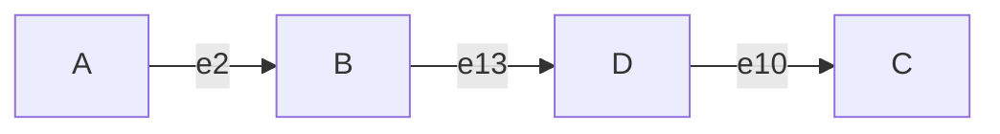
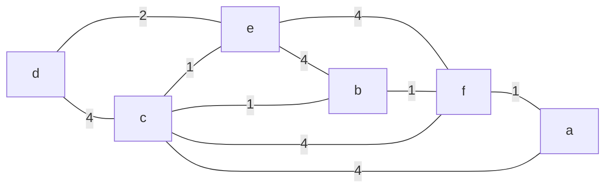

For the definition of a graph see the lectures:

* [COMP108 - Graphs - 1]({{site.baseurl}}/comp108/lectures/2021/04/14/1.html)

An **undirected graph** $G$ is **simple** if there is at most one edge between each pair of vertices $u$ and $v$.

A **digraph** is **simple** if there is at most one directed edge from $u$ to $v$ for every pair of distinct vertices $u$ and $v$.

Therefore, for a graph $G$ with $n$ vertices and $m$ edges:

* If $G$ is undirected, then:
	
	$$
	m\leq \frac{n(n-1)}2
	$$
* If $G$ is directed, then:

	$$
	m\leq n(n-1)
	$$

## Describing Walks & Paths
A **walk** is a sequence of alternating vertices and edges, starting at a vertex and ending at a vertex.

A **path** is a walk where each vertex in the walk is distinct.

We can describe this walk with the following syntax:



$$
A, e_2, B, e_{13}, D, e_{10}, C
$$

If this is part of a **simple** graph then this walk could be written as:

$$
A, B, D, C
$$

## Terminology

* A **subgraph** of a graph G is a graph $H$ whose vertices and edges are subsets of the vertices and edges of $G$.
* A **spanning subgraph** of $G$ is a subgraph of $G$ that contains all the vertices of $G$.
* A graph is **connected** if, for any two distinct vertices, there is a path between them.
* If a graph $G$ is **not connected**, its maximal connected subgraphs are called the **connected components** of $G$.
* A **forest** is a graph with no cycles.
* A **tree** is a connected forest (a connected graph with no cycles).
* A **spanning tree** of a graph is a spanning subgraph that is a free tree (no root node).

## Counting Edges
Let $G$ be an **undirected** graph with $n$ vertices and $m$ edges. We have the following observations:

* If $G$ is connected then $m\geq n-1$.
* If $G$ is a tree then $m=n-1$
* If $G$ is a forest then $m\leq n-1$

## Representations of Graphs
We have covered many representations of graphs in previous lectures:

* [COMP108 - Linked Lists - 1 (Searching)]({{site.baseurl}}/comp108/lectures/2021/03/04/1.html)
	* Linked Lists
* [COMP108 - Graphs - 2 - Representation of Graphs]({{site.baseurl}}/comp108/lectures/2021/04/14/2.html)
	* Adjacency and incidence matrices.
* [COMP108 - Graphs - 1]({{site.baseurl}}/comp108/lectures/2021/04/14/1.html)
	* Directed Graphs
	
## Graph Search Methods
We have covered various graph search methods before:

* [COMP108 - Graphs - 4 - Traversals]({{site.baseurl}}/comp108/lectures/2021/04/16/2.html)
	* DFS and BFS

## Single-Source Shortest Paths
We have covered this before in:

* [COMP108 - Greedy Algorithm - 3 - Single-Source Shortest Paths]({{site.baseurl}}/comp108/lectures/2021/04/22/2.html)

## Dijkstra's Algorithm
We have covered this before in:

* [COMP108 - Greedy Algorithm - 3 - Single-Source Shortest Paths]({{site.baseurl}}/comp108/lectures/2021/04/22/2.html)

We can use the following method to complete Dijkstra's without path enumeration. For the following graph:



we would represent the solution of completing Dijkstra's from $d$ in the following table:

| a | b | c | d | e | f | Chosen |
| :-: | :-: | :-: | :-: | :-: | :-: | :-- |
| $\infty$ | $\infty$ | $\infty$ | 0 | $\infty$ | $\infty$ | $\emptyset$ |
| $\infty$ | $\infty$ | 4 | 0 | 2 | $\infty$ | $\{d\}$ |
| $\infty$ | 6 | 3 | 0 | 2 | 6 | $\{d,e\}$ |
| 7 | 4 | 3 | 0 | 2 | 6 | $\{c, d,e\}$ |
| 7 | 4 | 3 | 0 | 2 | 5 | $\{b, c, d,e\}$ |
| 6 | 4 | 3 | 0 | 2 | 5 | $\{b, c, d,e,f\}$ |
| 6 | 4 | 3 | 0 | 2 | 5 | $\{a,b, c, d,e,f\}$ |

### Dijkstra's Algorithm Pseudo-Code

Dijkstra(G,v)

```
D[v] = 0
for each u != v do
	D[u] = +INFTY
Let Q be a priority queue (heap) having all vertices of G using the D labels as keys.
while notEmpty(Q) do
	u = removeMin(Q)
	for each z s.t. (u, z) in E do
		if D[u] + w({u, z}) < D[z]
			then D[z] = D[u] + w({u, z})
				key(z) = D[z] /* z might bubble up in the heap */
return D
```

### Time Complexity of Dijkstra's Algorithm
Let $G=(V, E)$ where $\vert V\vert=n$ and $\vert E\vert = m$.

Construction of the initial heap for the set of $n$ vertices takes $O(n\log n)$ time.

In each step of the `while` loop, getting the minimum entry from the heap requires $O(\log n)$ time (to update the heap), and then $O(\deg(u)\log n)$ time to perform the edge relaxation steps (and update the heap as necessary).

So the overall running time of the `while` loop is:

$$
\sum_{u\in V(G)} (1+\deg(u))\log n = O((n+m)\log n)
$$

Therefore Dijkstra's algorithms solves SSSP in $O(m\log n)$ time as $n\leq m$ for connected graphs.