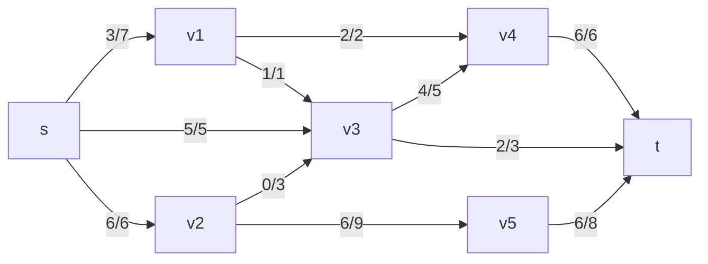
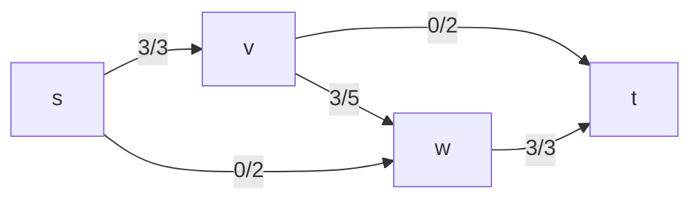
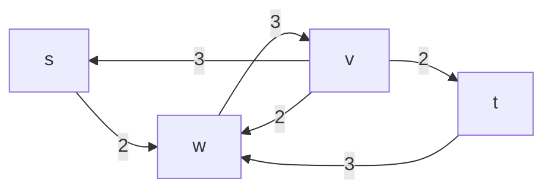
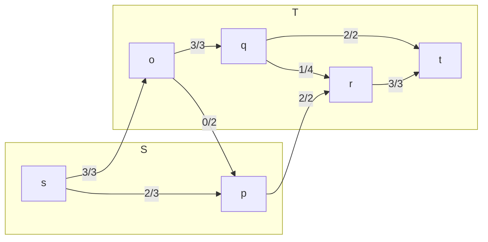

A flow network $G=(V,E)$ is a directed graph in which each edge $(u,v)\in E$ has a non-negative integer capacity $c(u,v)\geq 0$.

In a **flow network** there are two main vertices:

* Source: $s$
* Sink $t$

We assume that $s$ has no "in-edges" and that $t$ has no "out-edges".
{:.info}

Each edge $(u,v)$ also has an associated flow value $f(u,v)$ which tells us how much flow has been sent along an edge. These values satisfy $0\leq f(u,v) \leq c(u,v)$.

$c$ is the capacity of a particular edge.
{:.info}

For every vertex other than $s$ and $t$, the amount of flow into the vertex must equal the amount of flow out of the vertex.

## Maximum Flow Problem
In this type of problem we are expected to find a flow of **maximum value** from $s$ to $t$.

We might see a graph like so:



### Ford-Fulkerson Method
We can use this method to solve the maximum flow problem. 

This algorithm searches for a **flow-augmenting path** from the source vertex $s$ to the sink vertex $t$. We then send as much flow as possible along the flow augmenting path, whilst obeying the capacity constraints of each edge.

The maximum flow we can send along the path is limited by the **minimum** of $c(u,v)$ and $f(u,v)$ of an edge on this path.

Formally:

1. Start with $f(u,v) = 0$ for all $u, v\in V$.
1. At each iteration, we increase flow by finding an augmenting path from $s$ to $t$ along which we can push more flow.
	
	We consider the **residual network** when we search for augmenting paths.
	{:.info}
1. This process is repeated until no more augmenting paths can be found.

The **max-flow min-cut** theorem proves that this process yields a maximum flow.
{:.info}

We can also write this method in the following pseudo code:

FFMethod(Graph $G$, source $s$, sink $t$)

```
f = 0
while augmenting path, P exists (in the residual network)
	do augment flow along P
		f = f + new flow
		update residual network
return f
```

#### Ford-Fulkerson Time Complexity
Let $\lvert f^\*\rvert$ denote the value of a maximum flow $f^\*$ in a network with $n$ vertices and $m$ edges.

Finding an augmenting path in the residual network can be done using a DFS or BFS algorithm. These run in time:

$$
O(n+m) = O(m)
$$

Each augmentation increases the flow by at lease one unit (using the fact that the capacities are integers), so there are at most $\lvert f^*\rvert$ augmentation steps. This gives a time complexity of:

$$
O(\lvert f^*\rvert m)
$$

This isn't ideal, as a poor choice of augmenting paths can result in a large time bound.
{:.warning}

## Residual Networks
A residual network shows additional flow that can occur across an existing network.

Consider that we have the following network:



this will produce the following residual network:



Forward flow is reversed, while any residual capacity stays the same.
{:.info}

We formally define the edges like so, where $G$ is the flow network and $G_f$ is the residual network:

* Forwards Edges
	
	For any edge $(u,v)$ in $G$ for which $f(u,v)<c(u,v)$, there is an edge $(u,v)$ in $G_f$.
	
	The residual capacity $\Delta_f(u,v)$ of $(u,v)$ in $G_f$ is defined as $\Delta_f(u,v)=c(u,v)-f(u,v)$.
* Backwards Edges
	For any edge $(u,v)$ in $G$ for which $f(u,v)>0$, there is an edge $(v,u)$ in $G_f$.
	
	The residual capacity $\Delta_f(v,u)$ of $(v,u)$ in $G_f$ is defined as $\Delta_f(v,u)=f(u,v)$.

## Augmenting Paths
Given a flow network $G=(V,E)$ and a flow $f$, an augmenting path $P$ is a directed path from $s$ to $t$ in the residual network $G_f$.

An augmenting path is a path form the source to the sink in which we can send more net flow

### Updating Flow
Once an augmenting path $P$ has been identified, we need to update the flow. 

The amount of flow that can be sent along an augmenting path $P$ is limited by the edge with the **least residual capacity**, defined by:

$$
\Delta_f(P) = \min_{(u,v)\in P}\Delta_f(u,v)
$$

once we have calculated the capacity of this edge then we can take the following steps to update the flow network $G$ from the residual network $G_f$:

1. If $(u,v)$ is a **forwards** edge we set:
	
	$$
	f(u,v) = f(u,v) + \Delta_f(P)
	$$
1. If $(u,v)$ is a **backwards** edge we set:
	
	$$
	f(v,u) = f(v,u) - \Delta_f(P)
	$$
	
	This means we decrease the flow along the original edge in $G$.
1. For all edges $e$ not in $P$, we make no change.
1. Finally, we update the residual network to correspond to the new flow network.

## Cuts in Networks
A cut is a line that crosses a set of edges. It splits the network into two sub-graphs, one that contains $s$ and one that contains $t$. We can call these sub-graphs $S$ and $T$.




I'll call flow from $S$ to $T$ **forward** and from $T$ to $S$ **backward**.
{:.info}

The **net flow across a cut** is the sum of the forward flow, take the backward flow:

$$
f(S,T) = \sum_{u\in S, v\in T}f(u,v)-\sum_{u\in T, v\in S} f(u,v)
$$

The **capacity** of a cut is the sum of the forward flow:

$$
c(S,T) = \sum_{u\in S, v\in T}c(u,v)
$$

### Max-Flow Min-Cut Theorem

> The **maximum flow** of a network is equal to the **capacity of a minimum cut** in the network.